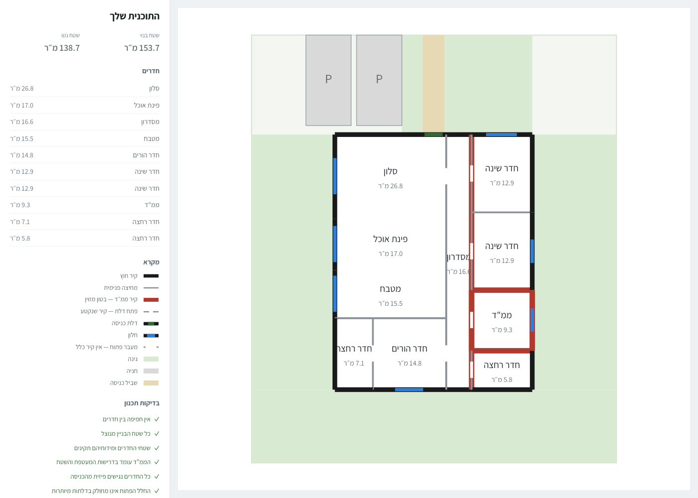
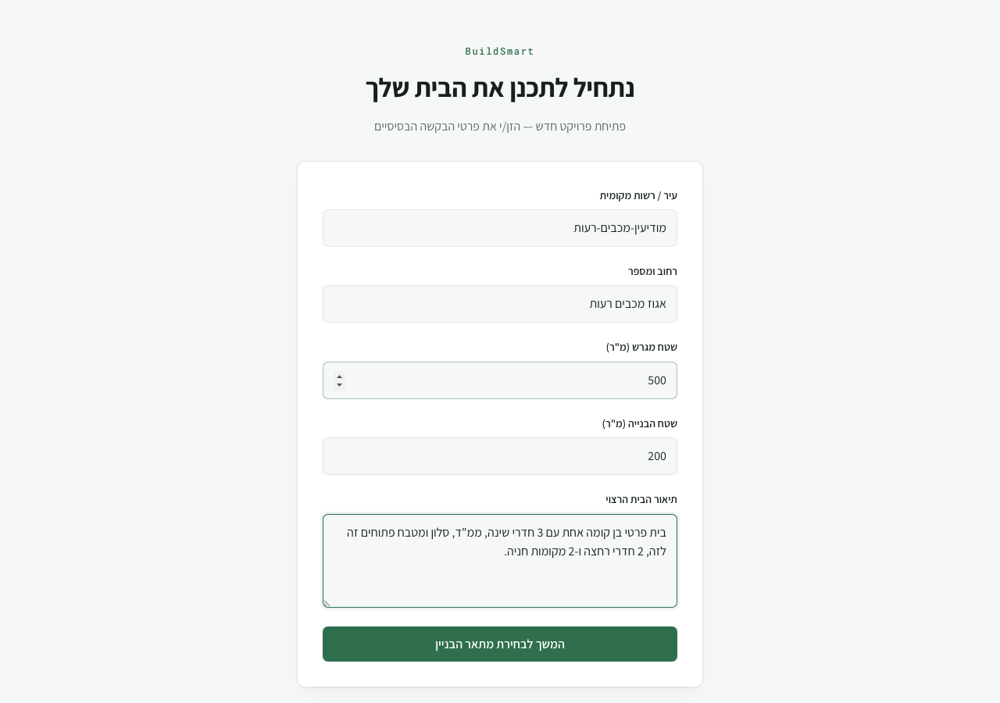
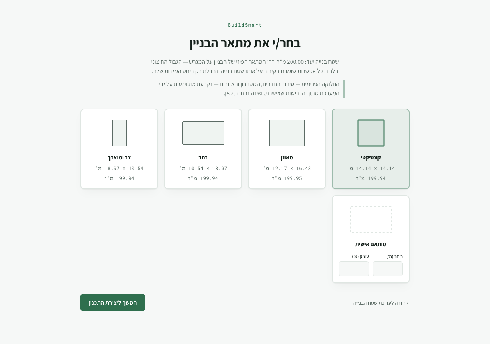
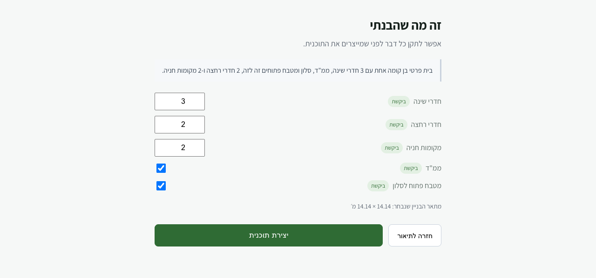
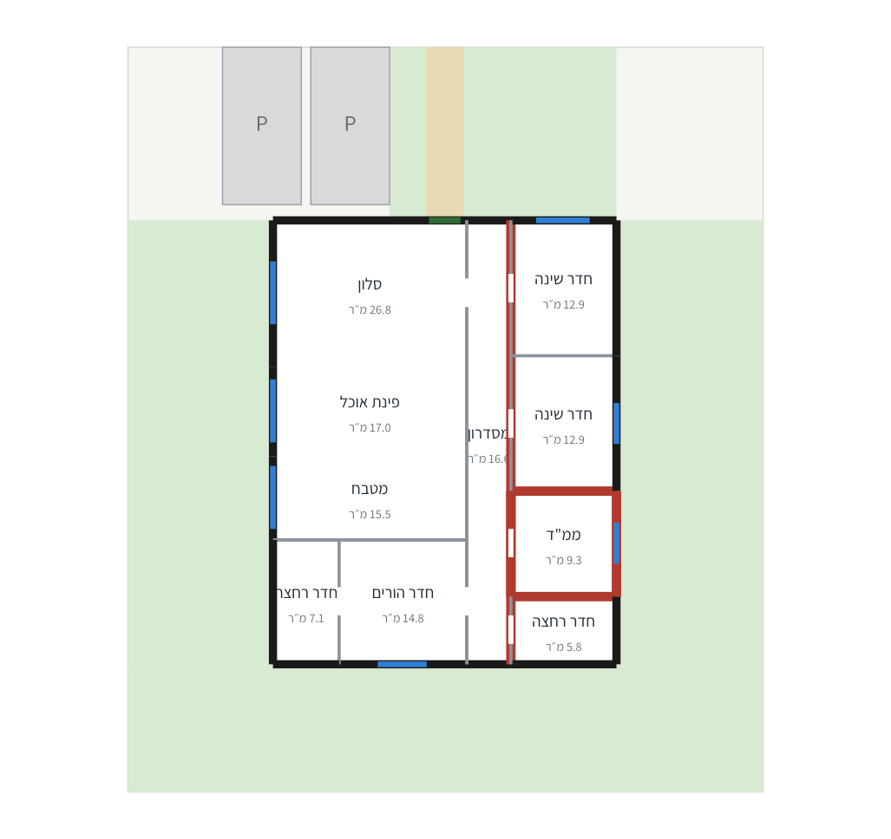
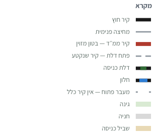
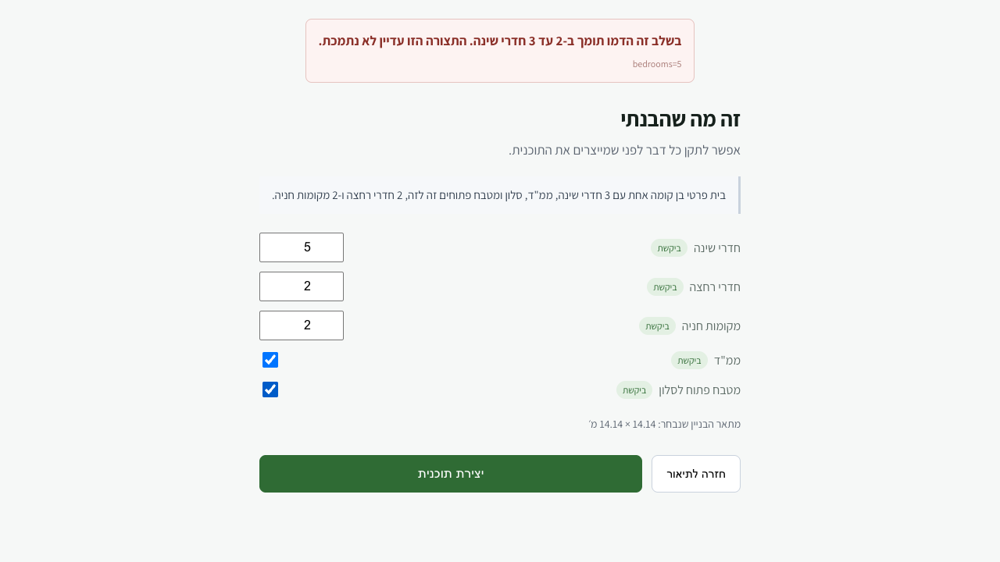

# BuildSmart

**Describe the house you want, in your own words. Get back a floor plan that is actually buildable.**

BuildSmart turns a free-text brief in Hebrew into a real architectural floor plan — rooms, walls,
doors, windows, a safe room, parking and garden — and refuses to show you anything that does not
pass its own planning checks.

<p align="center">
  
</p>

<p align="center">
  <em>Real output from the pipeline — 153.7 m² built, 138.7 m² net, 13/13 planning checks passed.</em>
</p>

---

## What makes it different

Most layout generators draw something plausible and leave you to spot the problems. This one treats
the drawing as a claim that has to be proved.

**Nothing is inferred at the drawing stage.** The frontend does not decide where a door goes, which
wall is load-bearing, or whether two rooms are open to each other. Every one of those is computed
by the planner and sent explicitly. If the backend supplies no door, the renderer draws no door —
absence is drawn as absence, never filled in with a guess.

**A declared connection must physically exist.** The plan first decides *topology* — what connects
to what — and only then geometry. Check C13 then goes back and verifies that every declared
connection is realizable: a door needs a shared wall long enough to hold it, and an open-plan join
needs both facing walls to genuinely not be there. This invariant has caught real defects, including
an "open-plan" living room that was quietly walled off and a master bedroom sealed behind its own
ensuite.

**Geometry is never invented.** The buildable area you select is converted to solver geometry by an
adapter with one hard rule: *it may lose usable area, but it must never create area that does not
exist.* Curved and irregular boundaries are approximated inward, and every candidate rectangle is
verified against the exact arc-aware geometry before the planner is allowed to use it.

**A failure is a refusal, not a bad drawing.** If any check fails, no plan is returned at all.

---

## The flow

### 1 · Describe the house

Free text. No form to decode, no vocabulary to learn.



### 2 · Choose the building outline

Four proportions at the same built area, plus your own exact dimensions. This is the **physical
outline on the plot** — the one thing about the building's shape that is yours to decide. How the
rooms are arranged inside it, where the corridor runs and how the zones are grouped are the
planner's decisions, derived from your requirements.



### 3 · Confirm what was understood

Every requirement is shown with where it came from — **ביקשת** (you asked for this), **הנחנו** (we
assumed it), **לא זוהה** (we could not tell). A wrong assumption is easy to spot, and correcting it
is what actually gets built: change 3 bedrooms to 2 here and a two-bedroom house comes out.



### 4 · Get the plan



Alongside the drawing is a room schedule, every check the plan passed in plain language rather than
check codes, and a key to the drawing itself.

### Reading the drawing



The **red walls are the safe room** (ממ״ד) — reinforced concrete, drawn heavier and in its own
colour because it is a structural requirement rather than an ordinary partition. Black is the
exterior envelope, grey an interior partition, blue a window, green the entrance door.

An **open passage carries no line at all**: where two spaces are genuinely open to each other the
wall is not drawn thin or dashed, it is absent, which is why the living room, dining area and
kitchen read as one continuous space above.

The key is generated from the drawing's own style values, and it lists only what is actually in
*this* plan — a house without a safe room shows no safe-room entry.

<br clear="left">

### When it can't be built, it says so

Ask for something outside what the planner supports, or for a programme that genuinely does not fit
the outline you chose, and you get a clear reason — **and your requirements are left exactly as you
set them.** Nothing is quietly adjusted to something that would have worked.



---

## How it works

```
BRIEF (free text)
  │
  ├─ requirement extraction ─────────── LLM, provenance-tagged, never silently defaulted
  ├─ REVIEW ─────────────────────────── the user's corrections become authoritative
  ├─ scope gate ─────────────────────── an explicit refusal, never a silent downgrade
  │
  ├─ concept generator ──────────────── topology decided BEFORE any dimension exists
  ├─ safe geometry adapter ──────────── authoritative geometry → proven-safe rectangles
  ├─ geometry core ──────────────────── exact tiling on a 5 cm integer grid
  ├─ doors → windows → furniture ────── openings and feasibility
  ├─ validation C1–C13 ──────────────── HARD GATE: a failure returns no plan
  │
  └─ DemoDesign ─────────────────────── the authoritative contract the UI renders verbatim
```

The geometry core places rooms with a **slicing tree** of guillotine cuts and shape curves, tiling
the footprint exactly on a 5 cm integer grid — so room areas are exact, not rounded into agreement.
Wall types resolve by precedence (`OPEN > RC_SAFE_ROOM > EXTERIOR > PARTITION`) through a bounded
re-solve loop, because wall thickness depends on wall type and wall type depends on the layout.

### The thirteen checks

No overlapping rooms · the whole footprint used · room areas and dimensions valid · safe room
envelope and area · every room physically reachable from the entrance · no needless doors inside an
open space · every door has real wall to sit in · every room needing daylight has a window · room
for basic furniture · parking connected to the street · pedestrian entrance connected to the house ·
outdoor areas explicitly classified · **every declared connection realized in the actual geometry**.

---

## Supported today

| Supported | Not yet |
|---|---|
| 2–3 bedrooms | 4+ bedrooms |
| optional safe room (ממ״ד) | more than one floor |
| 1–3 wet rooms | pools |
| open-plan **or** closed kitchen | 3+ parking spaces |
| 0–2 parking spaces | non-rectangular footprints |
| single floor, rectangular footprint | |

Anything in the right column is refused explicitly, with a reason.

---

## Running it

**Backend** — FastAPI, managed with `uv`:

```bash
cd backend
uv sync --group dev
cp .env.example .env        # set OPENAI_API_KEY for requirement extraction
uv run uvicorn app.main:app --reload --port 8000
```

Swagger UI at `http://127.0.0.1:8000/docs`. Tests need no API key — they use a fake parser and make
no network calls.

**Frontend** — React + Vite + TypeScript:

```bash
cd frontend
npm install
npm run dev        # proxies /projects and /localities to the backend on :8000
```

**Tests:**

```bash
cd backend  && .venv/bin/pytest          # 675 tests
cd frontend && npm test -- --run         # 56 tests
cd frontend && npx playwright test       # end-to-end, needs both servers running
```

---

## Repository

| Path | What lives there |
|---|---|
| `backend/app/demo/` | the demo pipeline: scope gate, review, contract, service, routes |
| `backend/app/vertical_slice/` | concept generator, geometry core, adapter, doors, windows, validation |
| `backend/app/geometry_domain/` | authoritative geometry: arcs, regions, constraints, provenance |
| `backend/spikes/geometry_core/` | the frozen proof spike the geometry core grew out of |
| `frontend/src/design/` | footprint selection, review screen, plan renderer |
| `docs/` | architecture reports and implementation records |
| `specs/` | feature specs, plans and tasks |

Built with [Spec-Driven Development](https://github.com/github/spec-kit): `/speckit-constitution` →
`/speckit-specify` → `/speckit-plan` → `/speckit-tasks` → `/speckit-implement`, with
`/speckit-clarify`, `/speckit-analyze` and `/speckit-checklist` available for extra rigor. The
engine lives in `.specify/`, and the Claude Code skills that drive each step in `.claude/skills/`.

---

## Known limits

- The plan is sized to the programme inside the outline you chose, so the built area can come out
  below the area you asked for — 200 m² requested, 153.7 m² built in the example above.
- Furniture is checked for fit but not drawn.
- No dimension lines, north arrow or door swings yet.
- Generation is a single synchronous call, so the progress screen has no real per-stage detail.

Screenshots on this page are real captures of the running application. The requirement-extraction
step was stubbed deterministically for reproducibility; everything downstream of it is the live
pipeline.
