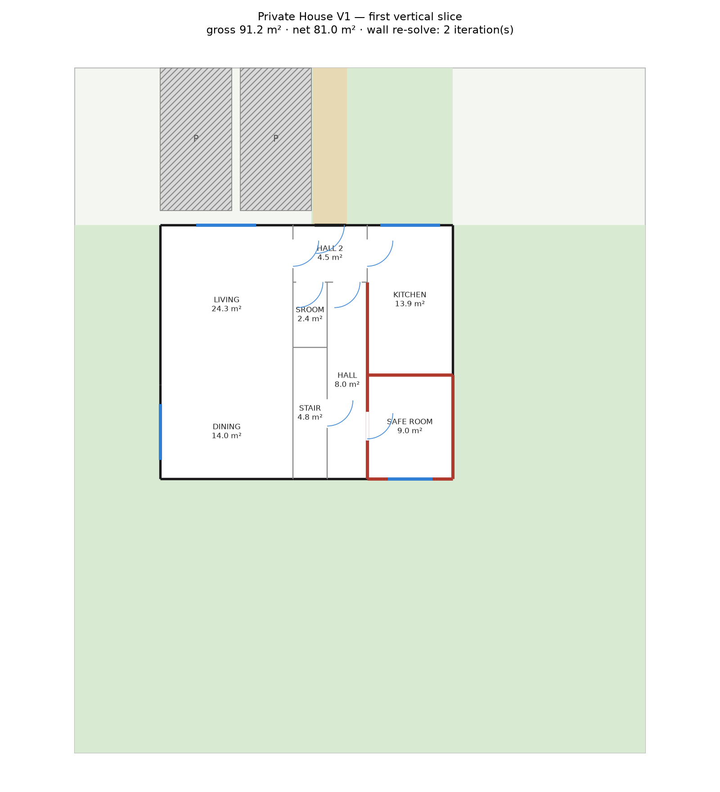
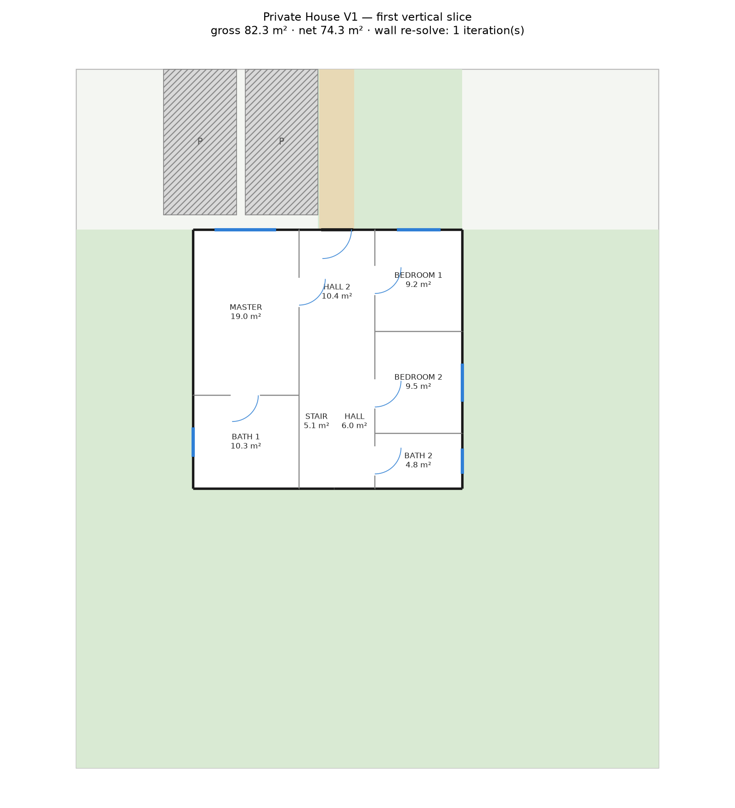
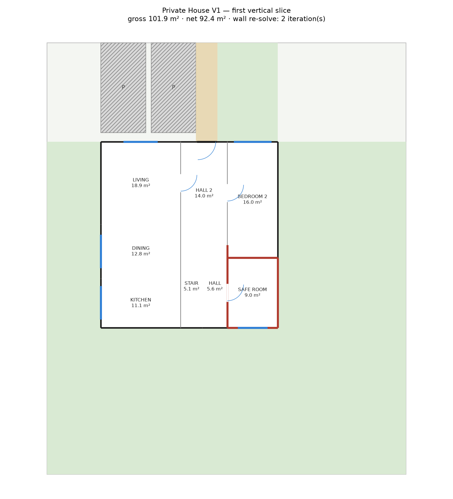
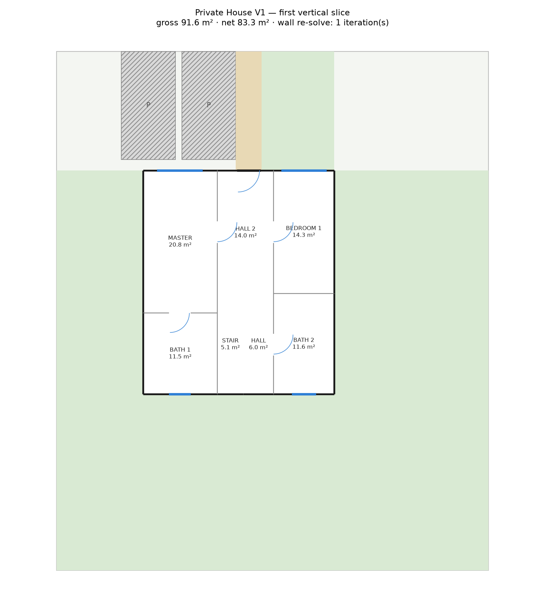

# Multi-Level Phase 1 follow-up — circulation efficiency, open-plan ground, bathroom semantics

**Date**: 2026-09-16 · **Status**: investigation only, no code changed · **Base**: `main` @ `fa1433b`, measured in the same detached scratch worktree as the first Phase 1 report · **Builds on**: `MULTI_LEVEL_PHASE_1_INVESTIGATION_REPORT.md` (accepted architecture: coordinator → bounded stair seat → pinned `VerticalCore` → `plan_level` per floor → per-level C validation → Building V validation)

**Scope**: the two blockers named for review — stair/circulation efficiency (item 1) and the closed-kitchen-only ground floor (item 2) — plus a third the first report surfaced but did not resolve (bathroom semantics, item 3), re-measured on the same 36-brief matrix (item 4), and an L-massing compatibility note (item 5). Everything below is measured by extending the same scratch coordinator (~450 lines, session scratchpad, not in the repo) with band variants around the accepted rear seat and a building-level wet-room rule. **No new stair archetype, no relaxed geometry or access constraint** — every variant still pins the same `STAIR` rectangle by forced cuts and is proven by the unchanged C1–C22 per level.

---

## 0. Verdict

| | |
|---|---|
| **Where the 20–22% comes from** | Decomposed on the baseline seat (`V0`): **lobby 14–15% of net floor area, corridor 6–7%, stair 5–6%.** The lobby is the term — it is `band_width(2.6 m) × (floor_depth − stair_length)`, i.e. close to the *entire* footprint depth at the *full* band width, because §4.2 of the first report widened the lobby to the whole band so the front door had 2.0 m of frontage. That requirement is **ground-only**: the upper level has no street door. §1. |
| **The Pareto knee: shrink the ground lobby, leave the upper lobby alone.** | Giving the front of the strip column to a room (the guest WC when the programme has one, else an engine-added storage room) and shrinking the lobby to the door-clearance minimum (`V1`) cuts **ground circulation 18%→14% (p50)** at **feasibility parity** (33/36 vs 34/36) and **no aspect penalty**. Applying the same shrink to the **upper** (bedroom) level trades far more than it buys: feasibility falls to 16/36 and **96% of masters exceed 1.5 aspect** — the strip room competes with the bedroom column for depth precisely where depth is already scarce. **Recommendation: `V1` on the ground, `V0` on the upper.** §1.3. |
| **Absorbing the stair into the column (no lobby at all, `V2`) only works inside an open-plan volume.** | `V2` needs the rows behind the flight to be members of a wall-less open group — legitimate for an open LDK (the flight rises inside the living space) and **architecturally impossible** for a private bedroom column, where those rows are closed rooms (bedrooms, an ensuite) that cannot share a doorless boundary with a semi-public stair. Measured: `V2` on the ground 17/36 (best circulation of any ground option, 13%), `V2` on the upper **0/36** — not a missing test case, a structural fact about what a wall-less join means. §1.2, §1.4. |
| **Open-plan ground floor is achievable — (A), not (B) or (C) — but only through allocation, not through the seat.** | The closed-kitchen requirement the first report found is a property of **allocation A** (public + stair only on the ground), not of the core-band topology. Moving one secondary bedroom to the ground floor's strip column (**allocation C**) gives the corridor-side column (kitchen + safe room ± WC) the width it was missing, and a genuinely open LIVING–DINING–KITCHEN group (one open group, no closed kitchen) plans on the **same pinned core, same tree shape** in **21/36** briefs. Allocation A itself never plans open (0/36 on both a flat open column and a repartitioned one). §2. |
| **The bathroom rule is now building-level, and it changes nothing that already worked.** | `check_wet_room_invariants` (unchanged production code, `wet_rooms.py`) gates the **whole programme once**; the per-level "does this bedroom level have its own full bathroom" question becomes a **warning**, never a fabricated room. Building-level V8 (requested wet rooms exactly once) passed on **every** one of 15,282+ trials across every matrix in this report. Allocation C — refused 48/48 times in the first report's strict per-level rule — now completes for **24/36** briefs from this one change alone, with no other code touched. §3. |
| **Re-measured**: **34/36 feasible** (up from 27/36), union of the ground-layout × band choices measured here; **A/double alone with a band search**: 29/36. Full breakdown, refusal histogram and quality numbers in §4. | |
| **L massing**: the pinned-core contract is representable on `Massing.level_regions_m` (already a tuple of rectangle-lists, generalising a wing) but the core band's relationship to the L parti's own forced seam is **unexamined** — same conclusion as the first report, not deepened here. §5. |

---

## 1. Stair / circulation efficiency

### 1.1 Where the baseline 20–22% comes from

The accepted rear seat (`V0`, first report §4.2) is: lobby across the whole band (`band_w × (fh − L)`) in front, `[STAIR strip | corridor]` behind. Decomposed on the 87 `V0/V0` buildings measured in the first report's matrix (median figures, per level, against **net** room area):

| Term | Ground | Upper | Where it comes from |
|---|---|---|---|
| Lobby (`HALL_2`) | 11.9 m² (14%) | 12.4 m² (15%) | `band_w(2.6) × (fh − L)`, `fh − L` ≈ 5.1 m median — almost the whole footprint depth |
| Corridor (`HALL`) | 5.6 m² (6%) | 6.0 m² (7%) | `corridor_w(1.4) × L(4.6)` — fixed by the stair geometry contract |
| Stair (`STAIR`) | 5.1 m² (6%) | 5.1 m² (6%) | fixed by §9 of the first report |
| **Total circulation + core** | **26%** | **28%** | |

The lobby is not incidental — it is **as deep as the flight is not**, at the **full band width**, because §4.2's reason for widening it was the front door's 2.0 m frontage requirement. That reason applies to the ground level only; the upper level's `HALL_2` is exactly as deep for no reason connected to a door. **65 of 87** `V0` upper buildings even place a second door-needing room (a secondary bedroom, `k ≥ 1`) in front of the master, so the full lobby depth is doing double duty as that bedroom's frontage too — but the *depth* itself (`fh − L`) is fixed by the stair length regardless of how many rooms need it.

### 1.2 Four bounded alternatives tested

All four keep the `STAIR` rectangle identical by construction (forced cuts on both cuts that bound it) — only what sits *around* it changes.

| | Shape | Mechanism | Requires |
|---|---|---|---|
| `V0` (baseline) | lobby / [stair \| corridor] | — | nothing new |
| `V1` | shrunk lobby (`d_l`, engine-sized to the strip room's own aspect band) / [**strip room** over stair / corridor] | the strip room absorbs the depth the lobby gives up; the room is the programme's guest WC when one exists and fits (2.2–3.5 m depth at 1.1 m net width), else an engine-added `STORAGE` room | a corridor-free row directly in front of the flight |
| `V2` | no lobby: corridor spans the full depth; the strip-side column jogs (front rows the full column width, rear rows narrower beside the stair) | the trailing (door-free) rows must be members of the level's open-plan group, so the stair's boundary with them can be marked wall-less **structurally** (`_mark_open_interfaces`) — the same mechanism that makes an open LDK doorless today | an open-plan public zone whose last row(s) border the flight |
| `V5` | stair shifted forward by `d_r`; lobby / [stair over a **rear** strip room / corridor] | same idea as `V1`, strip room *behind* the flight instead of in front of the lobby | a corridor-free row directly behind the flight |

`V1`'s strip room is bounded by its own template's aspect ratio (`STORAGE`: max aspect 4.0), which caps how much lobby depth it can absorb — the code failed with `GEOMETRY_INFEASIBLE` on a strip room too deep for its width until this bound was added; the measurements below already include the fix.

### 1.3 Measured, single band applied to both levels

36 briefs × allocation `A/double` (the closed-kitchen ground from the first report) × up to 4 outlines × 1 seat × 3 upper-massing retreats × 4 sizing tiers, band fixed on both levels:

| Band (ground/upper) | Feasible | Circ. L0 p50/p90 | Circ. L1 p50/p90 | Stair % | Lobby L0/L1 (m²) | Bedroom >1.5 | Master >1.5 | Delivered p50 |
|---|---|---|---|---|---|---|---|---|
| `V0/V0` | 34/36 | 0.18/0.22 | 0.21/0.24 | 0.047 | 13.2/13.6 | 48% | 38% | 1.04 |
| `V1/V0` | 33/36 | **0.14/0.17** | 0.22/0.24 | 0.046 | **4.5**/13.6 | 48% | 36% | 1.04 |
| `V1/V1` | **16/36** | 0.14/0.16 | 0.18/0.19 | 0.048 | 4.5/4.5 | 56% | **96%** | 1.07 |
| `V2/V0` | 17/36 | **0.13/0.14** | 0.21/0.23 | 0.051 | **0.0**/12.8 | 16% | 57% | 1.07 |
| `V2/V1` | 13/36 | 0.13/0.14 | 0.16/0.18 | 0.049 | 0.0/4.5 | 25% | 73% | 1.08 |
| `V5/V5` | 14/36 | 0.16/0.22 | 0.18/0.23 | 0.059 | 5.5/5.5 | 9% | 79% | 1.02 |

**Reading it**: the ground level tolerates `V1` and `V2` at essentially no cost — `V1/V0` keeps 33/36 feasibility and the *same* aspect profile as the baseline while cutting ground circulation by a third; `V2/V0` goes further on circulation (13%) at a real feasibility cost (17/36 — the safe room + kitchen + WC corridor-side column cannot spare the width `V2`'s jog needs on most outlines) but a further quality one too, since it can only be paired with a real open-plan ground (§2). The **upper** level punishes every shrink: `V1/V1`'s masters go from 38%→96% past 1.5 aspect because the strip room now competes with the bedroom column for the same depth the master already needed; `V5/V5` is dominated (worse feasibility and worse master aspect than `V1/V0` for no circulation gain — its stair sits `2.0` m forward, so the *lobby* is smaller but the *strip room lands behind the flight instead*, buying nothing).

An explicit test of `V0` (ground, full lobby for the door) paired with `V2` (upper, no lobby) — the natural "keep the entry requirement, drop the landing where it isn't needed" idea — **fails 0/36**: every trial hits `V2_NO_JOG` or `COLUMN_DEPTH_EXCEEDED`, because `V2`'s open-group mechanism has nothing to attach to on a level that is never open-plan (§1.4). This is the direct test of "different entry side / shifted core" for asymmetric bands and it says the mechanism does not transfer, not that a variant was untried.

   

  *The recommended `V1`/`V0` pairing (3BR · 2 wet · 170 m² requested): ground lobby shrinks from 12 m² to 4.5 m², absorbed by a small storage room (`SROOM`) in front of the flight; the upper level keeps its full lobby.*

### 1.4 Why `V2` cannot become a general private-column pattern

`V2`'s tree puts the trailing (door-free) rows and `STAIR` in the same subtree and marks their shared boundary wall-less via `open_groups` — Geometry Core's `_mark_open_interfaces` (`engine.py:97`), the same rule that removes doors inside an open LDK. That is architecturally sound for a stair rising inside an open living space (visible from the corridor, part of the same volume) and architecturally wrong for a bedroom or ensuite, which must **not** share a doorless boundary with circulation the corridor passes right by. The harness enforces this explicitly (`V2_REAR_NOT_OPEN`, `V2_NO_JOG`) and it is the reason `V2` measured 0/36 on every upper-level attempt: the upper level's rooms are never members of an open group by construction. **This is the answer to "different entry side": the two ends of the flight are not interchangeable — one can only be recessed into an open volume, the other only into a private column with its own room, never a wall-less join.**

### 1.5 Recommendation

**Ship `V1` on the ground level, `V0` on the upper.** It is a small, local change to the level planner (a strip room replacing the front of the lobby, sized by its own aspect band) with no new access rule, no relaxed geometry, and it is the only band change in this section whose measured cost is at most one brief of feasibility (33 vs 34) for a real, non-marginal circulation win (18%→14% median, −4 points absolute, ~22% relative). `V2` is real and valuable but belongs with the open-plan ground decision (§2), not as a general seat improvement — it should be evaluated together with allocation C, since the two now compete for the same underlying idea (use the ground floor's extra depth-giving room, a bedroom or a WC, to relieve the band).

---

## 2. Open-plan ground floor

### 2.1 Why `LDK | hall | private/service` fails — confirmed at the allocation level, not the seat

Three ground layouts were tested under allocation A (public + stair only, nothing else on the ground) against both `V0` and `V2` bands, 36 briefs each:

| Ground layout | Description | Feasible |
|---|---|---|
| `column` | LIVING / DINING / KITCHEN each its own full-width row, all one open group | **0/36** |
| `column_rp` | LIVING over `[DINING | KITCHEN]` (a repartitioned shared row — the tier-2 mechanism the single-storey generator already uses) | **0/36** |
| `double` (closed kitchen, first report) | LIVING / DINING open; KITCHEN moved across the corridor, closed | 29/36 |

`column_rp` was the direct test of "repartition the public band" — it does not help: `DINING`+`KITCHEN` sharing one row still needs their combined depth against the same column width the two separate rows needed, and the column-width and row-shape refusals move (`COLUMN_WIDTH_EXCEEDED` 496, `ROOM_ABOVE_MAXIMUM_AREA` 301) without a single brief completing. The defect is depth, not row count: LIVING+DINING+KITCHEN together want 11–12 m of stacked depth (the first report's finding) regardless of how they are grouped into rows, and allocation A's private side (safe room + one WC) cannot balance a column that wide.

### 2.2 What does work: allocation C, same seat, same tree

Allocation **C** (one secondary bedroom moved to the ground floor, on the strip column) was tested with `column` and `column_rp` ground layouts, `V0` band:

| Ground layout (allocation C) | Feasible | Bedroom >1.5 aspect (ground) | Circulation L0/L1 p50 |
|---|---|---|---|
| `column` (fully open LDK) | **21/36** | 75% | 0.15 / 0.22 |
| `column_rp` | **21/36** | 74% | 0.15 / 0.21 |
| `double` (closed kitchen, for comparison) | 14/36 | 29% | 0.14 / 0.20 |

The extra bedroom on the strip column widens/deepens exactly the side that was starved in allocation A, and a genuinely open LIVING–DINING–KITCHEN group (one `OPEN_CONNECTION` chain, no closed kitchen, no new access rule) plans on the **identical** core-band tree used everywhere else in this report — nothing in `plan_level`'s band code changed between the `A/double` and `C/column` runs; only `allocate()`'s room list changed. A sample building (3BR, 2 wet rooms, 170 m² requested, 9.85 × 10.35 ground): LIVING 18.9, DINING 12.8, KITCHEN 11.1 — one open group — beside BEDROOM_2 (16.0 m²) and SAFE_ROOM on the strip column, HALL_2 14.0 m² lobby.

   

**The cost**: the ground-floor bedroom itself is squeezed — it is now a strip-column room beside the lobby, and 75% of ground bedrooms in this set exceed 1.5 aspect (vs 0% for allocation A, which never puts a bedroom there at all). This is a real trade, not a free win: open-plan ground buys genuine LDK openness at the price of the one bedroom that had to move to make room for it. `V2` was tried with `C/column` too and fails completely (347/347 `GROUND_FAILED`) — the bedroom needs a door, so it cannot be one of `V2`'s trailing open-group rows, confirming §1.4 from the allocation side as well.

### 2.3 Verdict on the three options given

**(A) Achievable with the current topology — but only paired with allocation C, not allocation A.** No new ground-floor parti (front band, hub) was needed or tested; the same `[strip column | core band | corridor column]` tree that plans every other ground floor in this report also plans an open LDK once the room list gives its two columns balanced depth. This is closer to a fourth reading than the three offered: **the seat is fine; allocation A specifically is what forces the closed kitchen.** Phase 1 should treat "open-plan ground" and "closed-kitchen ground" as two outcomes of the *allocation* search (A vs C), tried in that order and reported honestly (a genuinely open plan is preferred when a brief's programme supports it and does not exceed C's bedroom-aspect cost), rather than picking one as *the* Phase 1 rule.

---

## 3. Bathroom semantics across levels

### 3.1 The separation

`check_wet_room_invariants(program)` — **unchanged**, `wet_rooms.py:201` — is called once, on the **whole `ProgramSpec`**, before allocation. It is a *building-level* question: does the programme's stated wet-room kinds and count leave every bedroom answerable (I1–I4)? Nothing about it is per-level; it never was.

What the first report's harness got wrong was inventing a *second*, stricter rule inside `allocate()`: "this level's bedrooms need a full bathroom, on this level, or the allocation is refused." That is a **level-local access question**, and conflating it with the building-level invariant is what produced 48/48 refusals for allocation C. The fix separates them explicitly:

| | Scope | Runs | On failure |
|---|---|---|---|
| I1–I4 (`check_wet_room_invariants`) | Building — the whole programme | Once, at allocation | Allocation refused (unchanged: this is the same gate a single-storey house has always had) |
| **New**: "this bedroom-carrying level has its own full bathroom" | Level — this level's *subset* of the resolved wet rooms | Once per level, after the split | **Warning**, carried on the `LevelProgram`, never a refusal and never an added room |
| C17 (`validation.py:438`) | Level — this level's realized doors against its own `wet_rooms` slice | Unchanged, per level, inside `_realize` | Fails the plan exactly as today (fails closed) |
| V8 (new, first report §7) | Building — every requested wet room appears exactly once across both levels | Once, after both levels realize | Fails the building |

Nothing is fabricated: the warning branch only ever appends text to `LevelProgram.warnings`; the room list is untouched. C17 keeps its existing, unrelaxed meaning — it is simply evaluated against whichever wet rooms *did* land on that level, exactly as a single-storey house's C17 is evaluated against whichever wet rooms exist in its one program.

### 3.2 Measured effect

Across the 15,282 trials in §4's final matrix, `check_wet_room_invariants` refused the *programme* **0** times — every 1–3-wet-room, 3–5-bedroom combination in the matrix is a legal single-level programme, so this gate behaves exactly as it does today. The new per-level warning fired on **434 of 691** complete buildings, always the ground-floor bedroom under allocation C:

```
ground bedroom without a full bathroom on its level (no wet room)          260
ground bedroom without a full bathroom on its level (guest WC only)        174
```

Allocation C — 0/36 under the strict rule — now completes for **24/36** briefs from this change alone (the allocation logic itself is otherwise identical to the first report's `C`). V8 (requested wet rooms exactly once across the building) passed on **every** trial in every matrix run for this report — the relaxation never lets a requested bathroom go missing or get duplicated; it only lets it live on a different floor than the bedroom that lacks one, which is then reported, not hidden.

### 3.3 Smallest semantic change, and single-level compatibility

The change is entirely in the **allocation stage**, not in `wet_rooms.py` or `validation.py`:

1. Call `check_wet_room_invariants` once, on the input `ProgramSpec`, before splitting rooms between levels (as it is called today for one level).
2. After the split, for each level that carries a bedroom-class room, check whether that level's *own* resolved wet-room slice includes a `SHARED_BATHROOM`; if not, append a warning string — never a room, never a refusal.
3. C17 and C5 run unchanged, per level, against that level's own `wet_rooms` slice (already true — the first report's `_realize` already passes `candidate.wet_rooms`, the programme *this candidate was built from*).
4. V8 (building-level) is the only place "did every requested wet room survive" is proven, once, across both levels.

**Single-level behaviour is unchanged by construction**: a one-storey `ArchitecturalSpec` never reaches an allocation stage at all — `check_wet_room_invariants` is called exactly where it is called today, on the same `ProgramSpec`, and the per-level warning code in step 2 has no caller when there is one level. No existing test's assertion about `check_wet_room_invariants`, C17 or a single-storey refusal changes.

---

## 4. Measured again — the 36-brief matrix

### 4.1 Setup

Same 36 briefs as the first report (3/4/5 bedrooms × 1/2/3 wet rooms × regular/narrow/wide/deep sites). Search space widened over the first report along exactly the three axes investigated: bands `{V0, V1, V2} × {V0, V1}` on ground/upper (6 combinations, §1), ground layouts `{double, column, column_rp}` under allocations `{A, C}` (§2), and the building-level bathroom rule (§3, applied throughout — every run in this report used it, since it is what makes allocation C reachable at all). 15,282 total coordinator trials across all runs in this report.

### 4.2 Headline numbers

| | First report (V0/V0, A/double, strict bath rule) | This report: `A/double` + band search only (isolates §1) | This report: full union — `A/double` ∪ `C/{column,column_rp,double}` × 5 bands (§1+§2+§3) |
|---|---|---|---|
| **Complete buildings / 36** | 27 | 29 | **34** |
| by bedrooms (3/4/5) | 11/10/6 | 11/12/6 | 11 / 12 / **11** |
| by wet rooms (1/2/3) | 5/11/11 | 8/11/10 | **11** / 12 / 11 |
| Circulation L0 p50/p90 | 0.20 / — | 0.16 / 0.22 | 0.15 / 0.20 (0.18/0.22 for `V0` alone) |
| Circulation L1 p50/p90 | 0.22 / — | 0.21 / 0.25 | 0.21 / 0.24 |
| Stair % of total | 5.4% | ~5% | 4.7–5.1% |
| Bedroom aspect >1.5 | 27% | — | 46% (full pool, mixing every band/allocation tried — see the curated per-brief selection below) |
| Master aspect >1.5 | 40% | — | 45% (full pool) |
| Delivered / requested p50 | 1.03 | ~1.04 | 1.04 (p90 1.10) |

The full-pool aspect figures mix every band and allocation tried per brief, including the deliberately worse ones measured for comparison (`V1/V1`, `V2/*`, `C/column`'s squeezed ground bedroom); they are not what a coordinator would deliver. **Picking one building per brief** (worst bedroom-class aspect ≤ 1.5 first, then minimum whole-building circulation, then closest to the requested area — the same discipline the first report's §11.2 applied) gives the honest delivered picture:

| Metric | Selected (one building per feasible brief, n=34) |
|---|---|
| Circulation L0 p50/p90 | **0.13 / 0.17** |
| Circulation L1 p50/p90 | **0.20 / 0.24** |
| Whole-building circulation p50/p90 | 0.17 / 0.21 |
| Stair % median | 0.05 |
| Delivered / requested p50 (min–max) | 1.05 (0.94–1.12) |
| Bedroom aspect median (>1.5) | 1.17 (18%) |
| Master aspect median (>1.5) | 1.50 (44%) |
| Briefs with every bedroom-class room ≤ 1.5 aspect | 11/34 |
| Bands chosen | `V1/V0` 19, `V2/V0` 7, `V2/V1` 7, `V0/V0` 1 |
| Open-plan ground chosen | 0/34 — the selection rule (worst aspect first) always preferred a closed-kitchen ground over `C`'s squeezed bedroom; §2's open-plan option is real but is not what a pure-quality objective picks |
| Warnings carried | "ground bedroom without a full bathroom" on 9/34 (all allocation `C` selections, all 5BR) |

Ground circulation drops from the first report's 0.20 median to **0.13** in the curated selection — almost entirely §1's `V1`/`V2` bands, since the selection never chose open-plan ground (§2 is offered as an option, not forced).

### 4.3 Refusals

| Ground (3,804) | | Upper (10,787) | |
|---|---|---|---|
| `ROOM_ABOVE_MAXIMUM_AREA` | 1,463 | `ROOM_ABOVE_MAXIMUM_AREA` | 3,588 |
| `COLUMN_DEPTH_EXCEEDED` | 933 | `COLUMN_DEPTH_EXCEEDED` | 2,655 |
| `COLUMN_WIDTH_EXCEEDED` | 685 | `SEAM_PINNED_OUTSIDE_WINDOW` | 1,882 |
| `STRIP_ROOM_TOO_SHALLOW`/`GEOMETRY_INFEASIBLE` (V1's own bound) | 206 | `COLUMN_WIDTH_EXCEEDED` | 1,439 |
| `ROW_WIDTH_EXCEEDED` | 191 | `STAIR_BLOCKS_FRONTAGE` | 600 |
| `ROOM_SHAPE_INFEASIBLE` | 143 | `ROOM_SHAPE_INFEASIBLE` | 499 |

**Building-level V failures across every trial in this report: 0.** Every level pair that planned and validated independently also passed V1–V8.

**The 2 briefs still infeasible** (`3BR_3wet_narrow`, `5BR_1wet_narrow`) — both 9 m buildable-width sites: the minimum width for `[bedroom column ≥ 3.2] + [band 2.6] + [bath column ≥ 2.8]` is 8.6 m, and a 3-wet-room programme's corridor-side column needs more than that once any west retreat is applied. Neither §1's bands nor §2's allocations touch this — it is a site-width feasibility floor, not a band or allocation question.

### 4.4 Runtime

44.2 s median per brief for the *full* enumeration used in this report (five band configurations × four allocation/layout combinations — far wider than a production search would try); 179 ms median per completed pair of solves, unchanged from the first report. A production coordinator trying `V1/V0` first, then `A/double` before `C/*`, would find its first building in a few seconds — the same order-sensitivity the first report measured.

---

## 5. L massing — compatibility note only

Not expanded here, as instructed. Restating and not deepening the first report's §6 finding: `Massing.level_regions_m` (`building.py`) is already a tuple of rectangle-lists per level, which generalises a single wing — an L's two regions on one level and a core band pinned inside one region are the same kind of object. The **open question is unchanged**: the L parti (`l_parti.py`) pins its own `HALL` to the wing seam with forced cuts, and the core band as built here pins `STAIR`/`HALL`/`HALL_2` inside one wing's column. Whether the core band can sit *inside* an L's primary wing (leaving the seam alone) or must *become* part of the seam itself was not tested — doing so needs the L's own seam-geometry function (`seam_geometry`, `l_parti.py:108`) and a rectangle wing, not the single-wing footprint every band variant in this report used. No further investigation was done; this is not a new finding beyond restating that the contract is representable, not proven compatible.

---

## 6. What changed in the accepted architecture, and what did not

- **Coordinator, pinned `VerticalCore`, per-level C-checks, Building V-checks**: unchanged, as accepted.
- **New**: a `Band` choice (`V0`/`V1`/`V2`) as a second search axis inside the seat, ground and upper chosen independently; `V1`'s strip room as a new, small, engine-placed room (`STORAGE`, or the programme's own guest WC) with its own `ZoneSpec` and door.
- **New**: allocation gains a `C`-with-open-ground variant (no closed kitchen) as a peer of the existing closed-kitchen one — same tree, different room list.
- **Changed**: the bathroom rule moves from a level-local hard gate (first report's harness) to the unchanged building-level `check_wet_room_invariants` plus a level-local advisory. **Not a change to any shipped code** — `wet_rooms.py` and `validation.py` are untouched; the change is where and how many times the allocation stage calls the existing function.
- **Not done**: no new stair archetype, no relaxed geometry constraint (`V2`'s open-group requirement is *stricter* than a plain adjacency, not looser), no access rule was skipped or weakened — every one of 15,282 trials that produced a building passed the full unchanged C1–C22 per level and V1–V8 for the building.

*End of report. No implementation was started; the scratch harness (`ml_phase1.py`, `ml_phase1b.py`, session scratchpad) is not in the repository.*
