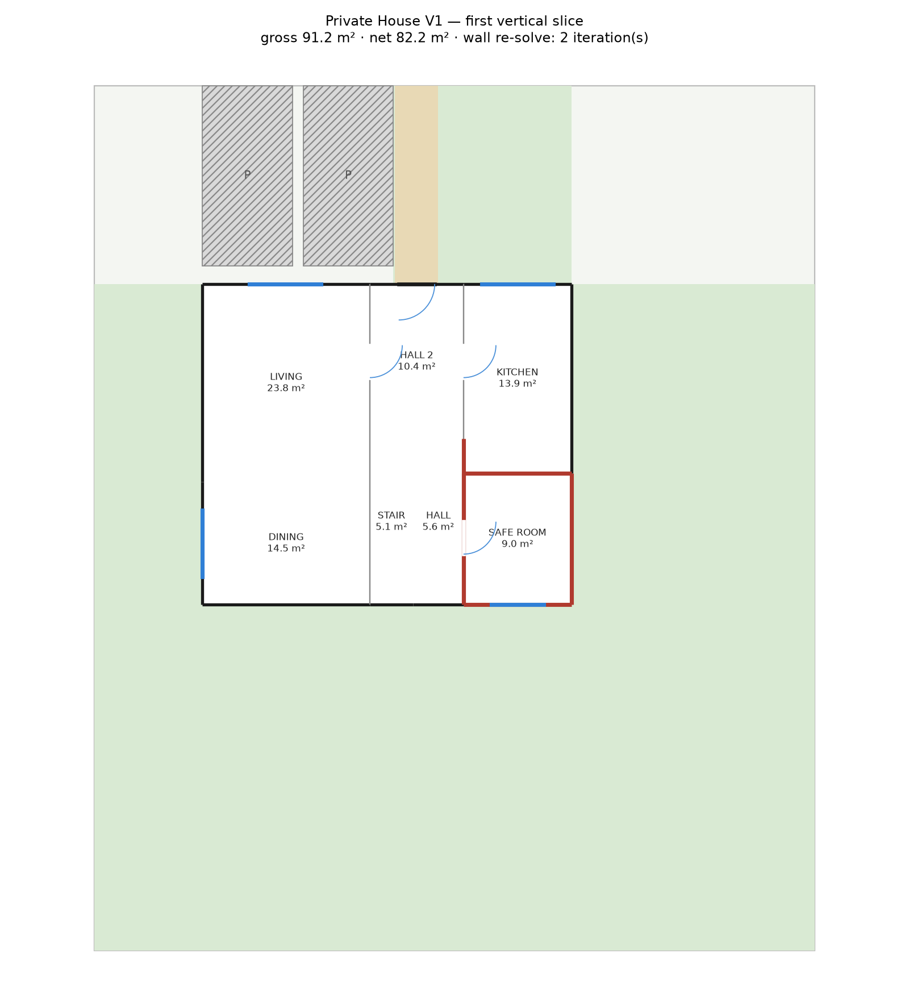

# Multi-Level Phase 1 — two floors, one straight stair: investigation report

**Date**: 2026-09-16 · **Status**: investigation only, no code changed · **Base**: `main` @ `fa1433b`, measured in a detached scratch worktree (the main checkout's uncommitted quality-tier work is not in the numbers) · **Builds on**: `MULTI_LEVEL_AND_HOUSE_CONCEPT_ARCHITECTURE_REPORT.md` (§0–§14) and `MULTI_LEVEL_PHASE_0_REPORT.md`

**Question**: how does the planner choose a stair seat and plan both floors *jointly*, without generating two floor plans that cannot share a stair — and what does a Phase 1 that does this cost in feasibility, area and room quality?

Everything below the verdict is either read from the code or measured by running a scratch coordinator (session scratch, not in the repository) that plans each level with the generator's own internals plus one new input — a pinned core — and runs Geometry Core, doors, windows, furniture, validation and assembly per level **unchanged**. 36 briefs × 4 allocation variants × bedroom split × ≤4 ground outlines × 3 seats × 5 upper massings — 9,858 coordinator trials, 263 complete buildings.

---

## 0. Verdict

| | |
|---|---|
| **Independent floors never align.** | Control: for the 76 (brief, outline, seat) pairs where a building completed with the seam pinned, planning the upper floor *freely* put its stair on the ground's in **0** cases (51 differ by 0.15–0.65 m, 25 do not plan at all at the generator's own seams). The two levels want different column widths, every time. §2. |
| **The coupling is one rectangle and one number.** | A *core band* — an entrance lobby across the band's front, then `[stair strip │ corridor]` behind it — pinned by forced cuts on both levels, plus the **west seam** (the x of the band) handed from the ground plan to the upper planner. With those two pinned, V1 (identical stair rectangle) holds by construction on all 263 buildings. §4, §5. |
| **The ground floor of a two-storey house is not a spine-parti floor.** | Allocation A (public below, private above) planned as `public column │ hall │ private column` fails on **every** outline of every brief (0/…): LIVING+DINING+KITCHEN stack ~12 m deep on one side while the safe room and a WC cannot fill 8 m on the other. It plans only with the **kitchen across the corridor (closed)** beside the safe room. Phase 1 must ship that arrangement — it is a product decision, not a tuning knob. §3, §10. |
| **Feasibility with the measured Phase 1**: **27/36 briefs.** | 3BR 11/12, 4BR 10/12, 5BR 6/12; 1 wet room 6/12 (no ensuite → the master must be ≥ 5.7 m deep beside the flight); narrow 9 m sites 7/9. Refusals are all named (§11.3); nothing generic. |
| **What it costs.** | Delivered area median 103 % of the request (94–112 %), split ~50:50 between levels, stair 5.4 % of the total gross (5.1 m² per level), **circulation 20 % per floor (single-storey reference: 11 %) — a ~12 m² lobby on each level is the excess**, bedroom aspect median 1.24 but 27 % of bedrooms and 40 % of masters past 1.5. §10, §11. |
| **Geometry Core: unchanged.** | Every level plan of the 9,858 trials went through `solve_fixture`, `generate_interior_doors`, `generate_windows`, `validate`, `assemble` exactly as the single-storey path does. §12. |
| **Smallest safe phase.** | Allocation A only, kitchen-across-the-corridor ground, the core-band seat at the rear, upper = ground or a west/east retreat, per-level C-checks with a `LevelContext`, V1–V5 + V7 + V8. ~1,100 lines new (allocation ~150, pinned level planner ~250 as a *second entry point* of the generator, coordinator ~250, validator ~150, contract/UI ~300), zero lines inside `_build`/`_allocations`. §13. |

---

## 1. What exists and what this adds

Phase 0 (`010-multi-level-phase0`, merged) gives: `HouseConcept` on `ArchitecturalSpec`, `ProgramSpec.total_built_area_m2` (alias), `VerticalCore`, `Level`/`LevelEntry`/`LevelPlan`/`Massing`/`Building`, `building_validation.validate_building` running V2 and V7 only, `DemoBuilding` beside `DemoPlanSet.plan`, `floors` on the review screen. Nothing produces a `VerticalCore`; `SUPPORTED_FLOORS` is still 1.

What the code cannot do today, verified again on `fa1433b`:

- `generate_concepts` derives rooms from `ProgramSpec` (`programme_variants` → `build_room_program`) — there is no way to hand it a level's room list.
- `_allocations` places no CIRCULATION room but `HALL`; `_concept_from` builds one V-V tree with a single `HALL` leaf; `_contains_hall` keeps exactly the root→HALL cuts forced in the free twin.
- `plan_layout` derives the hall width from area; no caller can pin the seam.
- `_realize` always resolves a street entrance and builds a site plan; `validate` always seeds C5 from `OUTSIDE` and runs the site checks.

None of these is a Geometry Core limit. §12.

---

## 2. Why the floors cannot be planned independently — and what the coupling is

### 2.1 The control measurement

For each of the 76 completed (brief, ground outline, seat) pairs, the upper programme was planned again with the seam **free** — `_seam_options` around the area-share natural, the generator's own rule — and its stair rectangle compared with the ground's:

| outcome | pairs |
|---|---|
| free upper seam coincides with the ground's | **0** |
| differs (Δx = −0.65 … +0.65 m, mode −0.40) | 51 |
| upper does not plan at any of its own nine seams | 25 |

The ground's natural seam is set by LDK versus kitchen + safe room; the upper's by master + ensuite versus bedrooms + bath. They differ by a few decimetres in every case, and a few decimetres is a different stair rectangle. Reconciling afterwards is not an option: the stair *is* the seam.

### 2.2 The minimum information both level planners need

Exactly this, in plot-absolute units, and nothing more:

```
PinnedCore
  band_x_u          the west edge of the core band  (= the ground's realized west column width)
  band_w_u          strip + corridor                (seat parameter)
  strip_w_u         the stair's width               (seat parameter)
  stair_len_u       the flight's length             (from the stair geometry contract, §9)
  lobby_depth_u     = level depth − stair_len       (derived per level; equal when depths are equal)
  strip_side        WEST | EAST of the corridor      (Phase 1: WEST)
  position          REAR | FRONT                    (Phase 1: REAR)
```

The upper planner receives the ground's realized `band_x_u` — not its planned one: `_columns_at_seam` plans at 5 cm steps and Geometry Core lands the seam exactly where the forced root cut says, so the realized rect's `x` is the authority (`solve.rects["STAIR"].x`). With the same `band_x_u`, `strip_w_u`, `stair_len_u` and level depth on both levels, the stair leaf's forced cuts are identical and V1 is true by construction; the validator still proves it.

### 2.3 What is NOT shared

Everything else is the level's own: its rows, its row depths, its east column width (it follows from the outline width), its free twin. The upper level's seam may be *pinned* even when the outline retreats — the band's x is plot-absolute, the retreat only changes the strip-side column's width (`band_x − upper.x`).

---

## 3. Programme allocation contract

### 3.1 The type

```
LevelProgram                                   # new, beside ProgramRoom in concept_generator (or a sibling module)
  level_index:     int
  rooms:           list[ProgramRoom]            # includes HALL (corridor), HALL_2 (lobby), STAIR — the core is IN the programme
  strip_rows:      list[list[ProgramRoom]]      # the column on the stair's side, FRONT to REAR, explicit
  corridor_rooms:  list[ProgramRoom]            # the other column; rows by the generator's own rules
  open_plan:       bool
  closed_kitchen:  bool                         # the kitchen is a corridor-side room with its own door (§3.3)
  target_gross_m2: float                        # this level's share of the TOTAL (§8)
```

`allocate_levels(program, concept) -> list[tuple[LevelProgram, LevelProgram]]`: pure, deterministic, bounded, expressed in `ProgramRoom`s built from `ROOM_TEMPLATES` and `resolve_wet_rooms` exactly as `build_room_program` builds them. No room count is hard-coded; the rules below are class rules.

### 3.2 Rules — what stays cross-floor

| Class | Rule | Why it must be cross-floor |
|---|---|---|
| HARD | The entrance level holds the entrance lobby and the public entrance sequence. | `resolve_entrance` / C11 / C16 exist on one level only. |
| HARD | `STAIR` appears in **both** level programmes with the same zone id, template `STAIRWELL`, group CIRCULATION; `HALL` (corridor) and `HALL_2` (lobby) appear in both. | The core is real area on both levels (V7); the arrival needs circulation on the upper level (V5). |
| HARD | An ensuite is on its host's level (`entered_from` already carries this). | `_build_access` declares the door from the host. |
| HARD | Every level with a bedroom-class room has a full bathroom on it; the ground gets a wet room only if the brief has one to give (guest WC, or a shared bath when ≥ 2). | 007's access invariant, per level. Measured consequence: allocation **C** (one bedroom below) is refused for every brief in the matrix — with 1–3 wet rooms there is never a spare full bathroom for a ground bedroom. C needs a fourth wet room or a relaxed rule (product question, §14). |
| HARD | Requested rooms appear exactly once across the building (V8). | Trivial, but the allocation is where it could break. |
| HARD | **The row at the stair end of the strip side needs no corridor door.** Ground: the open-plan public rooms (LIVING at the lobby end with its cased opening; DINING/KITCHEN behind). Upper: the master's ensuite stacked *behind* the master as its own full-width row, entered from the master. | The geometry of a straight flight open to a corridor: whatever sits beside the flight on the far side has no circulation frontage for its length (§4.2). This is the one rule that ties allocation to the seat. |
| PREFERENCE | Safe room on the entrance level (it is one of the bedrooms — the census). `Au` (safe room above) is a legal variant; it was refused in the matrix for a different reason: with it, the ground's corridor side is *empty* for 2-wet-room briefs. | — |
| PREFERENCE | Master below (variant **B**) is legal; it completed only for 5BR-3wet (2 buildings): the ground's corridor side (master + ensuite + safe + WC) needs 4.8 m of width beside a 2.6 m band and the public side ≥ 3.2 m — 10.6 m minimum. | — |
| ENGINE | How many secondary bedrooms sit on the strip side of the upper floor (`k` = 0…bedrooms−1, in front of the master). Measured: k=1 wins 183/263, k=0 66, k=2 12. Not a preference — a search variable with a bound of `bedrooms`. | — |
| ENGINE | The level targets (§8), the ground outline, the upper massing, the seat parameters. | — |

### 3.3 The ground-floor finding

Variant A planned as the spine parti (`public column │ band │ [safe room, WC]`) fails on **every** ground outline of every brief: `COLUMN_DEPTH_EXCEEDED` (LDK needs 11.5–12.3 m stacked at a ~5 m width; the outlines are 8–11 m deep) or, when the seam widens the public column, `ROOM_ABOVE_MAXIMUM_AREA` on the private side (a safe room at elasticity 0 and a 6 m² WC cannot absorb 8 m of column depth). This is the arithmetic of a floor whose private programme is two rooms.

The arrangement that plans — used for every completed building — puts the **kitchen across the corridor as a closed room** with its own door from the lobby, beside the safe room: `[LIVING, DINING] │ lobby / [stair │ corridor] │ [KITCHEN, SAFE_ROOM, WC]`. The open group is LIVING–DINING only. For a brief with `open_plan_living = true` this is a *reinterpretation* (an LD open space with a closed kitchen), and it must be reported on the review screen the way a dropped preference is (`_set_aside`), not silently. The alternatives — a front public band with the core behind it, or the L with a public wing — are Phase 2+ partis; neither was measured here.

---

## 4. Vertical core: the seat, and what changes on `VerticalCore`

### 4.1 Why the obvious seats fail — the geometry of a straight flight

A straight flight's entry (bottom step) and arrival (top step) are its two ends, `L ≈ 4.5 m` apart. On a single straight corridor, every seat was checked against "both ends face circulation on their level":

| Seat | L0 entry | L1 arrival | Verdict |
|---|---|---|---|
| Rear (or front) segment of the hall column, in line with it (the E3 seat) | ✓ from the corridor in front | ✗ at the rear exterior wall; nothing behind it on L1 and the corridor in front is across the void | **Dead.** |
| Transverse row across a column, entered from the corridor end | ✓ | ✗ far end is the exterior wall | **Dead.** |
| In line with the corridor, mid-column, lobby beyond it on L1 | ✓ | ✓ into a rear lobby | The flight *severs* the L1 corridor: rooms in front of it are reachable only across the void. **Dead.** |
| **Beside the corridor, long side open to it** (the core band) | ✓ bottom end of the open side, or head-on from the lobby | ✓ top end of the same open side onto the corridor | **Works on both levels.** The cost: the strip-side rooms beside the flight have no corridor frontage for `L` metres. |

So Phase 1's seat is the last row, and the allocation rule "the row at the stair end of the strip side needs no corridor door" is its direct consequence — not a preference.

### 4.2 The core band — the shape both levels pin

```
      x = band_x                  x = band_x + band_w
      │  lobby  HALL_2  (band_w × (fh − L))       │   ← front: entrance on L0 (door span ≥ 2.0 m ✓), landing on L1
      ├──────────┬──────────────────────────────────┤   y = fh − L
      │  STAIR   │  HALL (corridor, c × L)           │   ← rear: the flight, open along its east side to the corridor
      │  (s × L) │                                   │
      └──────────┴──────────────────────────────────┘   y = fh
```

Tree: `V(strip-side column, V(H(HALL_2, V(STAIR, HALL) @ s) @ fh−L, corridor-side column) @ band_w) @ band_x` — every cut in the band forced; the three leaves one wall-less open group (the flight is open to the lobby at its foot and to the corridor along its side; the void on L1 has a balustrade the 2D wall model does not draw). Row cuts in both columns are released in the pinned twin, exactly as `_unforced` releases them today with `_contains_hall` generalised to `_contains_pinned = {HALL, HALL_2, STAIR}`.

Why the lobby spans the *whole* band rather than the strip alone: a 1.4 m corridor and a 1.2 m strip cannot each hold the front door (`resolve_entrance` needs a door width of wall on both sides = 2.0 m of frontage), and a 2.6 m lobby can; and every corridor-side room then borders circulation over its full depth (front rows the lobby, rear rows the corridor). Measured on the first attempt with the strip alone: the door went into the living room and HALL_2–HALL came out walled (the stair leaf sat between them in the tree). Both went away with the band-wide lobby.

Rear rather than front: with the flight at the front, LIVING (the first public row) would border the stair instead of the lobby and lose its cased opening. The front position needs the public column reversed (LIVING at the garden end) — legal, architecturally attractive, and untested here.

### 4.3 `VerticalCore` — contract changes

`vertical.py` as merged carries `footprint_u`, `entry_edge`, `arrival_edge`, `direction`, archetype and the parameter fields. Two changes, both additive:

| Field | Change | Reason |
|---|---|---|
| `entry_edge`, `arrival_edge` | Keep, but their meaning for `STRAIGHT` is **the long side facing the corridor**, with the entry *zone* at the bottom end and the arrival *zone* at the top end of that side; add `entry_zone_m` and `arrival_zone_m` (PARAMETER, default 1.0). | A straight flight open to a corridor is entered and left sideways; the short ends are not the openings. V5 measures the shared circulation edge over the zone length at the right end. |
| **new** `corridor_zone_id`, `lobby_zone_id` | The circulation leaves the core is realized against on each level (`HALL`, `HALL_2`). | V5 and the renderer need to know which neighbours are "circulation" without re-deriving it from roles. |
| **new** `PinnedCore` (§2.2) | The *input* form: plot-absolute band geometry handed to both level planners. `VerticalCore` is the *output* form, built from the two realized plans. | Keeps the planner's input free of level ids and archetype semantics. |
| `direction` | For `position = REAR`: `Side.S` (rising toward the rear). | Renderer's arrow; V5's "which end is the top". |

Nothing else changes. `width_m`, `going_m`, `rise_m` are filled from the §9 parameters with their provenance.

---

## 5. The joint search — a bounded coordinator above `run_general`

```
plan_building(spec) -> list[Building]                          # new module, e.g. vertical_slice/coordinator.py
  for (L0prog, L1prog) in allocate_levels(program, concept):           ≤ 3 sets  (Phase 1: A only)
    g_target, u_target = split_target(total, L0prog, L1prog)           §8
    for outline in ground_outlines(site, g_target):                    ≤ 4  (feasible_options, behind the parking band)
      for seat in SEATS:                                               ≤ 3  (s, c) — Phase 1 could ship one
        L0 = plan_level(L0prog, outline, core=PinnedCore(seat, band_x=FREE))   # seam searched: ≤ 3 seams × (forced, pinned twin)
        if not L0: record reason; continue
        core = PinnedCore.from_realized(L0)                            # band_x := realized stair x
        for massing in upper_massings(outline, core):                  ≤ 5  (same, W1, W2, E1, W1E1)
          for k in range(bedrooms):                                    ≤ 4  (strip-side bedroom count — Phase 1 could fix k by rule)
            L1 = plan_level(L1prog(k), massing, core)                  # seam PINNED; ≤ 3 seams never — one
            if not L1: record reason; continue
            building = Building(L0, L1, core); V = validate_building(building)
            if V.ok: yield building   (fast path: stop at the first; survey: keep all)
```

**Bounds, measured**: full enumeration is 24.8 s median per brief (max 70 s) at 177 ms per completed *pair* of solves — i.e. the search is planner-bound, not solver-bound. **7,558 of 7,567 upper refusals and 1,855 of 1,980 ground refusals happen inside `plan_level` before any solve** (`COLUMN_DEPTH_EXCEEDED`, `SEAM_PINNED_OUTSIDE_WINDOW`, `ROOM_ABOVE_MAXIMUM_AREA`, `COLUMN_WIDTH_EXCEEDED`, `STAIR_BLOCKS_FRONTAGE`) — the level planner's own arithmetic *is* the early feasibility test, at ~1 ms. Time to the first complete building in enumeration order: 5.3 s median, 25 s max; with the order below and the survey/re-run split from 006 (`_plan_outlines_until_one_plans`) the common case is a few seconds.

**Order that finds a building soonest** (from the 263): allocation A → outline nearest the target → seat `(1.2, 1.4)` → massing `same` then `W1` → k = 1 then 0. `A/column` never completes and should not be tried; `B` completes only for large programmes and belongs after A.

**Where it sits**: above `run_general`, which stays the single-storey path untouched. `plan_level` is a second *entry point* into `concept_generator` that takes `(LevelProgram, outline, PinnedCore)` and returns `ConceptCandidate`s; it shares `scale_program`, `_rows_of`, `_orient_row`, `_daylight_order`, `_seam_options`, `_columns_at_seam`, `_row_widths`, `_zone_spec`, `_specs_within_maxima`, `_forced_chain`, `_build_access`, `_free_twin` (generalised) and `wet_rooms_of` — the scratch coordinator used exactly these and nothing else from the generator. No `if floors == 2` anywhere: `_build`, `_allocations`, `generate_concepts` are not called and not changed.

**Per-level realization**: `_realize` as-is for the ground. For the upper level it needs a `LevelContext(kind=UPPER, entry=STAIR_ARRIVAL)` so that `resolve_entrance`/`_site_plan_for` are skipped, C5 is seeded from the stair, and C7's street-door clause and C10/C11/C12/C16/C18 are *not run*. The scratch harness ran `_realize` unchanged on the upper level and filtered the report afterwards — proof that nothing below `validate` cares which level it is.

---

## 6. Upper-floor massing

Phase 1 rule: **the upper outline is the ground outline or a single-side retreat on the west or east, same depth.** Measured over the 263 buildings: `same` 142, `W1` 84, `W2` 27, `E1` 7, `W1+E1` 3. A west retreat is what makes a 5–6 m public column usable as a 4–5 m suite column; the east retreat is rare. The retreat strip (9.2 m² median when used) is the roof terrace — `Massing.retreat_m2` already counts it; it needs an `OutdoorRegion(TERRACE)` classification on L1 (Phase 0 left it unclassified).

Not admissible in Phase 1, with the reason: a **rear or front retreat** moves the stair line (`fh − L`) or the lobby depth between levels — the core's forced cuts would differ; a **different depth** likewise. **Rectangle over L / L over compatible regions**: `Massing.level_regions_m` already represents it, and the L parti (`l_parti.py`) pins its hall to the seam with forced cuts the same way — but the L's hall spans the seam and the core band would have to be the seam itself. Untested; the seat rules of §4.1 (the flight beside a corridor with an open long side) apply unchanged to whichever wing holds it. Defer to a later phase with its own measurement, as the architecture report's Phase 5 already says.

V2 (containment) is the only massing check and it ran on every building (0 failures — the coordinator only proposes contained outlines).

---

## 7. Building validation — per-level C versus whole-building V

**Per level, unchanged (C1–C9, C13–C15, C17, C20–C22)** and **skipped on the upper level (C10, C11, C12, C16, C18 — site checks — and C7's street-door clause)**. C5 is seeded from the level's `LevelEntry`: `OUTSIDE` on the ground, `STAIR` above. `realized_corridor_width_m` (C14) already ignores a `(STAIRWELL,)` zone; the stair's roles must stay `(STAIRWELL,)` — a test should pin it.

**Whole building, minimum Phase 1 set** (the scratch validator ran these on all 263; 0 failures):

| Code | Check | Evidence needed |
|---|---|---|
| V1 | `rects_L0["STAIR"] == rects_L1["STAIR"]` in plot units | two solves |
| V2 | upper regions ⊆ lower regions (exists) | massing |
| V3 | no other zone on either level overlaps the core rect (C1 per level implies it; asserted in building terms so it survives a non-zone core) | two solves |
| V4 | one BFS: `OUTSIDE → L0 realized graph → STAIR → L1 realized graph` reaches every zone of both levels; the level-side halves are C5 with the right seed | realized connections per level (`validation.realized_connections`) |
| V5 | L0: the stair's open long side shares ≥ `entry_zone_m` with a HALL-role zone at the *bottom* end (or its bottom short end with the lobby); L1: ≥ `arrival_zone_m` at the *top* end. Never a bedroom, bathroom or safe room. | rects + roles |
| V6 | two safe rooms on different levels are vertically aligned — vacuous in Phase 1, numbered now | — |
| V7 | each level's gross = its regions' area; ground on the plot; coverage a ratio; total = Σ levels (exists) | — |
| **V8** (new) | requested rooms appear exactly once across the building: `MASTER` 1, `BEDROOM` n−1, `SAFE_ROOM` 0/1, `LIVING`/`KITCHEN` 1, wet rooms = `wet_rooms`, `STAIRWELL` = story count | zones of both levels |

V4 and V5 are the only ones that need geometry the level checks do not already produce; both are ~30 lines over `realized_connections` and `Rect.shared_edge_len_u`.

---

## 8. Area semantics

`ProgramSpec.total_built_area_m2` is the request **for the whole house**; nothing below the allocation stage reads it. The coordinator derives:

```
g_target = total × target_gross(L0prog) / (target_gross(L0prog) + target_gross(L1prog))
u_target = total − g_target
```

with `target_gross_area_m2` (the existing function) applied to each level's room list *including its hall, lobby and stair*. For allocation A this lands at 50–53 % on the ground (measured: median 0.50). Only `g_target` meets the site: `feasible_options(site_behind_parking_band, g_target)` is reused unchanged for the ground outline; the upper outline is bounded by the ground's, never by the plot.

Delivered: `Building.total_gross_m2 = Σ level gross` (exists). Measured on the 263 buildings: median 103 % of the request, min 94 %, max 112 % — the same tracking behaviour as the single-storey `_proportions` rule, applied per level. A 160 m² request produced 178 m² (89 + 89), never 160 + 160.

**Capacity** is per level: `program_capacity_gross_m2(L0prog)` and `(L1prog)`; the scope gate's `one_storey_capacity_m2` becomes a check on `g_target`, and the `BUILT_AREA_EXCEEDS_ONE_STOREY_CAPACITY` refusal gains its computed "two storeys could reach …" line from `Σ capacity` (Phase 0 deferred it for exactly this).

What the totals hide and the contract must show: **15–20 m² of the total is circulation the single-storey house does not have** (a second lobby and the stair on both levels — §10). The per-level and total figures on `DemoBuilding.totals` should carry `circulation_m2` and `stair_m2` beside `gross`/`net`.

---

## 9. Stair geometry contract — demo assumptions, with provenance

Every value below is **PARAMETER · UNVERIFIED**: a plausible working figure for a private house, not a regulation. They belong in one place (a `StairRule` beside `FLOOR_TO_FLOOR_M` in `building.py`, or the RuleSet when one exists) and every derived number cites them.

| Quantity | Value used | Derivation / provenance |
|---|---|---|
| Floor-to-floor | 3.0 m | `building.FLOOR_TO_FLOOR_M` (Phase 0 placeholder) |
| Riser | 0.175 m | assumption |
| Going | 0.28 m | assumption |
| Risers | 17 | `round(3.0 / 0.175)` |
| Run (treads) | 4.48 m | `16 × 0.28` |
| **Stair leaf length `L`** | **4.6 m centerline** (4.5 net) | run + two half-partitions, snapped to the 5 cm grid |
| **Stair width `s`** | 1.2 or 1.3 m centerline (1.1 / 1.2 net) | `STAIRWELL.min_short_side_m = 1.1` + two half-partitions |
| Corridor `c` | 1.4 or 1.6 m centerline (1.2 / 1.4 net) | `HALL.min_short_side_m = 1.2` + allowance; the same figure `_hall_width_m` derives |
| Entry / arrival zone | 1.0 m | assumption — clear circulation at the bottom and top step |
| Headroom under the flight | not modelled | needs 3D; a rules question |

The `STAIRWELL` template (4–12 m², min short side 1.1, aspect ≤ 4.0, elasticity 0) admits this leaf (5.1 m² net, aspect 3.9–4.1 — the ZoneSpec in the harness used 4.2 to keep 1.1 × 4.5 inside; the template's 4.0 should be raised to 4.2 or `s` kept at 1.2). The stair's area is *fixed* by construction (both cuts forced), so elasticity 0 is respected without any change to `scale_program`.

Not included, deliberately: a landing inside the flight, winders, L/U archetypes, balustrade, headroom, minimum widths by occupancy. When a rules source supplies riser/going/width minimums, only the table above changes.

---

## 10. Massing + stair interaction — measured effects

Over the 263 complete buildings (§11 for the matrix):

| Effect | Measured | Cause | Phase 1 remedy |
|---|---|---|---|
| **Excessive hall / lobby** | Circulation share **20 % of room area on L0, 22 % on L1** (single-storey reference ≈ 11 %). The lobby is 12.0 / 12.4 m² median — `band_w × (fh − L)` = 2.6 × 4.3–5. | The band is 2.6 m wide for the whole depth; only its rear `L` is stair + corridor. | Give the strip's front part on the corridor's far side to a room: a guest WC on L0 (1.2 × ~4 m fits `TOILET`), a store/laundry on L1 — the lobby shrinks to `c × (fh − L)` ≈ 6 m². Not measured; it changes the band tree to `V(H(room, STAIR), H(HALL_2, HALL))`, still all forced. |
| **Stair area** | 5.1 m² per level, **5.4 % of the total gross** (4.4–6.8 %). | Fixed by §9. | None; report it. |
| **Narrow bedrooms / strips** | Bedroom aspect median 1.24, **27 % > 1.5**; master median 1.25, **40 % > 1.5**; safe room 12 % > 1.5. Best-per-brief (worst bedroom-class aspect minimised): ≤ 1.5 on 12/27 briefs; the strips are the **master on the strip side when no ensuite exists** (1-wet: 1.9) and **two bedrooms on a 9 m site** (5BR: 1.6–1.8). | One room per row: the strip-side column must be as wide as the ground's public column (minus the retreat), and the master row must be deep enough to reach past the flight. | The retreat (W1/W2) and the k-split are the levers the search already has; a stacked `[BEDROOM │ BEDROOM]` shared row on the corridor side (tier-2 repartition) would fix the 5BR cases — the known row-sharing limit. |
| **Oversized ensuite** | Ensuite median 6.7 m², max 11.9 m² (template max 12). | The ensuite row absorbs the strip-side column's leftover depth behind the master. | Accept (within maxima) or split the rear row `[ENSUITE │ DRESSING]` — `DRESSING_ROOM` exists in the vocabulary with no producer. |
| **Fragmented public area** | The kitchen is across the corridor from the dining room on **every** building (§3.3). LIVING aspect median 1.28 (40 % > 1.5), KITCHEN 1.77. | The spine parti cannot balance three stacked public rows against two private ones. | Product decision (closed kitchen reported as a reinterpretation) now; a front-band or L ground floor later. |
| **Dead space** | None: Geometry Core tiles exactly (C2) and the lobby is the sink. The *terrace* over a retreat (9.2 m² median) is outdoor, not dead — needs classification. | — | `OutdoorRegion(TERRACE)` on L1. |
| **Loss of usable area** | Net/gross 0.90 per level (unchanged); delivered 103 % of the request. Relative to a single-storey house of the same request: +1 lobby (~12 m²) +2 × stair (~10 m²) ≈ **22 m² more circulation**. | Two levels, one core. | Show it (§8). |
| **Impossible L seams** | Not measured (rectangles only). The core band would have to *be* the L's seam hall. | — | Phase 5. |

**Early feasibility tests** worth running before any solve, in this order (each is what actually refused most trials):
1. `west_min + east_min ≤ outline_w − band_w` (`COLUMN_WIDTH_EXCEEDED`) — with the safe room's RC allowance in `_column_min_width` (the 92 `GEOMETRY_INFEASIBLE` ground refusals are a 2.6 m safe-room column netting 2.3 m).
2. Strip-side rows: the row at the stair end needs no corridor door; every other strip-side room's planned depth reaches the lobby by ≥ 1.1 m (`STAIR_BLOCKS_FRONTAGE`, 241 refusals).
3. Both columns' floors ≤ depth and wants ≤ depth within maxima (`COLUMN_DEPTH_EXCEEDED` 3,274, `ROOM_ABOVE_MAXIMUM_AREA` 1,857) — the existing `_row_depths`.
4. Upper only: the pinned seam inside the upper's `[west_min, usable − east_min]` window (`SEAM_PINNED_OUTSIDE_WINDOW`, 1,912) — the cheapest test of all and the one that tells the coordinator to try a retreat.

---

## 11. Test matrix

### 11.1 Setup

- Programmes: 3/4/5 bedrooms × 1/2/3 wet rooms (default kinds: 1 → shared bath; 2 → ensuite + bath; 3 → ensuite + guest WC + bath), safe room, open plan, 2 parking. Requests: 3BR 170, 4BR 200, 5BR 230 m², ±10 per wet room.
- Sites (plot → buildable at the default setbacks): **regular** 20 × 24 → 14 × 14.5; **narrow** 15 × 30 → 9 × 20.5; **wide** 26 × 20 → 20 × 10.5; **deep** 18 × 32 → 12 × 22.5. Rectangles only; the L is not measured (§6).
- Search: allocation variants `A/column`, `A/double` (kitchen across), `B/double`, `C/double` × k = 0…bedrooms−1 × ground outlines at ratios 0.95/1.15/0.75/1.45/1.8 clipped to the site × seats (s, c) ∈ {(1.2, 1.4), (1.3, 1.4), (1.2, 1.6)} × upper massing {same, W1, W2, E1, W1E1} × sizing tiers {normal, shrunk, over-preferred, both} × {forced tree, pinned twin} × ≤ 3 seams. Full enumeration, no early stop.

### 11.2 Results per brief (first complete building in enumeration order)

| Brief | buildings | variants | ground outlines (w × d) | massings | total / request | ground share | stair % | circulation L0 / L1 | worst bedroom-class aspect |
|---|---|---|---|---|---|---|---|---|---|
| 3BR-1wet regular/wide/deep | 3 each | A k1 | 9.2 × 9.7 | same | 178 / 160 = 1.11 | 0.50 | 5.7 | 0.22 / 0.23 | 1.91 |
| 3BR-1wet narrow | 3 | A k1 | 9.0 × 9.9 | same | 1.11 | 0.50 | 5.7 | 0.23 / 0.23 | 1.96 |
| 3BR-2wet regular/wide/deep | 21 each | A k0, k1 | 10.25 × 8.9 · 11.5 × 7.9 · 9.3 × 9.8 | same, W1, W2 | 182 / 170 = 1.07 | 0.50 | 5.6 | 0.22 / 0.23 | 1.69 (best 1.17) |
| 3BR-2wet narrow | 6 | A k0, k1 | 9.0 × 10.1 | same | 1.07 | 0.50 | 5.6 | 0.23 / 0.23 | 1.87 |
| 3BR-3wet regular/wide/deep | 18–21 | A k0, k1 | 10.65 × 9.25 · 11.95 × 8.25 · 9.65 × 10.2 | same, W1, W2 | 188 / 180 = 1.04 | 0.52 | 5.4 | 0.19 / 0.21 | 1.69 (best 1.46) |
| 3BR-3wet narrow | **0** | — | — | — | — | — | — | — | `COLUMN_WIDTH_EXCEEDED` 36, `COLUMN_DEPTH_EXCEEDED` 20 |
| 4BR-1wet regular/deep | **0** | — | — | — | — | — | — | — | `COLUMN_DEPTH_EXCEEDED` 90, `SEAM_PINNED_OUTSIDE_WINDOW` 70 |
| 4BR-1wet narrow / wide | 3 / 3 | A k1 | 9.0 × 11.05 / 9.45 × 10.5 | same | 1.05 / 1.04 | 0.50 | 5.1 | 0.24 / 0.24 · 0.22 / 0.23 | 1.90 / 1.56 |
| 4BR-2wet regular/wide/deep | 6–8 | A k1 | 10.75 × 9.35 (· 9.6 × 10.5) | same, W1 | 201 / 200 = 1.00 | 0.50 | 5.1 | 0.19 / 0.19 | 1.75 (best 1.25) |
| 4BR-2wet narrow | 3 | A k1 | 9.0 × 11.2 | same | 1.01 | 0.50 | 5.1 | 0.24 / 0.24 | 1.58 |
| 4BR-3wet regular/wide/deep | 21–26 | A k1 | 10.1 × 10.7 · 11.15 × 9.7 · 12.5 × 8.65 · 9.0 × 12.0 | same, W1, W2, E1 | 216 / 210 = 1.03 | 0.50 | 4.7 | 0.20 / 0.21 | 1.40 (best 1.21) |
| 4BR-3wet narrow | 3 | A k1 | 9.0 × 12.0 | same | 1.03 | 0.50 | 4.7 | 0.24 / 0.25 | 1.71 |
| 5BR-1wet all four | **0** | — | — | — | — | — | — | — | `COLUMN_DEPTH_EXCEEDED` 126–173, `SEAM_PINNED_OUTSIDE_WINDOW` 73–96 |
| 5BR-2wet regular/narrow/deep | 3–4 | A k1, k2 | 9.05 × 12.05 | same | 218 / 230 = 0.95 | 0.50 | 4.7 | 0.24 / 0.24 | 1.78 (best 1.60) |
| 5BR-2wet wide | **0** | — | — | — | — | — | — | — | `COLUMN_DEPTH_EXCEEDED` 240 (10.5 m site depth) |
| 5BR-3wet regular/narrow/deep | 4 each | A k1/k2, B k2 | 9.35 × 12.45 · 11.65 × 12.25 · 9.0 × 12.95 | same, W1E1 | 233 / 240 = 0.97 | 0.50 | 4.4 | 0.23 / 0.24 | 1.76 |
| 5BR-3wet wide | **0** | — | — | — | — | — | — | — | `COLUMN_DEPTH_EXCEEDED` 209 |

**Feasible: 27 / 36.** By bedrooms 11 / 10 / 6 of 12; by wet rooms 6 / 11 / 10 of 12; by site: regular 7, wide 6, deep 7, narrow 7 of 9.

### 11.3 Refusal reasons (all 9,595 refused trials)

| Ground (1,980) | | Upper (7,567) | |
|---|---|---|---|
| `COLUMN_DEPTH_EXCEEDED` | 1,172 | `COLUMN_DEPTH_EXCEEDED` | 2,102 |
| `COLUMN_WIDTH_EXCEEDED` | 294 | `SEAM_PINNED_OUTSIDE_WINDOW` | 1,912 |
| `ROOM_ABOVE_MAXIMUM_AREA` | 246 | `ROOM_ABOVE_MAXIMUM_AREA` | 1,611 |
| `ROOM_SHAPE_INFEASIBLE` | 112 | `COLUMN_WIDTH_EXCEEDED` | 1,582 |
| `GEOMETRY_INFEASIBLE` (solver) | 92 | `STAIR_BLOCKS_FRONTAGE` | 241 |
| validation (C11, C13/C5) | 33 | `ROOM_SHAPE_INFEASIBLE` | 110 |
| `ROW_WIDTH_EXCEEDED` | 31 | validation (C13/U5) | 9 |

Allocation refusals: 48 — `C` on every brief (no spare full bathroom for a ground bedroom), `Au` on 2-wet briefs (empty ground corridor side). **Building-level V failures: 0** — every pair that planned and validated per level also passed V1–V8, which says the coupling is carried entirely by the pinned inputs.

### 11.4 The common structural failures, by name

1. **The two-storey ground floor has a thin private programme** — the spine parti's private column cannot fill the depth (§3.3). Every `A/column` trial.
2. **No ensuite ⇒ no corridor-free room beside the flight** — the master must be ≥ 5.7 m deep on the strip side (1-wet briefs: masters at 1.9 aspect where it planned, refusal where the column is too wide).
3. **Five bedrooms want ~13 m of depth** on the corridor side at one room per row; wide-shallow sites (10.5 m) refuse, and 9 m sites give 1.6–1.8 bedroom aspects.
4. **The pinned seam is outside the upper's window** in 1,912 trials — the ground's public column is wider than any upper suite column may be; the west retreat is the rescue (84 + 27 buildings) and its bound (2 m) is what leaves 4BR-1wet regular/deep at zero.
5. **The safe-room column's RC allowance** — 92 solver refusals on the ground at the 2.6 m column minimum (nets 2.3 m). The same defect the twin work found for forced cuts, now in `_column_min_width`.

### 11.5 Runtime

177 ms median per completed pair of solves; 24.8 s median per brief for the *full* enumeration (9,858 trials / 248 s ≈ 25 ms each, dominated by refused planner calls); 5.3 s median to the first building in enumeration order without the §5 ordering. `A/column` costs nothing (it refuses in the planner). A production fast path with the §5 order and a survey/re-run split should sit at a few seconds; a hard cap of ~60 level plans per brief is safe (the first building appeared within 36 trials on 3BR-2wet, 108 on 4BR-3wet, 146 on 5BR-2wet).

---

## 12. What reuses Geometry Core — and the rest of the slice — unchanged

- `geometry_core/engine.py`, `model.py`: **unchanged** across every solve of the matrix. Forced cuts pin the core; `_mark_open_interfaces` makes the lobby/stair/corridor group wall-less structurally; the `STAIRWELL` role's exclusion from `MIN_FURNITURE_ENVELOPE_M` and C14 is already right.
- `doors.generate_interior_doors`, `windows.generate_windows`, `furniture`, `validation.validate`, `design_output.assemble`, `renderer.render`: **unchanged per level**. The rendered pair (living/dining west, lobby + [stair │ corridor], kitchen + safe room east; master + stacked ensuite, landing, bedrooms + bath) reads as a house with no renderer change — the stair is drawn as a room named STAIR; the flight symbol and the void are the renderer's Phase 1 work.

   

  *3BR · 2 wet · 170 m² requested → 91.2 + 82.3 = 173.5 m²; ground 10.25 × 8.9, upper retreated 1 m on the west; stair 1.2 × 4.6 at the same rectangle on both levels.*
- `safe_adapter`, `site`, `site_geometry.feasible_options`: unchanged; the ground outline is planned exactly as 006 plans outlines.
- Generator internals reused verbatim: listed in §5.

What the generator needs (and only this): `plan_level(LevelProgram, outline, PinnedCore)` as a second entry point built from those internals; `_contains_hall → _contains_pinned`; `_column_min_width` with the RC allowance; `STAIRWELL.max_aspect_ratio` 4.0 → 4.2 (or `s` ≥ 1.2). `_build`, `_allocations`, `generate_concepts`, the front band, the hub, the L: untouched, byte-identical for `stories == 1`.

---

## 13. The smallest safe implementation phase

**Phase 1a — ship exactly what was measured.**

| Piece | Where | Size | Byte-identity gate |
|---|---|---|---|
| `LevelProgram` + `allocate_levels` (allocation A, kitchen-across ground, k as a search variable, the §3.2 rules) | new `vertical_slice/level_program.py` | ~150 lines + tests | no single-storey caller |
| `PinnedCore` + `plan_level` (the §4.2 band tree, pinned twin, the four early tests of §10) | `concept_generator.py`, additive; or a sibling `pinned_level.py` importing the internals | ~250 lines | every existing test; `_build` untouched |
| `LevelContext` on `_realize`/`validate` (skip site checks and the street door above ground; seed C5 from the entry) | `general_pipeline.py`, `validation.py` | ~40 lines | ground context = today's behaviour, byte-identical |
| Coordinator (§5 loop with the measured order and caps; `Building` assembly; `VerticalCore.from_realized`) | new `vertical_slice/coordinator.py` | ~250 lines | `run_general` unchanged |
| V1, V3, V4, V5, V8 (V2/V7 exist) | `building_validation.py` | ~150 lines | Phase 0 tests |
| Scope gate `SUPPORTED_FLOORS = (1, 2)`; per-level capacity; the reinterpretation note for the closed kitchen; `DemoBuilding` with two levels, `cores[0]`, per-level circulation/stair totals; level tabs, stair symbol, void, terrace | `demo/scope.py`, `demo/contract.py`, `demo/service.py`, frontend | ~300 lines | `DemoDesign` JSON of every `floors == 1` brief byte-identical |
| Stair parameters with provenance (§9) | `building.py` | ~20 lines | — |

Regression gates: all of Phase 0's, plus the 418-context sweep (`spikes/failure_log_sweep/ab.py`) with every `stories == 1` primary byte-identical and latency flat — the coordinator is only entered for `stories == 2`.

**Measure on landing** (the matrix above is the baseline): feasible briefs (27/36), lobby m² (12.0 / 12.4), circulation share (0.20 / 0.22), bedroom-class aspects (27 % / 40 % > 1.5), delivered share (1.03), refusal histogram, ms to first building.

**Explicitly not in 1a**: allocations B/C/Au (B needs ≥ 10.6 m; C needs a wet-room rule decision), the strip-front room that shrinks the lobby (1b — measure first), front-position stair, L massing, rear/front retreats, L/U stairs, editing, concept cards.

---

## 14. Not done, and open questions for review

- **The L**: not measured. `Massing.level_regions_m` can represent it; the core band's relation to the L's seam hall is unexamined.
- **The closed-kitchen reinterpretation** of an open-plan brief is the single product decision Phase 1 cannot avoid. The alternative (a ground-floor parti the generator does not have) is a bigger phase than Phase 1 itself.
- **Allocation C's bathroom rule**: strict 007 per level refuses every C in the matrix. Whether a ground guest room with a guest WC is acceptable is a policy question.
- **The 1-wet-room family** completes only with a 1.9-aspect master; a house of 3–5 bedrooms and one bathroom is rare in the log, and the matrix included it for coverage.
- **Regulation**: stair riser/going/width/headroom, the safe room's permitted level, per-floor rights — none modelled; all entered as parameters with provenance (§9). Two-storey output must be labelled a study until a rules source exists (the architecture report's §6.3 stance).
- **Scratch harness**: the coordinator that produced these numbers is session scratch (~450 lines) and is not in the repository; it can be moved under `spikes/` if the numbers should be reproducible from `main`.

*End of report. No implementation was started.*
