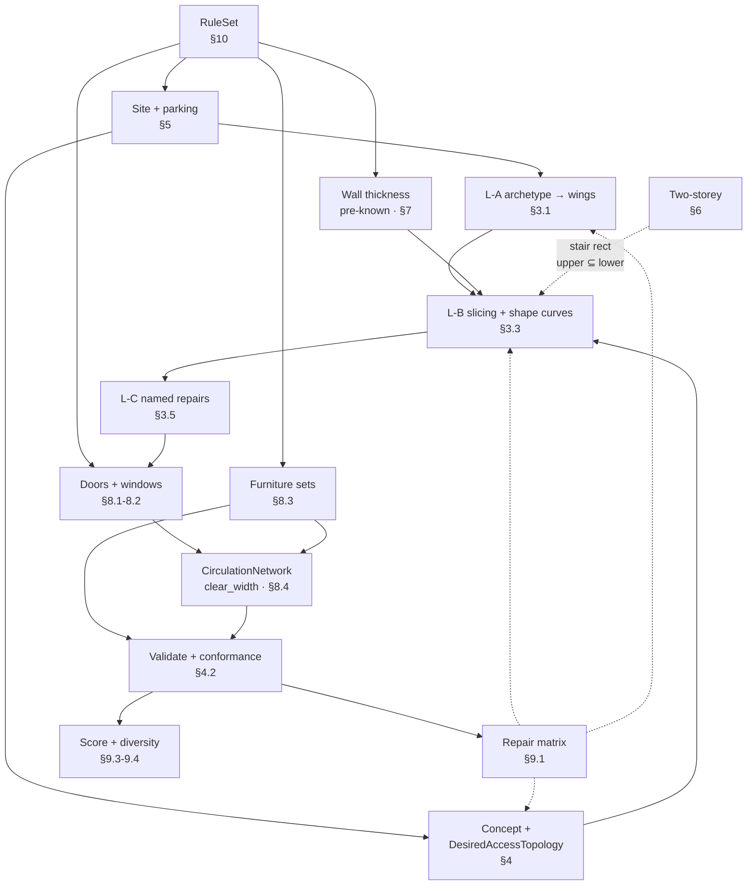

# Private House V1 — Engine Decision Report

| | |
|---|---|
| **Scope frozen** | בית פרטי אחד · 1–2 קומות · 150–180 מ״ר · ממ״ד · חניה · גינה · מרפסת · open-plan · מדרגות |
| **Explicitly out** | בנייני דירות · יחידות מרובות · רכוש משותף · מעליות · 3+ קומות · חניון תת־קרקעי |
| **Domain foundation** | `SPATIAL_ENGINE_SPEC_V2_1.md` — **לא מעוצב מחדש** |
| **Deliverable** | דוח החלטות. **לא נכתב production code** |
| **Date** | 2026-09-08 |

> **הנחת העבודה שמניעה את כל הדוח:** צמצום ה־scope אינו רק ויתור — הוא **משנה את החישוב
> האלגוריתמי**. 10–14 מרחבים, קומה או שתיים, ומעטפת מאחת מחמש משפחות — הופכים בעיות שקשות בכלליות
> לפתירות בדיוק ובמהירות. הדוח מנצל את זה בכוונה, ומסמן במפורש איפה ההרחבה תדרוש החלפה.

---

## 1. מה כבר קיים וניתן למחזור

| רכיב | מצב | החלטה | תיוג |
|---|---|---|---|
| `ArchitecturalSpec` (program/zones/relationships) | עובד; המודל המאומן מייצר אותו טוב (F1 0.78, שגיאת שטח 0.89%) | **REUSE כמות שהוא** | MUST_FOR_DEMO |
| מודל LoRA מאומן | 100% תקינות סכמה על holdout 500 | **REUSE** — אך ראה §10 על התאמת טיפולוגיה | MUST_FOR_DEMO |
| `MockArchitectModelGateway` | שטחי חדרים **קבועים** ולא תלויים בשטח המבוקש (F3 מ־V1) | **REPLACE** — הקצאה פרופורציונלית | MUST_FOR_DEMO |
| `planning/concept_generation.py` — transit roles, hub/destination, tier scoring | רעיון נכון; **קוד מת בפרודקשן** | **REUSE הרעיון**, החלף את הגדרת הקשת | MUST_FOR_DEMO |
| `spatial_v2/scoring.py` — 11 רכיבים מנומקים | חלק מהרכיבים תלויי־אריזה (`balance`, `strip_penalty` מניחים bounding box) | **REUSE חלקית** — מיקוד מחדש | MUST_FOR_DEMO |
| `GeometrySolver` — backtracking packer | הנתיב החי היום. אורז לפינה, משאיר 46–47% שטח מת | **RETIRE** מהנתיב החדש; להשאיר כ־fallback | FOUNDATION_ONLY |
| `GeometricDesign` DTO + תפר הרנדרר | התפר עובד; אוצר המילים חסר (עובי, חלונות, ריהוט, קומות) | **EXTEND** — התפר נשמר | MUST_FOR_DEMO |
| `ArchitecturalFloorPlan.tsx` | מרנדר DTO בלבד, בלי לוגיקה אדריכלית | **EXTEND** | MUST_FOR_DEMO |
| `spatial_edit` — MOVE_ROOM + adapter | דפוס פקודות טוב | **REUSE הדפוס**, לבסס מחדש על הגיאומטריה החדשה | FOUNDATION_ONLY |
| `SelectedFootprint` + UI בחירת מעטפת | מלבן בלבד | **EXTEND** לארכיטיפים | MUST_FOR_DEMO |
| Playwright + vitest harness | עובד | **REUSE** | MUST_FOR_DEMO |
| `spatial_v2/structural_variants.py` — שיקופים והחלפות | מייצר **מראות** של אותה תוכנית — בדיוק מה שלא רוצים (V2 §12) | **RETIRE** | DEFER |

**מסקנה:** התשתית שמעל הגיאומטריה (מודל → spec → concept) ומתחתיה (DTO → renderer) שמישה כמעט
כולה. **מה שחסר הוא המנוע באמצע.**

---

## 2. מה אין לו היום פתרון מספק

| # | פער | חומרה לדמו |
|---|---|---|
| G1 | קונספט → גיאומטריה מדויקת | **חוסם** |
| G2 | מעטפת לא־מלבנית (L / מדורג) | **חוסם** — כל תוכניות ה־reference |
| G3 | מרחב open-plan כיחידה גיאומטרית | **חוסם** |
| G4 | שטחי יעד עם סובלנות + איכות מידתית | **חוסם** |
| G5 | מניעת סליברים ושטח מת | **חוסם** |
| G6 | טופולוגיה רצויה מול ממומשת בלי מעגליות | **חוסם** |
| G7 | אתר + חניה + בית ביחד | **חוסם** |
| G8 | דו־קומתי | חוסם רק אם הדמו דו־קומתי |
| G9 | התכנסות עובי קיר / ממ״ד | **חוסם** |
| G10 | ייצור דלתות וחלונות | **חוסם** |
| G11 | ריהוט כמסנן היתכנות | **חוסם** |
| G12 | Repair ממוקד | גבוה |
| G13 | גיוון מועמדים אמיתי | בינוני |
| G14 | RuleSet לבית פרטי | גבוה |

---

## 3. G1–G5 · מנוע המימוש — ההחלטה המרכזית

### 3.1 ההמלצה: היברידי תלת־שכבתי

```
L-A  ארכיטיפ מעטפת  →  פירוק ל־1–3 אגפים מלבניים        [פרמטרי, מרחב חיפוש זעיר]
L-B  עץ חיתוך לכל אגף  →  מימוד ע״י shape curves          [חלוקה מובטחת, מדויק, מהיר]
L-C  ספריית תיקונים לא־חיתוכיים ממוינים                    [דפוסים בעלי שם, לא חיפוש כללי]
```

### 3.2 למה חיתוך (slicing) הוא הבסיס הנכון דווקא כאן

**חלוקה מובטחת בבנייה** — עץ חיתוך מרצף את המלבן בהגדרה. אין חפיפה, אין חור, **אין שטח מת** —
לא כאילוץ לאכוף אלא כתכונה. זה עונה על G5 מבנית ולא בעונשין.

**אימות מול תוכניות ה־reference** (זו הראיה, לא הטיעון):

| תוכנית | האם היא עץ חיתוך? |
|---|---|
| תוכנית 4 (מלבנית) | **כן, במלואה.** חתך אופקי מפריד רצועה ציבורית מרצועת חדרים; חתכים אנכיים בתוך כל רצועה |
| תוכנית 1 (וילה L) | **כן, פר־אגף.** אגף ציבורי = עלה אחד עם 4 אזורים; אגף פרטי = חיתוך רגיל **+ תיקון אחד** ל־L של מבואת החדרים |
| תוכניות 5/6 (מדורג) | **כן.** המדרגיות היא הארכיטיפ; הפנים חיתוכי, עם עלה אחד שמארח תנועה + פינת עבודה |

שלוש מתוך שלוש, עם **תיקון אחד בעל שם**. זה הבסיס האמפירי להמלצה.

### 3.3 מימוד ע״י Shape Curves — הליבה הטכנית

זו הנקודה שפותרת את G4 **ואת G9 יחד**.

לעלה בעץ חיתוך, אוסף הממדים הקבילים הוא עקומת צורה:

```
leaf_curve(S) = { (w, h) :  area_min(S) ≤ w·h ≤ area_max(S)
                            w ≥ min_width(S) ,  h ≥ min_depth(S) }
```

הרכבה מלמטה למעלה, בזמן פולינומי (Stockmeyer):

```
V-cut:  w = w_left + w_right ,  h = max(h_left, h_right)
H-cut:  h = h_top  + h_bottom ,  w = max(w_top, w_bottom)
```

ואז בוחרים את הנקודה על עקומת השורש שמתאימה למלבן האגף.

**מה זה נותן:**
- שטחי יעד עם **סובלנות אמיתית** — `[area_min, area_max]` ולא מספר יחיד (G4 ✔)
- **רוחב ועומק מינימליים מריהוט** נכנסים ישירות לעקומה (G4, G11 ✔)
- **מהיר ומדויק** — אין חיפוש, אין קירוב, אין timeout
- אי־היתכנות מתגלה **אנליטית**: עקומה ריקה = הצירוף בלתי אפשרי, עם אבחון מדויק איזה עלה גרם

### 3.4 מאיפה מגיע עץ החיתוך

**היררכיית האיזון היא ראש עץ החיתוך.** זה מה שקושר את §4 לכאן:

```
חתך עליון   →  אגף ציבורי | אגף פרטי
חתך שני     →  בתוך פרטי: חדרי שינה | ליבה רטובה + תנועה
חתך שלישי   →  בין חדרי השינה
```

העץ אינו מנוחש ואינו ממוספר על פני כל האפשרויות — הוא **נגזר מהקונספט**, עם אנומרציה חסומה
(≤ 24 עצים) רק בעלים. זה מה שהופך את מרחב החיפוש לזעיר.

### 3.5 שכבת התיקונים הלא־חיתוכיים

ספרייה סגורה של דפוסים **בעלי שם** — לא חיפוש כללי:

| תיקון | מה הוא עושה | נדרש בגלל |
|---|---|---|
| `L_CARVE_CIRCULATION` | הופך עלה תנועה למקטע L/T שנוגע ביותר שכנים | מבואת חדרים, תוכנית 1 |
| `MERGE_LEAVES_OPEN_PLAN` | מאחד עלים סמוכים ל־`PhysicalSpace` אחד עם N אזורים | G3 — open-plan |
| `NOTCH_RECESSED_OUTDOOR` | חורץ שקע למרפסת שקועה | תוכניות 5/6 |
| `SWAP_SIBLING_LEAVES` | מחליף שני עלים תחת אותו צומת | repair |
| `FLIP_CUT_ORIENTATION` | H↔V בצומת | repair |

**`MERGE_LEAVES_OPEN_PLAN` הוא הפתרון ל־G3, והוא כמעט חינם** בזכות V2.1: עלה חיתוך = `PhysicalSpace`
אחד; איחוד שני עלים = `PhysicalSpace` אחד שמארח שני `FunctionalZone`. ההפרדה של V2.1 מתמפה
לגיאומטריה אחד־לאחד.

### 3.6 חלופות שנשקלו ונדחו

| גישה | למה נדחתה **ל־scope הזה** |
|---|---|
| **CP-SAT עם מלבנים** | `area = w·h` לא לינארי → דורש בדידה או `AddMultiplicationEquality` איטי. וחמור מזה: **אינו מבטיח ריצוף** — משאיר חורים, כלומר מחזיר את G5. שימושי כ**ממדד** לטופולוגיה קבועה, לא כמחלק |
| **Grid / cell assignment** | ריצוף וחדרים לא־מלבניים בחינם, אבל: רציפות יקרה, צורות משוננות שדורשות רגולריזציה כבדה, ורזולוציית 25 ס״מ **לא מייצגת מחיצה של 10 ס״מ**. שניות עד דקות לפתרון. **לא ייראה כמו שרטוט אדריכל** — וזה קריטריון הדמו |
| **Rectangular dualization** | מתאים קונספטואלית, אבל דורש גרף מישורי משולש כראוי, לא כל גרף ניתן למימוש, מייצר **מלבנים בלבד**, ו**המעטפת חייבת להיות מלבן** — כלומר נופל על L. **התיאוריה נשמרת** כשער היתכנות זול (בדיקת מישוריות) |
| **SA / אבולוציוני** | אין הבטחת ישימוּת, כיול קשה, לא דטרמיניסטי. לא מתאים לדמו |
| **חיתוך בלבד** | לא מבטא את מבואת ה־L. **לכן L-C** |

### 3.7 מה הארכיטקטורה הזו **לא** יכולה לייצג — הצהרה מפורשת

- טופולוגיות לא־חיתוכיות אמיתיות (סחרחרה/pinwheel) שאינן באחד מ־5 התיקונים
- קירות אלכסוניים או מעוגלים
- חדר שעוטף יותר מפינה אחת
- מעטפת עם חצר סגורה (U/O) — הארכיטיפ יכול, התיקונים עוד לא → **DEFER**
- חדרים בצורת T או + שאינם תנועה

**אם תוכנית reference עתידית תדרוש אחד מאלה** — זו הוספת תיקון בעל שם ל־L-C, לא כתיבה מחדש של
המנוע. זה הקריטריון "ניתן להרחבה פיצ׳ר־אחר־פיצ׳ר" שביקשת.

**תיוג:** L-A · L-B · L-C = **MUST_FOR_DEMO**. שער מישוריות = FOUNDATION_ONLY.

---

## 4. G6 · טופולוגיה רצויה מול ממומשת

### 4.1 המעגליות ופתרונה

המעגליות שזיהית: דלתות נדרשות כדי לגזור את הגרף, שהיה אמור לקבוע את הדלתות. הפתרון הוא **שני
אובייקטים נפרדים**, לא אחד:

| | `DesiredAccessTopology` | `RealizedAccessGraph` |
|---|---|---|
| מתי | **לפני** גיאומטריה (L0) | **אחרי** פתחים (L2) |
| מקור | מנוע הקונספט — **נכתב** | נגזר מפתחים + שיתוף מרחב |
| צמתים | `FunctionalZone` | `FunctionalZone` |
| תוכן | "חדר שינה 1 נגיש מתנועה" | "יש דלת D-07 בין X ל־Y" |
| סמכות | `SOLVER` (קונספט) | `DERIVE` בלבד |

### 4.2 השרשרת — חד־כיוונית לחלוטין

```
ArchitecturalSpec
   ↓  concept engine
DesiredAccessTopology        ← נכתב. אין בו גיאומטריה.
   ↓  L-A/L-B/L-C            ← חייב לספק גבול משותף לכל קשת רצויה
Geometry (BoundarySurface)
   ↓  door generation        ← דלת אחת לכל קשת רצויה
Openings
   ↓  derive
SpatialAdjacencyGraph · RealizedAccessGraph · CirculationNetwork
   ↓
Conformance:  Realized ⊨ Desired ?
```

**אין מעגל:** הרצוי נכתב, הממומש נגזר, והדלתות יושבות ביניהם ומונעות מהרצוי. הגיאומטריה מחויבת
לספק גבול משותף — זה אילוץ **על המימוש**, לא תוצאה שלו.

### 4.3 החוזים המינימליים

| חוזה | ממי → למי | תוכן |
|---|---|---|
| `C1` | concept → geometry | `DesiredAccessTopology` + `required_adjacencies` + זיווג אזור→אגף |
| `C2` | geometry → openings | `BoundarySurface[]` עם אורך פנוי לכל קשת רצויה |
| `C3` | openings → derived | `Opening[]` עם host surface ושני האזורים |
| `C4` | derived → validation | שלושת הגרפים + `ConformanceReport` |

**כלל ההתאמה:** קשת רצויה שאין לה גבול משותף באורך ≥ רוחב דלת = **כשל מימוש**, לא כשל דלת.
מדווח ב־C2 ומפעיל repair בגיאומטריה — לא בהצבת הפתחים.

**תיוג:** MUST_FOR_DEMO.

---

## 5. G7 · אתר + בית + חניה ביחד

### 5.1 סדר ההכרעה

| שלב | משתנה | מצב | ניתן לשינוי ב־repair? |
|---|---|---|---|
| 1 | פוליגון מגרש, קשת רחוב, צפון | **קלט** — מהמשתמש | לא |
| 2 | קווי בניין → `BuildableRegion` | **נגזר** מ־`RuleSet` | לא |
| 3 | מיקום ירידת מדרכה על קשת הרחוב | **מוכרע מוקדם** | **כן** — הזזה לאורך הקשת |
| 4 | מלבני חניה (2) + מסדרון תמרון | **מוכרע מוקדם** → `BuildableExclusion` | **כן** — הזזה/סיבוב |
| 5 | מסלול הולכי רגל | נגזר מ־3 ו־4 | כן |
| 6 | **`entrance_facade`** | **מוכרע מוקדם** — פלט מחייב | **כן, אך יקר** (משנה את כל הטופולוגיה) |
| 7 | ארכיטיפ מעטפת + מיקום | `SOLVER` | **כן** — זול יחסית |
| 8 | פנים הבית | `SOLVER` | כן |
| 9 | גינה = שארית | **נגזר** — `BuildableRegion` פחות מעטפת פחות חניה | לא (נגזר) |

### 5.2 למה חניה לפני מעטפת

שלוש סיבות קונקרטיות ב־scope הזה:
1. שתי חניות + תמרון ≈ 30–40 מ״ר. במגרש 500 מ״ר עם קווי בניין זה משנה מהותית איפה הבית יושב.
2. **ירידת המדרכה קובעת את חזית הכניסה**, שקובעת את מיקום ה־entry hub, ששורש כל `DesiredAccessTopology`.
3. קווי בניין לחניה שונים מלבניין (פרמטר `RuleSet`, לא ערך).

**המימוש:** החניה היא **הזמנת מלבן** ב־`BuildableRegion` שהופכת ל־`BuildableExclusion` לפני
שהמעטפת נפתרת. זה בדיוק `Δ` מ־V2.1 — לא מנגנון חדש.

**גינה כשארית:** זו התוצאה **הרצויה** — הגינה היא מה שנשאר, והיא נמדדת ומדורגת (`usable outdoor
relation` ב־§9), לא מתוכננת.

**תיוג:** MUST_FOR_DEMO (רמת מלבן/L). מגרש לא־מלבני = DEFER.

---

## 6. G8 · בית דו־קומתי

### 6.1 העיקרון: 2D לכל קומה + קבוצה מינימלית של אילוצים אנכיים

**רק ארבעה יחסים אנכיים נכנסים לפותר.** כל השאר נשאר דו־ממדי.

| # | אילוץ | סוג | נימוק |
|---|---|---|---|
| **V1** | מלבן המדרגות תופס את **אותו (x,y) בשתי הקומות** | **קשיח** | הצימוד הגיאומטרי היחיד שבאמת נדרש |
| **V2** | `upper_footprint ⊆ lower_footprint` | **קשיח ב־V1** | קונזולות = DEFER |
| **V3** | ערימת חדרים רטובים (עליון מעל תחתון/פיר) | **העדפה** | אינסטלציה — עלות, לא חוקיות |
| **V4** | יישור ממ״ד אם יש שניים | **קשיח** | נדיר בבית פרטי; בד״כ ממ״ד אחד בקרקע |

### 6.2 מה נופל בחינם

**המרפסת העליונה = `lower_footprint − upper_footprint`.** גג החלק התחתון הופך לטרסה של העליונה.
זה בדיוק מה שקורה בבתים אמיתיים, וזה נגזר — לא מתוכנן. עם `Δ13` של V2.1 (`FootprintRegion` עם
`contributes_to`), הטרסה היא אזור שתורם ל־COVERAGE ולא ל־GFA. **אפס מנגנון חדש.**

### 6.3 מדרגות

שני ארכיטיפים בלבד ב־V1, כמלבן שמור:

| ארכיטיפ | מידות מוערכות | מתי |
|---|---|---|
| `U_HALF_LANDING` | ~2.5 × 2.8 מ׳ | ברירת מחדל — קומפקטי |
| `STRAIGHT_RUN` | ~1.1 × 4.8 מ׳ | כשיש רצועה ארוכה |

המידות נגזרות מ־`floor_to_floor` ומיחס שלח/רום ב־`RuleSet` — **לא מקודדות קשיח**.

**דרישות:** נגיש מתנועה בשתי הקומות · פודסט בראש ובתחתית · **פתח רצפה** בקומה העליונה כ־
`FootprintRegion` מסוג `STAIR_VOID` שאינו תורם ל־NET.

### 6.4 מה שנשאר דו־ממדי

מבנה, פירים, ומיקום כל שאר החדרים. **הפותר לעולם לא מחפש ב־3D.**

**תיוג:** V1+V2+פתח רצפה = MUST_FOR_DEMO **אם** הדמו דו־קומתי. V3 = FOUNDATION_ONLY.
V4 · קונזולות · מדרגות מסובבות = DEFER.

> **המלצת scope:** לפתוח את הדמו על **קומה אחת** ולהוסיף את השנייה כשלב שני. §12 בנוי כך.

---

## 7. G9 · התכנסות עובי קיר וממ״ד

### 7.1 התובנה: המעגל כמעט מתפרק מעצמו

טיפוס קיר הוא פונקציה של **הטופולוגיה**, לא של הגיאומטריה:

```
חוץ        ← הגבול על המעטפת
ממ״ד       ← הגבול נוגע בממ״ד
מחיצה      ← כל השאר
```

כל השלושה **ידועים לפני המימוד**. לכן:

> בונים את עקומות הצורה מדרישות **נטו**, ומנפחים בחצי עובי בכל צד בזמן ההרכבה.
> **הגיאומטריה יוצאת נכונת־עובי מהסבב הראשון. אין לולאה במקרה הרווח.**

זה גם התשובה לממ״ד: קירות בטון עבים + שטח נטו מינימלי = עקומת צורה שנבנית מהנטו ומנופחת בעובי
הידוע. **המקרה הקשה ביותר מתמוסס.**

**החריג היחיד:** קיר שהופך לנושא בגלל מפתח ארוך. בבית פרטי 1–2 קומות עם מפתחים < 6 מ׳ זה נדיר —
ומטופל בסבב שני.

### 7.2 פרוטוקול ההתכנסות

| פרמטר | ערך | נימוק |
|---|---|---|
| מקסימום איטרציות | **3** | סבב 1 = טופולוגי; סבב 2 = שינוי טיפוס; סבב 3 = ביטחון |
| סובלנות שטח כללית | `max(0.25 מ״ר, 2% מהיעד)` | מתחת לרעש השרטוט |
| **סובלנות ממ״ד** | **חד־צדדית: `[min, min + 0.5]`** | לעולם לא מתחת למינימום |
| קריטריון התכנסות | `max Δarea < tolerance` **וגם** אין שינוי טיפוס קיר | שניהם, לא אחד |
| כישלון | `NON_CONVERGENT` + `oscillating_entities` | כפי ש־V2.1 קבע — **לא משתנה** |

### 7.3 סדר התיקון

```
1. שינוי מקומי  — הזז נקודה על עקומת הצורה של אותו עלה           [זול]
2. הזז חתך      — הזז את הגבול בין שני אחים                      [זול]
3. החלף אחים    — SWAP_SIBLING_LEAVES                            [בינוני]
4. שנה חתך      — FLIP_CUT_ORIENTATION                           [בינוני]
5. backtrack    — הקצאת אזור→אגף מחדש                            [יקר]
6. backtrack    — ארכיטיפ מעטפת אחר                              [יקר מאוד]
7. דחייה        — NON_CONVERGENT / best-infeasible
```

**מתי לתקן מקומית מול לחזור לאיזון:** אם ההפרה נוגעת ל**עלה אחד** → 1–2. אם היא נוגעת ל**אגף
שלם** או לקשת גישה → 5. אם המעטפת עצמה קטנה מדי → 6.

**תיוג:** MUST_FOR_DEMO.

---

## 8. G10–G11 · פתחים, אור, ריהוט

### 8.1 דלתות — אסטרטגיית ייצור

| שלב | כלל |
|---|---|
| כניסה חיצונית | על `entrance_facade` (§5), על גבול מרחב הכניסה, מול מסלול הולכי הרגל |
| דלת פנים | **אחת לכל קשת ב־`DesiredAccessTopology`**, על הגבול המשותף |
| מיקום על הקיר | **צמוד לפינה** — היסט = רוחב כנף + מלבן. **לא במרכז** (כלל V1 היה שגוי) |
| בחירת פינה | זו שמשאירה את הקיר הרצוף הארוך ביותר לריהוט |
| היתכנות פתיחה | רבע־עיגול ברדיוס כנף, ללא חפיפה עם ריהוט `FIXED` או קשת דלת אחרת |
| סולם כשל | הפוך צד ציר → הפוך פנים/חוץ → פינה נגדית → הזז לאורך הקיר |

### 8.2 חלונות ואור

- לכל אזור עם `requires_daylight`, על הגבולות החיצוניים שלו
- שטח זיגוג ≥ יחס מה־`RuleSet` × שטח רצפה (**ערך לא מאומת — פרמטר**)
- עומק שמיש ≤ `k` × גובה משקוף → **מרחב פתוח עמוק ייכשל בקצה**, ומפעיל repair
- נפחים פתוחים מוכרים ב־V1: **`SITE_OPEN` בלבד**. חצר/פיר אור = DEFER
- **צוהר תקרה = DEFER** (כפי שאישרת) — התשתית של `Δ07` נשארת
- ממ״ד: פתחים מוגבלים לפי מפרט — **פרמטר `RuleSet`, ערך לא מאומת**

### 8.3 סטי ריהוט מינימליים

לא איכות עיצוב פנים — **מסנן היתכנות**. מידות = DOMAIN FACT אלא אם צוין.

| חדר | סט נדרש | מרווח כיווני |
|---|---|---|
| חדר שינה | מיטה 1.4×2.0 · ארון 0.6×1.5 | 0.7 בצד ארוך · 0.6 ברגליים |
| חדר הורים | מיטה 1.6×2.0 · ארון 0.6×2.0 | 0.7 **בשני** הצדדים |
| ממ״ד/שינה | מיטה 0.9×2.0 · שולחן 0.6×1.2 | 0.6 · פתיחת דלת בלט |
| חדר רחצה | אסלה 0.4×0.6 · כיור 0.5×0.4 · מקלחון 0.8×0.8 **או** אמבט 0.7×1.7 | 0.6 **חזית** אסלה/כיור |
| מטבח | פס עבודה ≥ 3.0 מ׳ רץ בעומק 0.6 · כיור · כיריים · מקרר | **1.0–1.2 חזית בלבד** |
| פינת אוכל | שולחן 0.9×1.6 (6) | 0.75 **סביב** — משיכת כיסא |
| סלון | ספה 0.9×2.2 | 1.0 חזית · מרחק צפייה 2.5–3.0 |

**המרווח הכיווני הוא העיקר** (`Δ09` מ־V2.1): מקרר ומכונת כביסה דורשים חזית בלבד. מרווח סימטרי
יפסול חדרים תקינים.

### 8.4 איך ריהוט משפיע על `CirculationNetwork`

```
clear_width(segment) = רוחב פנוי אחרי חיסור ריהוט FIXED + המרווחים הכיווניים שלו
```

רק `FIXED` משתתף. `LOOSE` לא. קטע עם `clear_width` מתחת למינימום = **הפרה**, ומפעיל את סולם
התיקון של §7.3.

**תיוג:** דלתות · חלונות · סטי ריהוט = MUST_FOR_DEMO. חצר/פיר/צוהר · חוקי פרטיות מול שכן = DEFER.

---

## 9. G12–G13 · Repair וגיוון

### 9.1 מטריצת תיקון — הפרה → סולם

| הפרה | תיקון ראשון | תיקון שני | Backtrack | דחייה |
|---|---|---|---|---|
| שטח חדר מחוץ לסובלנות | נקודה אחרת בעקומת הצורה | הזז חתך אחים | הקצאת אזור→אגף | עקומה ריקה |
| רוחב/עומק מינימלי | הזז חתך | `FLIP_CUT_ORIENTATION` | ארכיטיפ | עקומה ריקה |
| ריהוט לא נכנס (M3) | שנה יחס צלעות | הזז חתך | אזור→אגף | אחרי 2 ארכיטיפים |
| `clear_width` נמוך | הזז ריהוט | הרחב קטע | `L_CARVE_CIRCULATION` | — |
| קשת רצויה בלי גבול | `SWAP_SIBLING_LEAVES` | `FLIP_CUT` | טופולוגיה מחדש | 3 קונספטים |
| דלת ללא פתיחה | הפוך ציר/כיוון | פינה נגדית | הזז חתך | — |
| כשל אור | סובב חתך | העבר אזור לאגף אחר | ארכיטיפ | — |
| חריגת קו בניין | הזז מעטפת | הקטן מעטפת | ארכיטיפ | מעטפת < תוכנית |
| חניה לא נגישה | הזז מלבני חניה | הזז ירידת מדרכה | חזית כניסה | אין מקום חוקי |
| ממ״ד לא תקין | הגדל מקומית | הזז חתך | **מיקום ממ״ד אחר** | — |
| מדרגות לא מיושרות | הזז מלבן בשתי הקומות | שנה ארכיטיפ מדרגות | אזור→אגף | — |
| `NON_CONVERGENT` | — | — | — | **מיידית** |

**עיקרון:** כל תיקון הוא **אופרטור בעל שם על עץ החיתוך**. אין "נסה הכל מחדש".

### 9.2 שערים קשיחים — לפני כל ניקוד

חפיפה · מרחב לא נגיש · הפרת מידה/שטח מינימלי · ממ״ד לא תקין · מדרגות בלתי אפשריות · חריגת קו
בניין · גישת חניה בלתי אפשרית → **פסילה, לא ניקוד.**

### 9.3 איכות

`area accuracy` · `circulation` · `privacy depth` · `adjacency` · `daylight` · `furniture fit` ·
`compactness` · `usable outdoor relation` · `dead-space` · `dimensional quality`

**מיקוד מחדש מ־V2:** `balance` ו־`strip_penalty` הניחו bounding box של אריזה. תחת ריצוף הם חסרי
משמעות ומוחלפים ב־`dimensional quality` (התפלגות יחסי צלעות) ו־`usable outdoor relation`.

### 9.4 גיוון אמיתי — 3–5 מועמדים

**מוגדר ברמת הקונספט, לא הגיאומטריה:**

```
candidate_signature = ( footprint_archetype ,
                        zone → wing assignment ,
                        circulation structure ,
                        slicing tree topology to depth 2 )
```

Dedup על החתימה **אחרי קנוניזציה לשיקוף**. שני פתרונות עם אותה חתימה = אותה תוכנית. זה מבטל את
בעיית המראות ש־`structural_variants.py` ייצר.

**תיוג:** מטריצת תיקון · שערים · ניקוד = MUST_FOR_DEMO. גיוון 3–5 = MUST_FOR_DEMO.

---

## 10. G14 · RuleSet לבית פרטי

### 10.1 ארבע קטגוריות — הפרדה מחייבת

| קטגוריה | משמעות | מקור | מותר לקודד ערך? |
|---|---|---|---|
| **DOMAIN FACT** | מציאות פיזית | מידות תקן | **כן** — מיטה היא 2.0 מ׳ |
| **REGULATION** | חוק מחייב | תקנות | **לא בלי אימות** — פרמטר בלבד |
| **PRODUCT POLICY** | החלטת מוצר שלנו | אנחנו | כן, מסומן |
| **ARCH PREFERENCE** | איכות תכנון | ידע אדריכלי | כן, כמשקל |

### 10.2 הסט המינימלי לדמו

| כלל | קטגוריה | סטטוס |
|---|---|---|
| ממ״ד — שטח נטו מינימלי | REGULATION | **פרמטר · לא מאומת** |
| ממ״ד — עובי קירות בטון | REGULATION | **פרמטר · לא מאומת** |
| ממ״ד — הגבלות פתחים | REGULATION | **פרמטר · לא מאומת** |
| שטח/מידה מינימלית לחדר | REGULATION | **פרמטר · לא מאומת** |
| יחס תאורה טבעית | REGULATION | **פרמטר · לא מאומת** |
| רוחב מסדרון מינימלי | REGULATION | **פרמטר · לא מאומת** |
| מדרגות — שלח/רום/רוחב | REGULATION | **פרמטר · לא מאומת** |
| קווי בניין ותכסית | REGULATION | **פרמטר · לא מאומת** |
| מספר חניות ומידות תא | REGULATION | **פרמטר · לא מאומת** |
| מידות ריהוט (§8.3) | DOMAIN FACT | ✔ ניתן לקידוד |
| רוחב דלת פנים 0.8–0.9 | DOMAIN FACT | ✔ |
| יעד 12–16 מ״ר לחדר שינה | PRODUCT POLICY | ✔ מסומן |
| טווח יעד נטו/ברוטו | PRODUCT POLICY | ✔ מסומן |
| מטבח סמוך לפינת אוכל | ARCH PREFERENCE | ✔ משקל |
| חדר רחצה לא נפתח לסלון | ARCH PREFERENCE | ✔ משקל |
| ערימת חדרים רטובים | ARCH PREFERENCE | ✔ משקל |

> **כלל ברזל:** כל שורת REGULATION נטענת מקובץ `RuleSet` עם `source`, `version`, `verified: false`.
> **אף מספר רגולטורי לא נכתב בקוד.** ערך לא מאומת שמשמש בדמו מסומן ב־UI כהנחה.

**תיוג:** מנגנון `RuleSet` = MUST_FOR_DEMO. אימות משפטי של הערכים = **חוסם ל־production, לא לדמו.**

---

## 11. תלויות בין הפתרונות



**שלושה מסלולים קריטיים:**
1. `RuleSet → Wall thickness → L-B` — בלי עובי ידוע מראש, §7 חוזר להיות לולאה
2. `Site → entrance_facade → Concept` — בלי זה הטופולוגיה מושרשת שרירותית
3. `Furniture → CirculationNetwork → Validate` — בלי זה חדר "תקין מספרית" עובר

---

## 12. ארכיטקטורת הפרוסה האנכית המינימלית

**הפרוסה הראשונה — הקטנה ביותר שמייצרת תוכנית שנראית אדריכלית:**

```
מגרש מלבני קבוע  +  program קבוע (150 מ״ר, 3 שינה + ממ״ד)
        ↓
RuleSet מינימלי (ערכים placeholder מסומנים)
        ↓
Site: קווי בניין → 2 חניות → חזית כניסה
        ↓
Concept: איזון + DesiredAccessTopology
        ↓
L-A: ארכיטיפ אחד בלבד — L
        ↓
L-B: עץ חיתוך + shape curves + עובי ידוע מראש
        ↓
L-C: MERGE_LEAVES_OPEN_PLAN בלבד
        ↓
דלתות מהטופולוגיה + חלונות מהחוקים
        ↓
ריהוט → clear_width → validate
        ↓
GeometricDesign מורחב → renderer
```

**מה בפרוסה הראשונה:** קומה אחת · ארכיטיפ אחד · תיקון אחד · מועמד אחד · בלי repair.
**היא כבר צריכה לייצר תוכנית שנראית סבירה.** אם לא — הבעיה בבסיס, לפני שמשקיעים בהרחבות.

---

## 13. רצף המימוש

| # | שלב | תיוג | תלוי ב־ |
|---|---|---|---|
| 1 | `RuleSet` שלד + טעינת פרמטרים | MUST | — |
| 2 | הרחבת `GeometricDesign`: עובי קיר, חלונות, ריהוט, קומה | MUST | — |
| 3 | הרנדרר: poché, חלונות, קשתות דלת, ריהוט, קווי מידה | MUST | 2 |
| 4 | Site + חניה + חזית כניסה | MUST | 1 |
| 5 | `DesiredAccessTopology` (בסיס: concept הקיים) | MUST | — |
| 6 | **L-A + L-B + shape curves** | MUST | 1, 5 |
| 7 | `MERGE_LEAVES_OPEN_PLAN` | MUST | 6 |
| 8 | דלתות + חלונות | MUST | 6, 7 |
| 9 | ריהוט + `clear_width` | MUST | 8 |
| 10 | Validation + conformance | MUST | 9 |
| **—** | **← הפרוסה האנכית שלמה כאן** | | |
| 11 | מטריצת תיקון | MUST | 10 |
| 12 | ארכיטיפים 2–5 | MUST | 6 |
| 13 | גיוון 3–5 מועמדים + ניקוד | MUST | 11, 12 |
| 14 | `L_CARVE_CIRCULATION` + `NOTCH_RECESSED_OUTDOOR` | MUST | 11 |
| 15 | קומה שנייה: מדרגות, פתח רצפה, `upper ⊆ lower` | MUST אם דו־קומתי | 13 |
| 16 | ערימת רטובים כהעדפה | FOUNDATION | 15 |
| 17 | `spatial_edit` על הגיאומטריה החדשה | FOUNDATION | 10 |
| 18 | חצר/פיר/צוהר · קונזולות · מגרש לא־מלבני | DEFER | — |

---

## 14. מה חייב להיפתר לפני הדמו · מה ניתן לדחות

### MUST_FOR_DEMO
מנגנון `RuleSet` · הרחבת DTO + רנדרר · אתר וחניה · `DesiredAccessTopology` · **L-A/L-B/shape
curves** · open-plan merge · דלתות · חלונות · סטי ריהוט · `clear_width` · ולידציה · מטריצת תיקון ·
2–5 ארכיטיפים · 3–5 מועמדים · הקצאת שטח פרופורציונלית במוק

### FOUNDATION_ONLY
שער מישוריות · `DesignDecision` · ערימת רטובים · `spatial_edit` מחדש · fallback ל־packer הישן ·
`NON_CONVERGENT` מלא

### DEFER
צוהר תקרה · חצר · פיר אור · קונזולות · מגרש לא־מלבני · 3+ קומות · חניון · קירות אלכסוניים ·
טופולוגיות לא־חיתוכיות מחוץ לספרייה · `structural_variants` הישן · אימות משפטי של הרגולציה

---

## 15. קריטריוני קבלה לדמו

**התרחיש:** מגרש פרטי · בית 150–180 מ״ר · 1–2 קומות · סלון+אוכל+מטבח פתוח · 3 חדרי שינה ·
ממ״ד/שינה · הורים · 2 רטובים · כניסה · מדרגות אם 2 קומות · גינה · מרפסת · 2 חניות · שביל.

| # | קריטריון | מדידה |
|---|---|---|
| A1 | **ריצוף מלא** — אין שטח לא משויך | `Σ leaf areas = footprint area` בסובלנות |
| A2 | **אין סליברים** — M1 לכל מרחב מעל סף התפקיד | `opening_ratio ≥ threshold(role)` |
| A3 | **שטחים בסובלנות** | כל אזור בתוך `[min, max]`; ממ״ד `≥ min` |
| A4 | **פרופורציות** | אין חדר עם יחס צלעות > 2.5 (PRODUCT POLICY) |
| A5 | **כל חדר נגיש** | `Realized ⊨ Desired` — קונפורמנס מלא |
| A6 | **דלת לכל קשת רצויה, ואף דלת מיותרת** | 1:1 מול `DesiredAccessTopology` |
| A7 | **פתיחת דלתות אפשרית** | אין חפיפת קשת עם ריהוט FIXED |
| A8 | **אור לכל חדר מגורים** | `exposure ≥ threshold` |
| A9 | **ריהוט נכנס** | M3 עובר לכל חדר בסט §8.3 |
| A10 | **מעבר פנוי** | `clear_width ≥ min` בכל קטע רשת |
| A11 | **ממ״ד תקין** | שטח נטו · עובי קירות · פתחים לפי `RuleSet` |
| A12 | **חניה נגישה** | 2 תאים · שביל רציף מהרחוב · בתוך המגרש |
| A13 | **קווי בניין** | מעטפת ⊆ `BuildableRegion` |
| A14 | **מדרגות** (אם 2 קומות) | מיושרות · נגישות בשתי הקומות · פתח רצפה |
| A15 | **גינה נמדדת** | שארית מחושבת ומדווחת |
| A16 | **3–5 מועמדים מובחנים** | חתימות שונות, לא מראות |
| A17 | **זמן** | < 10 שניות למועמד ראשון (PRODUCT POLICY) |
| A18 | **המבחן הסובייקטיבי** | אדריכל מסתכל ואומר "זו תוכנית בית", לא "אלה מלבנים" |

**A18 הוא הקריטריון האמיתי.** A1–A17 הם תנאים הכרחיים לו, לא תחליף.

---

## 16. סיכונים פתוחים

| סיכון | חומרה | מיטיגציה |
|---|---|---|
| חיתוך לא יספיק לתוכנית reference עתידית | בינונית | ספריית L-C ניתנת להרחבה בלי לגעת ב־L-B |
| ערכי רגולציה לא מאומתים | **גבוהה ל־production** | מסומנים ב־UI כהנחה; חוסם production ולא דמו |
| התאמת טיפולוגיה של המודל (וילה ישראלית מול BOOMI) | **גבוהה** | הסיכון שנותר מ־V1 — לא ניתן להעריך בלי הרצה |
| open-plan עמוק ייכשל באור בקצה | בינונית | זו התנהגות **נכונה** — מפעיל repair |
| `entrance_facade` שגויה מייקרת backtrack | בינונית | להעדיף חזית עם ירידת מדרכה; לוותר רק אחרי 2 כשלים |
| דו־קומתי נשאר לא מוכח | בינונית | §12 פותח בקומה אחת בכוונה |

---

## 17. ההמלצה בשורה אחת

> **ארכיטיפ מעטפת → עץ חיתוך מהיררכיית האיזון → מימוד ב־shape curves עם עובי ידוע מראש →
> ספריית תיקונים בעלי שם.**
>
> זה נותן ריצוף מובטח, שטחים מדויקים בסובלנות, מידות מריהוט, ומעטפות L/מדורג —
> **בלי חיפוש כללי ובלי 3D.** מה שהוא לא יכול לייצג מנוי במפורש ב־§3.7, וכל אחד מהם הוא הוספת
> תיקון בעל שם, לא כתיבה מחדש.
