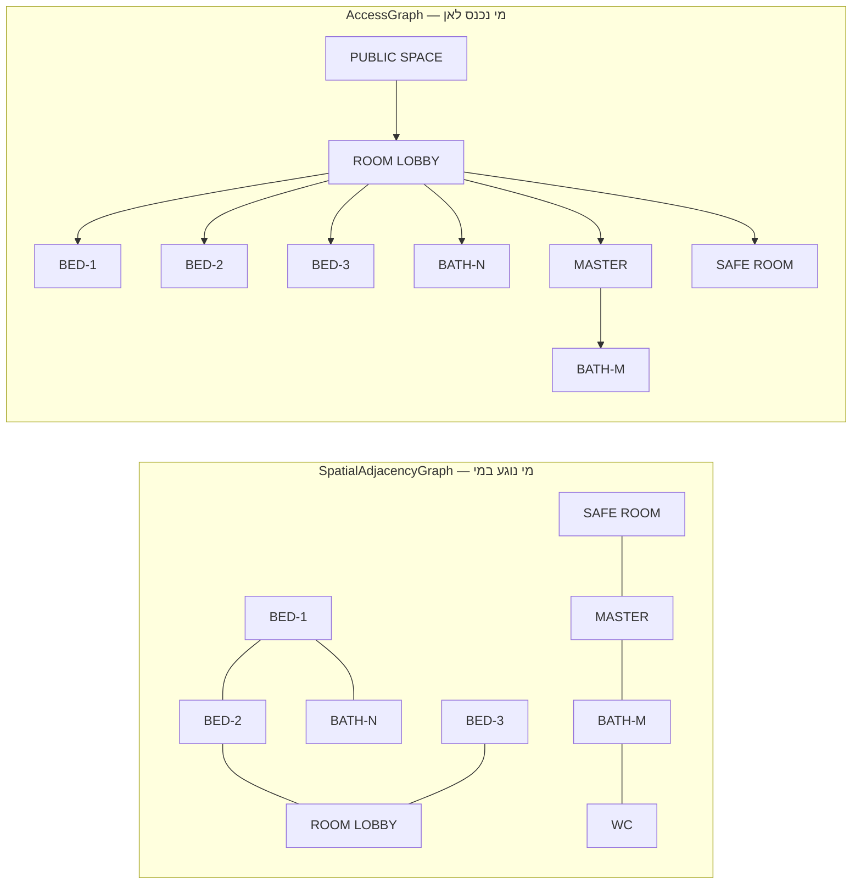

# E0a — Domain Model Stress Test
## פירוק ידני של שלוש תוכניות אמת מול מודל הדומיין של V2

| | |
|---|---|
| **Input spec** | `docs/SPATIAL_ENGINE_SPEC_V2.md` |
| **Purpose** | לבדוק אם מודל V2 מסוגל **לייצג** תוכנית אדריכלית אמיתית — לא לבנות פותר |
| **Scope** | פירוק ידני בלבד. לא נכתב production code |
| **Date** | 2026-09-08 |
| **Outcome** | 24 כשלי ייצוג (7 קריטיים · 1 חוסמת) · 21 שינויים נדרשים במודל |

---

## 0. שיטה, ומה המבחן הזה **לא** מוכיח

הפירוק נעשה מ**תמונות** של התוכניות, לא מקבצי מקור עם קנה מידה. ההשלכה מדויקת ויש להצהיר עליה:

| רובד | רמת ודאות | סטטוס |
|---|---|---|
| טופולוגיה — אילו מרחבים, מי גובל במי, איפה פתחים | **גבוהה** | נבדק |
| הרכב תכניתי — אילו אזורים, אילו תפקידים, פתוח מול סגור | **גבוהה** | נבדק |
| טיפוסי קיר, ליבות רטובות, ארונות בנויים | **בינונית–גבוהה** | נבדק |
| שטחים ומידות | **נמוכה — משוער** | לא נבדק |

לכן:

> **E0a הוא מבחן כושר ביטוי, לא מבחן מטרי.** הוא עונה על "האם המודל מסוגל לתאר את זה" ולא על
> "האם המספרים נסגרים". יישוב השטח בכל תוכנית להלן הוא **מבני** — האם כל הקטגוריות קיימות
> וסוגרות זהותית — ולא **מספרי**.

מה שנשאר ל־E0 המלא: קבצי מקור עם קנה מידה (DWG/PDF), 15–30 תוכניות, ומדידה אמיתית. E0a מקדים
אותו בכוונה — **אין טעם למדוד 30 תוכניות למודל שלא יכול לתאר 3.**

**מקור הכשלים:** קריאת תוויות ומרכיבים נעשתה ברזולוציית התמונות שסופקו. אם פירטתי לא נכון פריט
מסוים — זו שגיאת פירוק שלי, לא כשל של המודל. סימנתי בכוכבית (\*) כל מקום שבו הקריאה שלי פחות ודאית.

### בחירת שלוש התוכניות

נבחרו כך שיהיו **שונות מבנית**, לא שלוש וריאציות של אותה טיפולוגיה:

| | תוכנית | טיפולוגיה | למה היא במבחן |
|---|---|---|---|
| **A** | וילה חד־קומתית, מעטפת L/U | בית פרטי מנותק | העשירה ביותר: מבואת חדרים לא־סדירה, מרחב ציבורי פתוח, ממ״ד דו־תכליתי, שתי ליבות רטובות |
| **B** | קומה עם **שתי דירות** (34 + 130 מ״ר) + גרעין מדרגות משותף | רב־יחידתי | החריג המבני. בודקת בעלות, רכוש משותף, קיר משותף, גרעין אנכי |
| **C** | דירה מודרנית, מעטפת מדורגת | דירה בבניין | סוויטת הורים, ממ״ד־כחדר־שינה, פינת עבודה ללא קירות, מרפסת שקועה |

---

## 1. תוכנית A — וילה חד־קומתית

### 1.1 פירוק

**אתר וגישה** — התוכנית היא מפלס כניסה בלבד; אין נתוני מגרש בשרטוט.

| ישות | ערך | הערה |
|---|---|---|
| `Plot` | לא ידוע | **לא ניתן לקידוד** — התוכנית לא מציגה מגרש |
| `StreetEdge` | לא ידוע | חץ ENTER מרמז על כיוון הגישה בלבד |
| `VehicleAccess` | לא מוצג | — |
| `Level` | 1, datum ±0.00 | מסומן במפורש בשרטוט |
| `Footprint` | מלבן עם צעד ופינה נסוגה | ארכיטיפ: מדורג / שני אגפים |

**PhysicalSpaces ו־FunctionalZones** — ההפרדה שהוכנסה ב־V2 עומדת במבחן:

| # | `PhysicalSpace` | `FunctionalZone`(ים) | פתוח? |
|---|---|---|---|
| P1 | המרחב הציבורי | `KITCHEN` · `DINING` · `LOBBY (מבואה פנימית)` · `LIVING` | **כן — 4 אזורים** |
| P2 | מבואת חדרים (ROOM LOBBY) | `CIRCULATION` | לא |
| P3 | חדר שינה (צפון־מערב) | `BEDROOM` | לא |
| P4 | חדר שינה (מערב) | `BEDROOM` | לא |
| P5 | חדר שינה (צפון־מרכז) | `BEDROOM` | לא |
| P6 | חדר רחצה (צפוני) | `BATHROOM` | לא |
| P7 | חדר הורים | `MASTER_BEDROOM` | לא |
| P8 | חדר רחצה (הורים) | `BATHROOM` | לא |
| P9 | שירותים\* | `WC` | קריאה פחות ודאית |
| P10 | חדר ביטחון (ממ״ד) | `SAFE_ROOM` **+** `BEDROOM` | **שני תפקידים** |

**ליבות רטובות:** שתיים נפרדות — {P8, P9} בדרום־מערב (גב אל גב), ו־{P6} בצפון **כיחיד**.

**ארונות בנויים:** רצועות מסורקות בכל חדרי השינה ובחדר ההורים. באחד המקרים\* רצועת הארון היא
עצמה ההפרדה בין שני מרחבים.

**פתחים:** דלת כניסה אחת (ENTER, דרום־מזרח); דלת לכל אחד מ־P3–P10 מ־P2 או מ־P1; חלונות על
כל קיר חוץ של חדרי מגורים; **צוהר תקרה** (ריבוע מקווקו) ב־P2.

### 1.2 שלושת הגרפים — ההוכחה



**שתי הפרכות, בשני הכיוונים:**

- **סמיכות בלי גישה:** `BED-1 ↔ BED-2` חולקים קיר ואין ביניהם דלת. הסמיכות אמיתית ומשמעותית
  (אקוסטיקה, מבנה, קיר רטוב משותף) אבל היא **אינה** גישה.
- **גישה בלי סמיכות:** `KITCHEN ↔ LIVING` נגישים זה לזה לחלוטין — ואין ביניהם `BoundaryEdge`
  **בכלל**, כי הם אזורים באותו `PhysicalSpace`.

מסקנה: אף אחד משני הגרפים אינו תת־קבוצה של האחר. V2 הניח שקשת גישה נשענת על `BoundaryEdge` —
זה שגוי. → **FL-A9**

### 1.3 יישוב שטח (מבני)

| קטגוריה | נוכח? | הערה |
|---|---|---|
| `NetArea` — מרחבים מתוחמים | ✔ | P1–P10 |
| `InternalWallArea` | ✔ | מחיצות + קירות ממ״ד עבים |
| `ShaftArea` | ✘ | לא מוצג — סביר בבית חד־קומתי |
| `GFA` | ✔ | לפי מעטפת חיצונית |
| `SiteCoverage` | **✘ לא ניתן** | אין מגרש בשרטוט |

הקטגוריות סוגרות זהותית. **המספרים לא נבדקו** — ראה חלק 0.

### 1.4 כשלי ייצוג

| # | הכשל | חומרה |
|---|---|---|
| **FL-A1** | ה־`LOBBY` הוא אזור תנועה **מכוון ומתויג** בתוך מרחב פתוח. V2 מכיר תנועה בתוך מרחב רק כ־`CIRCULATION_WITHIN_SPACE` — טיפוס **שארית**. כאן זו החלטה אדריכלית, לא שארית | גבוהה |
| **FL-A2** | **צוהר תקרה** ב־P2. `Opening` ב־V2 יושב על `Wall` שיושב על `BoundaryEdge` — כלומר על גבול **אנכי** בלבד. אין ישות לגבול אופקי. תוצאה: מודל החשיפה יפסול את מבואת החדרים כחסרת אור, בעוד שבפועל היא מוארת היטב מלמעלה | **קריטית** |
| **FL-A3** | הממ״ד הוא **גם חדר שינה**. `FunctionalZone` ב־V2 נושא טיפוס יחיד. צריך לספק שתי מערכות חוקים ולהיספר פעם אחת | **קריטית** |
| **FL-A4** | חדר הרחצה הצפוני הוא ליבה רטובה **של אחד**. V2 דורש ≥2 חברים ב־`WetCore`, ולכן אין לו שיוך אינסטלציה | בינונית |
| **FL-A5** | רצועת ארון שהיא **ההפרדה עצמה** בין שני מרחבים. האם זה `Wall` בעובי 60 ס״מ או `BuiltInCabinet` על מחיצה? V2 לא מכריע, וההפרש בחשבונאות השטח גדול | גבוהה |
| **FL-A6** | מבואת החדרים לא־סדירה וצרה בנקודות. M1 עם רדיוס של חדר שינה יפסול אותה — למרות שזו תנועה תקינה לגמרי | **קריטית** |
| **FL-A7** | סימוני חתך, ±0.00 וחצי ENTER — הערות שרטוט. V2 לא מצהיר עליהן כמחוץ לתחום, ו־`Datum` מוזכר אך אינו ישות | נמוכה |
| **FL-A8** | אין מגרש בתוכנית → `Plot`, `BuildableRegion`, `SiteCoverage` לא ניתנים לקידוד. המודל דורש אותם, המציאות לא תמיד מספקת | בינונית |
| **FL-A9** | **סמיכות וגישה אינן אותו גרף** (חלק 1.2). V2 הניח שקשת גישה נשענת על `BoundaryEdge` — ושני הכיוונים מופרכים כאן | **קריטית** |

---

## 2. תוכנית B — קומה עם שתי דירות

**זו התוכנית ששוברת את V2 הכי חזק.** V2 עובר מ־`Level` ישירות ל־`PhysicalSpace`, בלי שום דבר
באמצע — ולכן אין לו שום דרך לומר "אלה שתי דירות".

### 2.1 פירוק

| ישות | יחידה 34 מ״ר | יחידה 130 מ״ר | משותף |
|---|---|---|---|
| `Entrance` | ✔ (חץ ENTER שמאלי) | ✔ (חץ ENTER ימני) | + כניסת בניין\* |
| מטבח | ✔ | ✔ | — |
| סלון | ✔ | ✔ | — |
| פינת אוכל | — | ✔ | — |
| מבואה פנימית | ✔ | ✔ | — |
| חדר שינה | 1 | 3 (כולל חדר הורים) | — |
| חדר רחצה | 1 | 2 | — |
| מכונת כביסה | ✔ | ✔ | — |
| גרעין מדרגות | — | — | **✔** |

### 2.2 כשלי ייצוג

| # | הכשל | חומרה |
|---|---|---|
| **FL-B1** | **אין ישות `DwellingUnit`.** אי אפשר לבטא גבול יחידה, חשבונאות שטח ליחידה, תוכנית ליחידה, או כניסה ליחידה. `Level → PhysicalSpace` ישיר | **חוסמת** |
| **FL-B2** | גרעין המדרגות והמבואה המשותפת אינם שייכים לאף יחידה. אין `ownership` ואין מושג **רכוש משותף** — הבחנה אמיתית ומחייבת בישראל | **קריטית** |
| **FL-B3** | **קיר משותף** בין היחידות. V2 מכיר `wall_type = party` אבל `AreaAccount` הוא לכל **קומה**, לא לכל יחידה — ולכן אין איך לחלק את שטח הקיר בין שתי היחידות | גבוהה |
| **FL-B4** | V2 קובע כאינווריאנט "קיימת בדיוק `Entrance` אחת מטיפוס `Main`". כאן יש **שלוש** — כניסת בניין ושתי כניסות יחידה. האינווריאנט פשוט שגוי | **קריטית** |
| **FL-B5** | גרם המדרגות משרת כמה קומות **וכמה יחידות**. שורש `AccessGraph` אינו כניסה אחת אלא: כניסת בניין → גרעין → כניסת יחידה → פנים היחידה | גבוהה |
| **FL-B6** | הצינור S0–S12 מניח **תוכנית אחת**. כאן יש תוכנית־על לבניין ותוכניות ליחידות, ותקצוב שטח בשתי סקאלות | גבוהה |
| **FL-B7** | ביחידת 34 מ״ר, המטבח + הסלון + המבואה הם מרחב אחד עם 3 אזורים — מחזק את FL-A1 | — |

### 2.3 יישוב שטח — היחיד עם מספרים אמיתיים

התוכנית מדפיסה **34 מ״ר** ו־**130 מ״ר**. מה שאי אפשר לדעת מהתמונה: האם המספרים האלה הם
`NetArea` של היחידה, `GFA` שלה, או GFA כולל חלק יחסי ברכוש המשותף. **שלוש תשובות שונות לחלוטין,
ואין בשרטוט מה שיכריע.**

> זו בדיוק השאלה הפתוחה "עיקרי מול שירות" מ־V2 חלק ט׳, מופיעה כאן כמכשול מדיד: **בלי הכרעה
> בהגדרת השטח, אי אפשר לקודד אפילו תוכנית שמדפיסה את השטח שלה על עצמה.**

---

## 3. תוכנית C — דירה מודרנית, מעטפת מדורגת

### 3.1 פירוק

| `PhysicalSpace` | `FunctionalZone`(ים) | הערה |
|---|---|---|
| מרחב ציבורי | `LIVING` · `DINING` · `KITCHEN` | פתוח, עם אי |
| מרחב תנועה | `CIRCULATION` **+ `WORK_NOOK` (פינת עבודה)** | **אזור מתפקד בתוך חלל תנועה** |
| סוויטת הורים | `MASTER_BEDROOM` | חלק מקבוצה |
| חדר ארונות | `WALK_IN_CLOSET` | ריהוט = 100% בנוי |
| מקלחת הורים | `BATHROOM` | חלק מקבוצה |
| חדר שינה ממ״ד | `SAFE_ROOM` **+** `BEDROOM` | שוב FL-A3 |
| חדר שינה | `BEDROOM` | — |
| חדר רחצה | `BATHROOM` | — |
| אזור שירות | `UTILITY` | מכונת כביסה |
| מרפסת | `OutdoorSpace / BALCONY` | **שקועה** בתוך המעטפת |

### 3.2 כשלי ייצוג

| # | הכשל | חומרה |
|---|---|---|
| **FL-C1** | **"פינת עבודה" היא אזור מתפקד בתוך חלל תנועה.** V2 מגדיר `CirculationSpace` כ"מרחב שתפקידו **היחיד** תנועה". ההגדרה הזו פשוט לא נכונה | **קריטית** |
| **FL-C2** | **סוויטת הורים** = חדר + חדר ארונות + מקלחת, עם שער גישה אחד. אין ל־V2 `SpaceGroup`. זה משנה גם את עומק הפרטיות וגם את ביטוי התוכנית ("סוויטה 25 מ״ר") | גבוהה |
| **FL-C3** | **מרפסת שקועה.** V2 אומר "חצרות הן חורים ולא שטח" — אבל מרפסת שקועה **אינה חור**: היא שקע פתוח מצד אחד, בתוך קו המעטפת, שלא נספר ב־GFA | גבוהה |
| **FL-C4** | **האי במטבח** מעוגן ל**כלום** — עומד חופשי אך קבוע. `BuiltInCabinet` ב־V2 "מעוגן ל־`Wall`". גם מקרר דורש מרווח **בכיוון אחד** ולא מסביב | גבוהה |
| **FL-C5** | חדר הארונות: `required_furniture` שלו שונה מהותית מכל חדר אחר. חייב להגיע מ־`RuleSet` לפי תפקיד, לא מרשימה קבועה | בינונית |
| **FL-C6** | מידות כמו `-335-`, `-265-` הן מידות **אור נטו בין קירות** — מאשר שחשבונאות ה־finish-face של V2 חלק ז׳ היא הנכונה | — (אישוש) |
| **FL-C7** | סימוני "+" ורודים וקווי מבט מקווקווים — שכבת מצג. יש להצהיר עליהם כמחוץ לתחום | נמוכה |
| **FL-C8** | המעטפת המדורגת מייצרת פינות קעורות רבות. M1 ברדיוס אחיד יפסול חלק מהן — מחזק את FL-A6 | גבוהה |

---

## 4. תשובות לחמשת האתגרים

### 4.1 האם M1 יכול להיות אינווריאנט אוניברסלי של `PhysicalSpace`?

**לא. חד־משמעית.**

שלוש ראיות מהפירוק: מבואת החדרים בתוכנית A (לא־סדירה, צרה בנקודות, תקינה לחלוטין), הפינות הקעורות
של המעטפת המדורגת בתוכנית C, וחדר הארונות ברוחב ~1.5 מ׳ שעובר M1 רק ברדיוס קטן.

הבעיה אינה בנוסחה אלא בהחלה: **הרדיוס, הסף, ועצם הרלוונטיות תלויים בתפקיד**. עבור תנועה, המבחן
הנכון אינו `opening_ratio` בכלל — הוא `clear_width` לאורך מסלול הרשת.

> **M1 נשאר חישוב אוניברסלי. הסף וההחלה עוברים ל־`RuleSet`.**

### 4.2 האם צריך שלושה גרפים נפרדים?

**כן — הוכח בשני הכיוונים** (חלק 1.2):

| גרף | נגזר מ־ | צרכנים |
|---|---|---|
| `SpatialAdjacencyGraph` | `BoundaryEdge` — נגיעה פיזית | אקוסטיקה, ליבות רטובות, מבנה, תרמי |
| `AccessGraph` | פתחים **+ שיתוף `PhysicalSpace`** | נגישות, עומק פרטיות, גזירת דלתות |
| `CirculationNetwork` | גישה + גיאומטריה + ריהוט | רוחב פנוי, תקורת תנועה, מעבר דרך |

אף אחד אינו תת־קבוצה של האחר. שתי הדוגמאות המכריעות: חדר שינה↔חדר שינה (סמיכות בלי גישה),
מטבח↔סלון באותו מרחב (גישה בלי סמיכות).

### 4.3 אילו "אינווריאנטים" שייכים בעצם ל־RuleSet?

הבעיה ב־V2 היא **ערבוב שתי משפחות**. הכלל שמפריד ביניהן:

> **אינווריאנט** = מה שהופך את הייצוג ל**קוהרנטי**. הפרתו = הנתון מקולקל.
> **חוק** = מה שהופך את התכנון ל**קביל**. הפרתו = תכנון פסול — **שחייבים להיות מסוגלים לייצג**.

ההשלכה חשובה: **המודל חייב לדעת לייצג תכנון לא־חוקי.** אחרת אי אפשר לדווח הפרות, אי אפשר להציג
`best infeasible`, ואי אפשר לתת למשתמש לעקוף במודע.

| מה ש־V2 קרא לו אינווריאנט | סיווג נכון | נימוק |
|---|---|---|
| `opening_ratio ≥ סף` (M1) | **חוק** | תלוי תפקיד — FL-A6, FL-C8 |
| "בדיוק `Entrance` אחת מטיפוס Main" | **חוק** (ושגוי) | תוכנית B מפריכה |
| `WetCore` ≥ 2 חברים | **העדפה** | FL-A4 |
| `Footprint ⊆ BuildableRegion` | **חוק** | חייבים לייצג חריגה כדי לדווח עליה |
| `north_azimuth` מוגדר | **חוק מותנה** | נדרש רק כשחוקי אור פעילים |
| רוחב מסדרון מינימלי | **חוק** | כבר נאמר ב־V2 |
| חסימת מעבר דרך חדר שינה | **חוק** | כבר נאמר ב־V2 |
| אזורים מרצפים את התיחום | **אינווריאנט** | הגדרתי |
| אין `Opening` על גבול פנימי בין אזורים | **אינווריאנט** | הגדרתי |
| מרחב שייך לקומה אחת | **אינווריאנט** | הגדרתי |
| מרחבים אינם חופפים | **אינווריאנט** | הגדרתי |
| יישור אנכי של פיר/גרעין | **אינווריאנט** | פיזי, לא רגולטורי |

### 4.4 האם סמנטיקת `FurnitureItem` מספיקה?

**לא.** ארבעה ליקויים שהפירוק חשף:

1. **עיגון** — `BuiltInCabinet` ב־V2 "מעוגן לקיר". האי במטבח (FL-C4) מעוגן לרצפה. נדרש:
   `anchor ∈ {WALL(edge, offset), FLOOR(point), CEILING, NONE}`.
2. **מרווח כיווני** — מקרר, תנור ומכונת כביסה דורשים מרווח **מלפנים בלבד**. מרווח סימטרי מסביב
   הוא גם שגוי וגם בזבזני.
3. **קבוע מול נייד** — `mobility ∈ {FIXED, LOOSE}`. רק קבוע משתתף ב־`clear_width` של רשת התנועה.
4. **ארון כגבול** — FL-A5: ארון בנוי שהוא ההפרדה עצמה. נדרש שיוכל **לממש** `BoundaryEdge`.

בנוסף: סט הריהוט הנדרש חייב להגיע מ־`RuleSet` לפי תפקיד (FL-C5), לא מרשימה קבועה בקוד.

### 4.5 האם לולאת centerline→wall→remeasure מתכנסת בסבב אחד?

**לא. נדרשת התכנסות איטרטיבית חסומה.**

V2 אמר "סבב תיקון אחד; אם הפער מתחת לסובלנות — עוצרים". שרשרת התלות אינה נעצרת שם:

```
עובי קיר משתנה
  → שטח נטו של החדר משתנה
    → חדר יורד מתחת ל-min_area
      → נדרשת הקצאה מחדש של שטח
        → מידות שכנים משתנות
          → ייתכן טיפוס קיר אחר (נושא / ממ״ד)
            → עובי קיר משתנה ...
```

בתוכנית A זה קונקרטי: קירות הממ״ד עבים משמעותית משאר המחיצות. אם הממ״ד חייב לשמור על שטח נטו
מינימלי, קופסת קו־המרכז שלו **חייבת לגדול** — מה שדוחף את השכנים, ועלול להוריד חדר אחר מתחת
למינימום שלו.

**הפרעה קטנה (ס״מ) ובכיוון עקבי — ולכן צפוי שתתכנס מהר, אך אין הבטחה.** לכן:

> `fixed_point(max_iterations, convergence = max Δarea < tolerance)`,
> ותוצאה שלישית מפורשת: **`NON_CONVERGENT`** — לא לולאה אינסופית, ולא קבלה שקטה של תוצאה לא־מתוקנת.

---

## 5. יומן כשלי הייצוג — מרוכז

| # | תוכנית | כשל | חומרה | דלתא |
|---|---|---|---|---|
| FL-A1 | A | תנועה כאזור מכוון בתוך מרחב פתוח, לא כשארית | גבוהה | D4 |
| FL-A2 | A | צוהר תקרה — אין גבול אופקי במודל | קריטית | D7 |
| FL-A3 | A, C | ממ״ד שהוא גם חדר שינה — תפקיד יחיד ל־`FunctionalZone` | קריטית | D3 |
| FL-A4 | A | ליבה רטובה של חבר יחיד אינה חוקית | בינונית | D2 |
| FL-A5 | A | ארון בנוי שהוא ההפרדה עצמה | גבוהה | D8, D10 |
| FL-A6 | A | M1 אחיד פוסל תנועה תקינה | קריטית | D14 |
| FL-A7 | A | הערות שרטוט לא מוצהרות כמחוץ לתחום | נמוכה | D19 |
| FL-A8 | A | תוכנית בלי מגרש — ישויות אתר חובה שאין להן נתון | בינונית | D21 |
| FL-A9 | A | סמיכות וגישה אינן אותו גרף — מופרך בשני הכיוונים | קריטית | D6 |
| FL-B1 | B | **אין `DwellingUnit`** | חוסמת | D1 |
| FL-B2 | B | אין בעלות ואין רכוש משותף | קריטית | D11 |
| FL-B3 | B | קיר משותף — אין חלוקת שטח בין יחידות | גבוהה | D11, D20 |
| FL-B4 | B | "בדיוק כניסה ראשית אחת" — שגוי | קריטית | D12 |
| FL-B5 | B | שורש `AccessGraph` היררכי: בניין → גרעין → יחידה | גבוהה | D12 |
| FL-B6 | B | הצינור מניח תוכנית אחת | גבוהה | D18 |
| FL-B7 | B | מחזק את FL-A1 | — | D4 |
| FL-B8 | B | 34/130 מ״ר — לא ניתן לדעת איזו כמות זו | קריטית | פתוח |
| FL-C1 | C | "מרחב שתפקידו היחיד תנועה" — הגדרה שגויה | קריטית | D5 |
| FL-C2 | C | אין `SpaceGroup` / סוויטה | גבוהה | D2 |
| FL-C3 | C | מרפסת שקועה אינה חור ואינה שטח | גבוהה | D13 |
| FL-C4 | C | עיגון ומרווח כיווני של ריהוט | גבוהה | D9 |
| FL-C5 | C | סט ריהוט נדרש חייב להיות מ־`RuleSet` | בינונית | D9 |
| FL-C7 | C | שכבת מצג לא מוצהרת | נמוכה | D19 |
| FL-C8 | C | מעטפת מדורגת מול M1 אחיד | גבוהה | D14 |

**סיכום:** 24 כשלים · 7 קריטיים · 1 חוסמת. (FL-C6 אינו כשל אלא **אישוש** של החלטת V2 ולכן אינו נספר.)

---

## 6. Domain Model Delta

### 6.1 ישויות חדשות

| # | שינוי | מקור | נימוק |
|---|---|---|---|
| **D1** | **`DwellingUnit`** בין `Level` ל־`PhysicalSpace`. בעל תוכנית, כניסה וחשבונאות שטח משלו | FL-B1 | בלעדיו לא ניתן לקודד קומה רב־יחידתית כלל |
| **D2** | **`SpaceGroup`** `{SUITE, WET_CORE, SERVICE_CLUSTER}`. **`WetCore` הופך לתת־טיפוס** ומינימום החברים יורד ל־1 | FL-C2, FL-A4 | *מפשט* — ישות אחת במקום שתיים |
| **D7** | **`HorizontalBoundary`** (גג / תקרה / רצפה) שיכול לארח `Opening`; `ROOFLIGHT` נוסף לנפחים הפתוחים המוכרים | FL-A2 | בלעדיו כל תנועה פנימית מוארת־מלמעלה נפסלת שלא בצדק |

### 6.2 שינויי סמנטיקה

| # | שינוי | מ־ | ל־ |
|---|---|---|---|
| **D3** | תפקיד אזור | `program_type` יחיד | **`program_roles: set`** עם תפקיד ראשי אחד לחשבונאות |
| **D4** | תנועה בתוך מרחב | טיפוס **שארית** `CIRCULATION_WITHIN_SPACE` | `CIRCULATION` כ**תפקיד אזור מן המניין** |
| **D5** | `CirculationSpace` | "מרחב שתפקידו **היחיד** תנועה" | **ההגדרה מבוטלת.** תנועתיות היא תכונה של אזורים וקטעי רשת |
| **D8** | `BoundaryEdge` | תמיד מתממש כ־`Wall` או כלום | **`realization ∈ {Wall, CabinetWall, Glazing, Open}`** |
| **D12** | `Entrance` | "בדיוק אחת מטיפוס Main" | **`scope ∈ {BUILDING, UNIT}`**; האינווריאנט הופך לחוק |
| **D13** | `Footprint` | "חצרות הן חורים" | **`gross_outline`** נפרד מ**אזורים תורמי־GFA**; שקע ≠ חור |
| **D14** | M1 | אינווריאנט של `PhysicalSpace` | **חישוב** אוניברסלי; **סף והחלה ב־`RuleSet`** לפי תפקיד |
| **D16** | לולאת קיר↔מידה | סבב תיקון אחד | **נקודת שבת חסומה** + תוצאת `NON_CONVERGENT` |

### 6.3 הרחבות

| # | שינוי | פירוט |
|---|---|---|
| **D6** | **שלושה גרפים מוצהרים** | `SpatialAdjacencyGraph` · `AccessGraph` · `CirculationNetwork`, עם גזירה וצרכנים מוגדרים לכל אחד (טבלה 4.2) |
| **D9** | `FurnitureItem` | `anchor {WALL, FLOOR, CEILING, NONE}` · מרווח **כיווני** · `mobility {FIXED, LOOSE}` · סט נדרש מ־`RuleSet` |
| **D10** | `BuiltInCabinet` | רשאי **לממש** `BoundaryEdge` (ראה D8) |
| **D11** | בעלות וחשבונאות | `PhysicalSpace.ownership {PRIVATE(unit), COMMON, SERVICE}`; `AreaAccount` לכל **(יחידה × קומה)** + חשבון רכוש משותף |
| **D15** | **הפרדת אינווריאנט מחוק** | לפי הכלל בחלק 4.3. **המודל חייב לדעת לייצג תכנון לא־חוקי** |
| **D17** | `WetCore` | מינימום חברים 1 (מובלע ב־D2) |
| **D18** | הצינור | `BuildingProgram` = אוסף `UnitProgram`; תקצוב שטח בשתי סקאלות |
| **D19** | תחום | שכבת מצג (סימוני חתך, נק׳ חשמל, קווי מבט) **מוצהרת מחוץ לתחום**; `Level.datum_elevation` נשאר ישות |
| **D20** | קיר משותף | מדיניות חלוקת שטח בין יחידות — **חוק**, לא קבוע |
| **D21** | נתונים חסרים | ישויות אתר חייבות `UNKNOWN` מפורש. תוכנית בלי מגרש היא מצב תקין, לא שגיאה |

### 6.4 מה שרד ללא שינוי

לא פחות חשוב — ארבע ההחלטות המרכזיות של V2 עמדו במבחן:

| החלטה | סטטוס | ראיה |
|---|---|---|
| **`PhysicalSpace` ⟂ `FunctionalZone`** | **אושר חזק** | כל שלוש התוכניות. בלעדיה אף אחת מהן לא ניתנת לקידוד |
| **`BoundaryEdge` (L2a) ⟂ `Wall` (L2b)** | אושר | מידות ה־`-335-` בתוכנית C הן finish-face — בדיוק כפי ש־V2 קבע |
| **הפרדת ארבע כמויות השטח** | אושר, והורחב | תוכנית B הוסיפה מימד יחידה/רכוש משותף |
| **מודל חשיפה מדורג** | אושר, והורחב | נדרש `ROOFLIGHT` (D7) |
| **`DesignDecision`** | **לא נבדק** | אין החלטות בפירוק ידני — נבדק רק כשיש מנוע |

---

## 7. מה E0a לא יכול היה לבדוק

1. **כל רובד מטרי** — שטחים, יחסי נטו/ברוטו, אחוזי תנועה, יחסי צלעות. דורש קבצי מקור עם קנה מידה.
2. **`DesignDecision` ולולאת ה־backtracking** — אין החלטות בפירוק ידני.
3. **התכנסות בפועל** של לולאת הקיר (4.5) — ההנמקה תיאורטית; המדידה דורשת מימוש.
4. **כיול פונקציית החשיפה** — דורש מדידת אורכי פתחים ועומקים אמיתיים.
5. **תוכניות רב־קומתיות** — שלוש התוכניות הן מפלס אחד. `VerticalCirculation` בתוכנית B נראה
   בחתך אחד בלבד; יישור אנכי לא נבדק כלל.

---

## 8. המלצה

**לא לעבור ל־implementation עדיין.** הרצף:

1. **לעדכן את V2 בדלתא** (D1–D21) — עבודת מפרט, ללא קוד.
2. **להריץ E0a שוב על תוכנית רביעית רב־קומתית** — הפער הגדול ביותר שנותר פתוח (סעיף 7.5).
   תוכנית B סיפקה גרעין מדרגות אך לא קומה שנייה.
3. **רק אז E0 המלא** — 15–30 תוכניות עם קבצי מקור, לרובד המטרי.

**הנימוק:** תוכנית B לבדה חשפה כשל **חוסם** ושלושה קריטיים. מודל שלא יכול לקודד קומה עם שתי דירות
אינו מוכן למימוש — וזה התגלה תוך פירוק אחד, לא תוך שלושה חודשי פיתוח.
