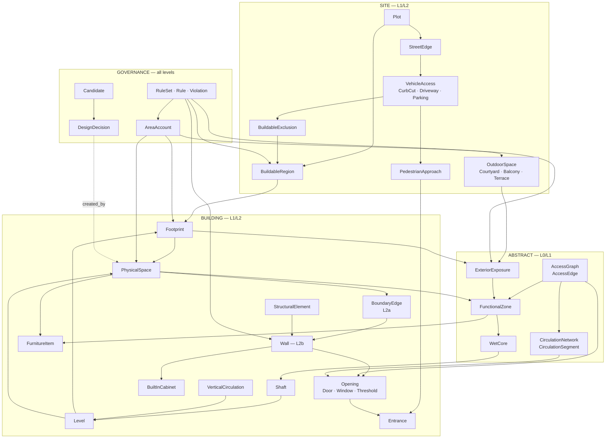
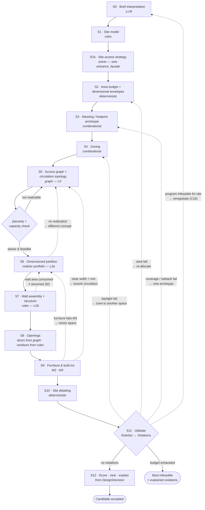

# Architecture Spec V2
## מנוע התכנון המרחבי — second-pass adversarial review + מפרט דומיין

| | |
|---|---|
| **Supersedes** | `docs/SPATIAL_ENGINE_RESEARCH.md` (V1) |
| **Repo** | `sddproject` @ `9c18d6a` |
| **Scope** | מפרט בלבד — לא נכתב production code |
| **Status** | טרם אושר ל־implementation |
| **Date** | 2026-09-08 |

> **הערת קריאה:** V1 נשאר תקף בחלקים 0–2 ו־7 (ממצאים, מפת מערכת, מחקר אלגוריתמים). המסמך הזה
> **מחליף** את חלקים 3–6 ו־16 של V1 (מודל הדומיין, מודל השטח, טופולוגיה, ניסויים). כל מקום שבו V2
> סותר את V1 — V2 גובר.

---

## חלק א׳ — ביקורת עצמית על V1

שש־עשרה תיקונים. C1–C12 מקבילים לנקודות שהועלו; C13–C16 הם ליקויים נוספים שמצאתי בסבב השני.

| # | מה V1 טען | למה זה שגוי |
|---|---|---|
| **C1** | חלוקה מישורית פותרת שטח מת | **הטענה הכי בעייתית ב־V1.** ראה חלק ב׳ — היא פותרת *כיסוי*, לא *שימושיות*, ולמעשה מסתירה את הבעיה |
| **C2** | `Space` = מרחב | ערבב תיחום פיזי עם הקצאה תכניתית → **לא ניתן לייצג open-plan בכלל** |
| **C3** | `CirculationSpace` כישות | תנועה לא תמיד חדר; V1 לא יכול לייצג מעבר *דרך* חלל מתפקד |
| **C4** | חניה/שביל ב־S10 (מאוחר) | גישת רכב משפיעה על המסה ועל בחירת חזית הכניסה — היא **קלט** ל־S3, לא פלט של S10 |
| **C5** | "כל חדר מגורים נוגע בהיקף" | גס מדי; לא מכיר חצר/פיר אור; בינארי במקום מדורג. V1 עצמו סימן שזה דורש אימות (E4) |
| **C6** | "להרחיב את `Wall` בעובי" | לא מודל. מסתיר תלות מעגלית: עובי קובע שטח, שטח קובע מידות, מידות קובעות קירות |
| **C7** | קומה אחת | ההנחה דלפה לתוך מודל הדומיין. עלות רטרואקטיבית עצומה |
| **C8** | 12 ישויות | חסרים `Level`, `WetCore`, `Shaft`, `StructuralElement`, `BuiltInCabinet`, `OutdoorSpace`, `VehicleAccess` — וגם `AreaAccountingRule`, תת־טיפוסי `Opening`, `Datum` |
| **C9** | "לפרק את `built_area_m2`" | הביקורת נכונה, החלופה לא הושלמה: V1 לא הפריד program / net / GFA / coverage כארבע כמויות עם יחסים מוגדרים |
| **C10** | E1 נמדד ב־IoU | IoU לבדו שגוי: מעניש פתרון חלופי תקף, מתעלם משימושיות, ולא מוגדר ל־open-plan |
| **C11** | ניסויים E1–E7 | כולם דורשים ground truth שאין. **חסר E0** |
| **C12** | "משמעת provenance היא נכס" | שובחה ולא מודלה. אין ישות שמסבירה למה החלטה התקבלה |
| **C13** | "סמיכות טופולוגית, בלי אפסילון" | נכון ב־L0/L1 בלבד. ב־L2 המימוד מחזיר סובלנות מספרית — צריך מדיניות tolerance מפורשת |
| **C14** | "portfolio של מממשים" | התעלם מכך שלמממשים **כושר ביטוי שונה**: grid לא ייתן שטח מדויק, dual לא ייתן חדר לא־מלבני. Portfolio בלי הצהרת יכולת הוא הימור |
| **C15** | — | V1 לא הגדיר מה קורה כשאין מועמד תקף. צריך מושג "best infeasible" עם קבוצת הפרות מוסברת |
| **C16** | "ה־LLM נשאר מעל הגיאומטריה" | לא הוגדר מה קורה כשהתוכנית *עצמה* בלתי אפשרית לאתר. צריך לולאת משא ומתן חזרה ל־S0 |

---

## חלק ב׳ — כיסוי גיאומטרי ≠ שימושיות מרחבית

### הטענה של V1 והפרכתה

V1 טען: *"אין שטח מת ואין חפיפה — לא כאילוץ לאכוף, אלא כתכונה של הייצוג."*

התכונה אמיתית אבל היא מוכיחה דבר אחר ממה שנטען. חלוקה מישורית מבטיחה ש־**Σ שטחי הפאות = שטח
המעטפת**. היא לא מבטיחה שאפשר להשתמש בשטח. מה שקורה בפועל:

> **חלוקה מישורית לא מבטלת שטח מת — היא מבליעה אותו בתוך החדרים, ומסתירה אותו מהמדד.**

זה **גרוע יותר** מהמצב הקיים. היום שטח מת נראה כלבן בשרטוט וניתן לספירה (`utilization = 0.47`).
תחת חלוקה מלאה, אותם 6 מ״ר יהפכו לזנב ברוחב 60 ס״מ שמחובר לחדר שינה, והמדד ידווח `utilization = 1.00`.

### מצבי כשל שכיסוי לא תופס

| מצב | דוגמה | למה `utilization` מפספס |
|---|---|---|
| **סליבר מובלע** | חדר 12 מ״ר בצורת L עם זנב 0.6×2.0 מ׳ | הזנב נספר כשטח החדר |
| **פרופורציה בלתי אפשרית** | חדר שינה 2.0 × 6.0 = 12 מ״ר | השטח נכון, החדר לא ניתן לריהוט |
| **צוואר** | שני חלקי חדר מחוברים במעבר 0.7 מ׳ | פאה רציפה, שימוש לא רציף |
| **צל דלת** | 1.2 מ״ר מאחורי כנף דלת נפתחת | שטח קיים, לא שמיש |
| **עודף תנועה** | מסדרון 0.9×8 מ׳ | 7.2 מ״ר "מנוצלים" שהם תקורה טהורה |
| **פינה קעורה** | פינה פנימית של אגף L | שמיש חלקית, תלוי בעומק |

### מדדי שטח בלתי שימושי — הגדרות ניתנות לחישוב

חמישה מדדים, מהזול ליקר. כולם על L2.

**M1 · Morphological opening (הזול, תופס הכי הרבה)**

```
usable_core(S) = open(polygon(S), r)          # erosion by r then dilation by r
r = clearance_radius(S)                        # e.g. 0.45 m for a 0.9 m passage
unusable_appendix(S) = area(S) − area(usable_core(S))
opening_ratio(S) = area(usable_core(S)) / area(S)
```

תופס סליברים, זנבות, צווארים ופינות — בלי ידע על ריהוט. `r` מגיע מה־`RuleSet` לפי טיפוס המרחב.

**M2 · Inscribed-rectangle fit**

```
fits_envelope(S) = ∃ axis-aligned rect ⊆ polygon(S)
                   with w ≥ min_width(S) and d ≥ min_depth(S)
```

בינארי, בודק את מעטפת המידות (חלק ד׳). זה מה שהופך "12 מ״ר" ל"12 מ״ר שאפשר לגור בהם".

**M3 · Furniture-fit residual (החזק ביותר)**

```
required_footprint(S) = ⋃ (furniture_i ⊕ clearance_i)   for the space's required furniture set
furniture_feasible(S) = required_footprint(S) packs inside polygon(S)
residual(S) = area(S) − area(required_footprint(S))
```

קשור ישירות לעיקרון מ־V1 שריהוט הוא קלט ולא בדיקה.

**M4 · Access-shadow**

```
shadow(S) = area unreachable by a disc of radius r_pass moving from S's openings,
            with door-swing arcs subtracted
```

**M5 · Circulation exclusivity**

```
circulation_overhead = Σ area(spaces whose only function is circulation) / GFA
through_traffic_cost = Σ (path length through a functional space × sensitivity(space_type))
```

מבחין בין מסדרון ייעודי (עולה שטח) לבין מעבר דרך סלון (עולה פרטיות) — ראה חלק ד׳.

### טקסונומיית "שטח לא שמיש" — חובה להבחין

| קטגוריה | הגדרה | יחס |
|---|---|---|
| `VOID` | לא משויך לאף מרחב | אסור תחת חלוקה מלאה — כשל |
| `ABSORBED_SLIVER` | משויך, נכשל ב־M1 | **קנס — זו הבעיה שהוסתרה** |
| `FUNCTIONALLY_DEAD` | עובר M1, נכשל ב־M2/M3 | קנס כבד — החדר לא מתפקד |
| `CIRCULATION_OVERHEAD` | שמיש רק כמעבר | נמדד, נכנס ליעד ולא לקנס בינארי |
| `DELIBERATE_OPEN` | חצר, פיר אור, מרפסת, גינה | **לא קנס.** תכנון נכון |
| `STRUCTURAL` | עמוד, פיר, קיר | נספר ב־GFA, לא ב־net |

השורה החמישית קריטית: חצר היא **חור בחלוקה** ואות לתכנון טוב. מדד שמעניש אותה ידחוף את המנוע
לארכיטיפים גרועים. לכן `DELIBERATE_OPEN` חייב להיות טיפוס מוצהר ולא שארית.

### המסקנה למודל

חלוקה מישורית נשארת ההמלצה — אבל **הנימוק משתנה**. היא לא נבחרת כי היא מבטלת שטח מת (היא לא), אלא
כי היא:

1. הופכת סמיכות לעובדה טופולוגית ולא לחישוב אפסילון,
2. מאפשרת חדרים לא־מלבניים ומרחב פתוח,
3. נותנת לקיר זהות ולפתח מקום לשבת עליו,
4. **הופכת שטח מת לניתן לאיתור ולקנס במקום לבלתי נראה** — בתנאי ש־M1–M5 נאכפים.

בלי M1–M5, המעבר לחלוקה מישורית הוא רגרסיה במדידה.

---

## חלק ג׳ — PhysicalSpace מול FunctionalZone

### הבעיה

בכל שש תוכניות ה־reference, סלון + פינת אוכל + מטבח הם **מרחב פיזי אחד** ללא קירות ביניהם, אבל
**שלושה תפקידים תכניתיים** עם שטחים, ריהוט ודרישות שונים. מודל שבו "חדר" הוא ישות אחת לא יכול
לייצג את זה — וזה בדיוק המצב היום וגם ב־V1.

תוצאות הכשל במערכת הקיימת, כולן נובעות מאותו שורש:
- סמיכות `kitchen ↔ dining` מיוצגת רק כקיר משותף — בעוד שבפועל **אין קיר**.
- `_find_direct_access_doors` היה מייצר דלת בין מטבח לפינת אוכל — דלת שלא קיימת באף תוכנית אמת.
- שטח המטבח (12 מ״ר) הוא הקצאה, לא חלל מתוחם — אין מה למדוד מולו.

### ההפרדה

```
PhysicalSpace   — תיחום. מה שקירות עוטפים ומה שנכנסים אליו.
FunctionalZone  — הקצאה תכניתית בתוך (חלק מ)תיחום. מה שהתוכנית ביקשה.
```

| | PhysicalSpace | FunctionalZone |
|---|---|---|
| גבול | קירות ופתחים (קשיח) | ריהוט, אי, שינוי ריצוף/תקרה (רך) |
| גיאומטריה | פוליגון = קבוצת פאות | תת־פוליגון, ללא קשתות קיר משלו |
| קיים ב־ | L1, L2 | L0, L1, L2 |
| שטח | נמדד (net) | מבוקש (program) ונמדד |
| דלת | ייתכן פתח בגבול | **לעולם לא פתח בגבול פנימי** |
| דוגמה | "המרחב הציבורי" | סלון / פינת אוכל / מטבח |

**קרדינליות:** `PhysicalSpace 1 ──< FunctionalZone`. אזור שייך לתיחום אחד בדיוק (הפשטת V1 של
המפרט; אזור שנמרח על שני תיחומים אינו open-plan אלא שני חדרים).

### מה ההפרדה פותרת

- **סמיכות:** `ADJACENT(kitchen, dining)` מסופקת ע״י `SAME_PHYSICAL_SPACE` — סוג סיפוק חדש, חזק
  יותר משיתוף קיר. `DOOR_CONNECTION` בין שני אזורים באותו תיחום היא **סתירה** ויש לדחות אותה.
- **חשבונאות שטח:** שטח קירות פנימיים נגזר מגבולות תיחום בלבד. open-plan חוסך שטח קירות — וזה
  צריך להופיע במודל השטח, לא כהנחה.
- **אור טבעי:** אזור מקבל אור דרך חלונות **התיחום שלו**, בכפוף למגבלת עומק (חלק ו׳). זה מסביר
  למה מטבח בקצה מרחב פתוח עמוק עדיין עלול להיכשל בדרישת האור.
- **פרטיות ותנועה:** מעבר *דרך* אזור בתוך תיחום משותף אינו "מעבר דרך חדר" — הוא נורמלי. הכלל
  `DESTINATION` הנוכחי אינו מבחין בזה.

### אינווריאנטים

1. אזורי תיחום מרצפים אותו: `⋃ zones(P) = polygon(P)`, כולל אזור שארית מטיפוס
   `CIRCULATION_WITHIN_SPACE` אם נשאר שטח.
2. אין `Opening` שגבולו הוא גבול פנימי בין שני אזורים באותו תיחום.
3. תיחום עם >1 אזור מסומן `is_open_plan = true` — נתון נגזר, לא מוצהר.
4. `program_area(zone)` הוא דרישה; `measured_area(zone)` הוא מדידה; הפער נבדק ב־validation.

---

## חלק ד׳ — CirculationSpace מול CirculationNetwork

### הבעיה

תנועה במערכת הקיימת היא **טיפוס חדר** שמוזרק כמלבן ששטחו נגזר מנוסחת קיבולת. זה לא מסוגל לייצג
את מה שקורה בכל תוכניות ה־reference: חלק מהתנועה עוברת *דרך* חללים מתפקדים (מבואה → סלון →
מסדרון), וחלק היא חדר ייעודי.

### ההפרדה

```
CirculationNetwork  — גרף. איך מגיעים מכל מקום לכל מקום. מופשט.
CirculationSpace    — PhysicalSpace שתפקידו היחיד תנועה. אחד המימושים האפשריים של קשתות הרשת.
```

**`CirculationNetwork`**
- צמתים: `Opening`, מרכז `FunctionalZone`, צומת מסלול, `Entrance`, נקודת מעבר בין קומות.
- קשתות: קטע מעבר עם `clear_width`, `length`, `host` (התיחום שדרכו הוא עובר), ו־`exclusivity`
  (ייעודי / משותף עם תפקוד אחר).
- קיים ב־L0 (טופולוגי, ללא רוחב), ב־L1 (סדר יחסי), וב־L2 (גיאומטרי, עם רוחב פנוי אמיתי).

### מה זה נותן שאין היום

| יכולת | היום | תחת רשת |
|---|---|---|
| נגישות כל מרחב | תפקידי `HUB/DESTINATION` לפי טיפוס | reachability בגרף — אילוץ קשיח אמיתי |
| עומק פרטיות | לא נמדד | `step_depth` מהכניסה (space syntax) |
| רוחב מעבר | `min_width` של חדר | `clear_width` **אחרי ריהוט** — הרבה יותר קטן |
| מעבר דרך חדר שינה | נאסר לפי טיפוס | תכונה של הקשת, עם `sensitivity` מדורגת |
| עלות תנועה | שטח מסדרון | `area_cost` (ייעודי) מול `privacy_cost` (משותף) |

**הנקודה המרכזית:** `clear_width` נמדד אחרי הצבת הריהוט, לא לפי מידות החדר. סלון ברוחב 4 מ׳ עם
ספה וכורסה עשוי להותיר מעבר של 0.8 מ׳. זה מקשר את חלק ד׳ ישירות ל־M3 בחלק ב׳ — **רוחב מעבר הוא
תוצר של התאמת הריהוט, לא קלט לה**.

### הכלל שמחליף את `roles.py`

במקום "חדר שינה לעולם לא HUB", הכלל הופך למדורג ולגזיר:

```
through_cost(edge) = length(edge) × sensitivity(host_zone_type)
sensitivity:  circulation 0.0 | entrance 0.1 | living 0.4 | dining 0.5
              kitchen 0.7 | bedroom 1.0 (hard-blocked by rule) | bathroom 1.0 (hard-blocked)
```

חסימה קשיחה נשארת לחדרי שינה ורחצה — אבל היא הופכת ל**כלל ב־RuleSet**, לא לקבוע בקוד, ומעבר דרך
סלון הופך לעלות מדידה במקום להיתר שקט.

---

## חלק ה׳ — גישת רכב והולכי רגל כקלט למסה

### התיקון

V1 שם חניה/שביל ב־S10 (שילוב באתר, מאוחר). זה שגוי משלוש סיבות:

1. **צריכת שטח אתר.** שתי חניות + תמרון ≈ 30–40 מ״ר על המגרש. במגרש 500 מ״ר עם קווי בניין, זה
   משנה איפה הבניין יכול לשבת.
2. **בחירת חזית הכניסה.** מיקום ירידת המדרכה קובע מאיזה כיוון מגיעים — וזה קובע איזו חזית היא
   חזית כניסה, וזה קובע את מיקום ה־entry hub, שהוא שורש כל גרף הגישה.
3. **טיפול רגולטורי שונה.** קווי בניין לחניה מקורה שונים מלבניין; חניה מקורה עשויה להיספר ב־GFA.

### הפיצול לשני שלבים

**`S1b · Site access strategy` — מוקדם, משפיע על מסה**
- בחירת קשת רחוב פעילה, מיקום ירידת מדרכה
- מסדרון שביל רכב (רוחב, רדיוסים, שיפוע) כאזור אסור לבנייה
- מיקום ומספר מקומות חניה, ומעמדם (פתוח / מקורה / מוסך סגור)
- מסלול הולכי רגל מהרחוב לכניסה
- **פלט מחייב:** `entrance_facade` — קלט קשיח ל־S5

**`S10 · Site detailing` — מאוחר, לא משפיע על מסה**
- ריצופים, נטיעה, מפלסים, שערים, גדרות, פחים, תאורה, מספרי בית

### תלות שיש להצהיר עליה

`VehicleAccess` יוצר `BuildableExclusion` — אזור שבו אסור לבנות אף שהוא בתוך `BuildableRegion`.
זה אילוץ שמצטמצם ל־S3 (מסה) ולא מתגלה ב־S10 כשכבר מאוחר.

---

## חלק ו׳ — מודל חשיפה חיצונית במקום "נוגע בהיקף"

### למה הכלל של V1 לא מספיק

`touches_perimeter` הוא בינארי, מתעלם מאורך המגע, מתעלם מעומק החדר, ולא מכיר חצר. הוא גם פוסל
מראש את ארכיטיפ החצר — שהוא הפתרון הקלאסי לתוכנית עמוקה.

### המודל

מרחב מקבל אור אם יש לו **קטע גבול מסוגל־פתח** אל **נפח פתוח מוכר**.

**נפחים פתוחים מוכרים:**

| טיפוס | מוכר עבור | תנאי הכרה |
|---|---|---|
| `SITE_OPEN` (היקף) | הכול | קיים תמיד |
| `COURTYARD` | מגורים + שירות | רוחב מינימלי וגודל מינימלי לפי `RuleSet` |
| `LIGHTWELL` | שירות בלבד | קטן מסף החצר |
| `BALCONY` / `TERRACE` | מגורים | **מפחית** הכרה לחדר שמאחוריו לפי עומק המרפסת |
| `ROOF` | דרך אור עליון | קומה עליונה בלבד |

**מדד החשיפה (מדורג, לא בינארי):**

```
exposure(zone) = f( aperture_wall_length,      # אורך גבול מסוגל־פתח
                    open_volume_class,          # מהטבלה
                    depth_from_aperture,        # עומק החדר מהפתח
                    orientation,                # דורש צפון אמיתי — F5
                    obstruction )               # מרפסת/בניין שכן
```

שני כללי אצבע שנכנסים כפרמטרים של `RuleSet` ולא כקבועים:
- **חדירת אור:** עומק שמיש ≈ k × גובה משקוף. מרחב פתוח עמוק ייכשל בקצה — וזה בדיוק המקרה של
  מטבח בקצה open-plan (חלק ג׳).
- **אורך פתח מינימלי:** קטע קצר מדי לא יכול לארח חלון בגודל הנדרש.

**האילוץ:** כל `FunctionalZone` עם `requires_daylight = true` חייב `exposure ≥ threshold(zone_type)`.
הסף מה־`RuleSet`, לא מהגיאומטריה.

### השלכה על E4

ניסוי E4 משתנה מ"לספור כמה חדרים נוגעים בהיקף" ל־**"לכייל את `f` מול תוכניות אמת"**: למדוד עבור כל
חדר בתוכניות ה־gold את אורך הפתח, העומק, וטיפוס הנפח הפתוח — ולבדוק אילו ערכי סף מייצרים את
ההחלטות שהאדריכל קיבל בפועל. זה הופך את הכלל מהשערה למודל מכויל.

---

## חלק ז׳ — סמנטיקת קירות: קשת טופולוגית מול עובי פיזי

### שתי ישויות, לא אחת

```
BoundaryEdge  (L0/L1/L2a)  — קשת בחלוקה המישורית. עובי אפס. מפרידה שתי פאות (או פאה וחוץ).
Wall          (L2b)        — אלמנט פיזי בעובי, ממוקם על קשת. צורך שטח. בעל טיפוס.
```

`Wall` הוא **מימוש** של `BoundaryEdge`. יחס 1:0..1 — קשת בין שני אזורים באותו תיחום (חלק ג׳)
אינה מקבלת קיר כלל.

### מי מחזיק את העובי — שלוש חלופות

| מודל | הפאות הן | net area | חיסרון |
|---|---|---|---|
| **(א) Centerline** | קווי מרכז הקירות | נגזר ע״י erosion בחצי עובי | שטח החדר תלוי בטיפוס הקיר → **תלות מעגלית עם תקציב השטח** |
| **(ב) Finish-face** | פוליגון החדר הנקי; קירות = פאות דקות נפרדות | ישירות שטח הפאה | פאות ברוחב 10 ס״מ הורגות grid ו־CP — ב־25 ס״מ רזולוציה הן לא קיימות |
| **(ג) היברידי** | פותרים ב־centerline, גוזרים finish-face | נמדד על הגזירה | דורש איטרציית תיקון אחת |

### ההחלטה: (ג) היברידי

```
L2a  centerline partition        ← מה שהפותר מייצר
L2b  wall assembly + erosion     ← מה שנמדד ומה שמוצג
```

נימוק: פותרים עובדים הרבה יותר טוב על חלוקה נקייה בלי פאות דקות; אבל **החוזה וחשבונאות השטח
חייבים לעבוד על finish-face**, כי זה מה שמשתמש ורגולטור מודדים.

**התלות המעגלית מוצהרת ולא מוסתרת:** טיפוסי הקיר נקבעים ב־S7, אחרי המימוש ב־S6, אבל הם צורכים
7–12% מהשטח שהמימוש הניח שיש לו. לכן:

> `S7 → S6` הוא **קשת backtracking מוצהרת** בתרשים הזרימה. הסבב הראשון משתמש בעובי משוער לפי
> טיפוס (`RuleSet` נותן ברירת מחדל לכל טיפוס קיר); הסבב השני מתקן את המידות. אם הפער מתחת
> לסובלנות — עוצרים.

### יחסי השטח שנגזרים מכאן

```
GFA(level)      = area(footprint measured to OUTER face of exterior walls)
NetArea(level)  = Σ area(finish-face polygon of each enclosed occupiable PhysicalSpace)
WallArea        = GFA − NetArea − ShaftArea − (courtyards are holes, not included in GFA at all)
Efficiency      = NetArea / GFA
```

### מדיניות סובלנות (C13)

ב־L0/L1 סמיכות היא עובדה טופולוגית — אין אפסילון. ב־L2 מוחזרת סובלנות מספרית, ולכן:

- כל המידות מעוגלות לרשת מימוד מוצהרת (`dimension_grid`, ברירת מחדל 1 ס״מ; הצעה: 5 ס״מ למידות
  קירות, כפי שאדריכל עובד).
- השוואות שטח משתמשות ב־`area_tolerance` יחסי + רצפה מוחלטת (כמו התבנית הקיימת ב־`SelectedFootprint`).
- **אינווריאנט:** עיגול לעולם לא ישבור אינווריאנט טופולוגי. אם עיגול גורם לשתי פאות להפסיק לגעת —
  זו שגיאה, לא סטייה מקובלת. הטופולוגיה קובעת, המספרים מתיישרים אליה.

---

## חלק ח׳ — Multi-level מהיום

הפותר של V1 יתמוך בקומה אחת. **מודל הדומיין חייב לתמוך בכמה, מהיום.** עלות עכשיו: שדה מפתח זר
ו־enum. עלות רטרואקטיבית: כל טיפוס גיאומטרי משתנה.

### מה נדרש

1. **`Level` כישות** — `elevation`, `floor_to_floor_height`, `level_type` (basement / ground /
   upper / roof), `datum` (±0.00, מופיע בתוכנית reference 1).
2. **כל מרחב שייך לקומה אחת בדיוק.** קואורדינטות הן מקומיות לקומה + datum גלובלי.
3. **מעטפת לכל קומה** — הן שונות. `Footprint` הוא לכל `Level`, לא לבניין.
4. **יישור אנכי כאינווריאנט:** `VerticalCirculation`, `Shaft` ו־`StructuralElement` קיימים בכמה
   קומות וחייבים ליישור. זו הדרישה היחידה שאין לה משמעות בקומה אחת — ולכן היא בדיוק זו שתישבר
   בהמשך אם לא תמודל עכשיו.
5. **סמיכות מקבלת ממד:** `SAME_LEVEL_ADJACENT` | `VERTICALLY_ALIGNED` | `ABOVE` / `BELOW`.
   (חדר רחצה מעל חדר שינה = בעיית רעש; ממ״ד מעל ממ״ד = דרישה מבנית.)
6. **רשת התנועה חוצה קומות** — קשתות אנכיות דרך מדרגות.
7. **חשבונאות:** `GFA = Σ GFA(level)`; `SiteCoverage` נגזר **מקומת הקרקע בלבד**. V1 היה מערבב את
   שניהם ברגע שתתווסף קומה.

**אכיפה ב־V1:** הפותר מצהיר `capability.max_levels = 1` ונדחה ספק עם יותר — במקום שהמודל יניח אחת.

---

## חלק ט׳ — הפרדת שטחים מלאה

`built_area_m2` **מבוטל כשם**. במקומו ארבע כמויות נפרדות + הבחנה ישראלית.

| # | כמות | סוג | הגדרה |
|---|---|---|---|
| 1 | `ProgramArea` | **דרישה** | מה שהבריף/המודל ביקש, לכל פריט תוכנית. `(min, target, max)` |
| 2 | `NetArea` (NIA) | **מדידה** | Σ פוליגוני finish-face של מרחבים מתוחמים ותפוסים |
| 3 | `GrossFloorArea` | **מדידה** | לפי מעטפת חיצונית, לכל קומה, מסוכם |
| 4 | `SiteCoverage` | **מדידה** | היטל קומת הקרקע על המגרש ÷ שטח המגרש |
| 5 | `Primary / Service` | **סיווג** | שטח עיקרי מול שטח שירות — תכונה לכל טיפוס מרחב, מה־`RuleSet` |

```
GFA(level)   = NetArea(level) + InternalWallArea + ShaftArea + ExteriorWallArea·k
Efficiency   = NetArea / GFA                       # יעד: טווח מכויל (E3), לא קבוע
Fulfilment_i = NetArea_i / ProgramArea_i.target    # לכל מרחב, מול min/max
Coverage     = FootprintArea(ground) / PlotArea    # מול תכסית מותרת
```

### כללי מיגרציה

- הקלט מהמשתמש נקרא **פעם אחת** בגבול אחד ומתורגם ל־`requested_gfa_m2` (או
  `requested_primary_area_m2` אחרי הכרעת השאלה המשפטית).
- `built_area_m2` נשאר כשדה תאימות בלבד; **אסור לקרוא אותו** בשום מקום מלבד אותו גבול תרגום.
- כל קוד שמשתמש במספר אחד לשני תפקידים — באג, לא פשרה.
- `SelectedFootprint` מפסיק לאמת `width×depth ≈ built_area`. הוא מאמת `footprint_area ≈ requested_gfa`
  **ורק אם** ההגדרה היא GFA. זו ההתנגשות F2 של V1, נפתרת בשורש.

### `AreaAccountingRule` כישות

איך טיפוס מרחב תורם לכל כמות — נתון, לא קוד:

| טיפוס | Program | Net | GFA | Coverage |
|---|---|---|---|---|
| חדר מתוחם | ✔ | ✔ | ✔ | ✔ |
| מסדרון | (נגזר) | ✔ | ✔ | ✔ |
| פיר | ✘ | ✘ | ✔ | ✔ |
| מרפסת | ✔ (חלקי) | ✘ | לפי חוק | לפי חוק |
| חצר | ✘ | ✘ | ✘ | לפי חוק |
| מוסך סגור | ✔ | ✔ | לפי חוק | ✔ |
| חניה פתוחה | ✘ | ✘ | ✘ | לפי חוק |

השורות "לפי חוק" הן בדיוק המקום שבו קידוד קשיח יישבר בין מדינות — ולכן זו טבלה ב־`RuleSet`.

---

## חלק י׳ — קטלוג הישויות

לכל ישות: סמנטיקה · אינווריאנטים · יחסים · רמות · סמכות · ולידציה.

**מקרא סמכות:** `USER` · `LLM` (מודל האדריכל) · `RULES` (מנוע חוקים) · `SOLVER` (אופטימיזציה) ·
`DERIVE` (חישוב דטרמיניסטי) · `REPAIR` (חיפוש מקומי)

---

### קבוצה 1 — אתר והקשר

**`Plot`** — המגרש הפיזי.
- **אינווריאנטים:** פוליגון סגור, פשוט, לא ריק; `north_azimuth` מוגדר; לפחות קשת רחוב אחת.
- **יחסים:** `1 ──< StreetEdge`, `1 ── 1 BuildableRegion`, `1 ──< VehicleAccess`.
- **רמות:** L0 (שטח בלבד) · L1 · L2 (פוליגון מלא).
- **סמכות:** `USER` יוצר. `DERIVE` משלים צפון ממפה. אף שלב מאוחר לא משנה.
- **ולידציה:** שטח מול הצהרת המשתמש; פוליגון תקין; צפון קיים לפני שדרישת אור נאכפת.

**`StreetEdge`** — קשת של המגרש הגובלת בדרך.
- **אינווריאנטים:** תת־קטע של גבול ה־`Plot`; רוחב דרך ידוע או מסומן כלא ידוע.
- **יחסים:** `Plot 1 ──< StreetEdge`; מארח `CurbCut`.
- **רמות:** L1 · L2.
- **סמכות:** `USER` / `DERIVE`. **ולידציה:** לפחות אחת קיימת, אחרת אין גישה לאתר.

**`BuildableRegion`** — האזור החוקי לבנייה.
- **סמנטיקה:** `Plot` ⊖ קווי בניין ⊖ `BuildableExclusion`. **לא** זהה למעטפת.
- **אינווריאנטים:** ⊆ `Plot`; לא ריק (אחרת האתר לא בר־בנייה — כשל מדווח); מחושב מחדש בכל שינוי בקווי בניין.
- **יחסים:** מכיל כל `Footprint`.
- **רמות:** L1 · L2. **סמכות:** `RULES` בלבד — לא `SOLVER`, לא `USER`.
- **ולידציה:** `∀ footprint: footprint ⊆ BuildableRegion` — אילוץ קשיח רגולטורי.

**`BuildableExclusion`** — אזור בתוך `BuildableRegion` שאסור לבנייה מסיבה שאינה קו בניין.
- **סמנטיקה:** שביל רכב, מסדרון תמרון, עץ לשימור, זכות מעבר.
- **יחסים:** נוצר ע״י `VehicleAccess` ואחרים; מצטמצם מ־`BuildableRegion`.
- **רמות:** L1 · L2. **סמכות:** `RULES` / `DERIVE` מ־S1b.
- **ולידציה:** נכלל ב־`BuildableRegion` לפני S3 — זהו התיקון של C4.

**`VehicleAccess`** — מכלול גישת רכב.
- **סמנטיקה:** `CurbCut` + `Driveway` + `ParkingSpace[]` + `Garage?` כיחידה אחת.
- **אינווריאנטים:** רציף מ־`StreetEdge` לכל `ParkingSpace`; רוחב ורדיוסים לפי `RuleSet`; מספר
  מקומות ≥ הנדרש.
- **יחסים:** יוצר `BuildableExclusion`; משפיע על בחירת `Entrance.facade`.
- **רמות:** L1 (איזה רחוב, כמה מקומות) · L2 (גיאומטריה).
- **סמכות:** `SOLVER` ב־S1b בגבולות `RULES`. **ולידציה:** ספירה, רוחב, רציפות, אי־חפיפה עם מעטפת.

**`PedestrianApproach`** — מסלול הולכי רגל מהרחוב לכניסה.
- **אינווריאנטים:** רציף; רוחב מינימלי; אינו חוצה `Driveway` יותר מפעם אחת.
- **יחסים:** מסתיים ב־`Entrance`. **רמות:** L1 · L2. **סמכות:** `SOLVER` ב־S1b.

**`OutdoorSpace`** — חלל חוץ מוגדר. תת־טיפוסים: `Courtyard` · `Balcony` · `Terrace` · `Garden` ·
`Lightwell` · `RoofTerrace`.
- **סמנטיקה:** **לא** `PhysicalSpace` — לא נספר ב־Net, ובדרך כלל לא ב־GFA.
- **אינווריאנטים:** `Courtyard` מוקף מעטפת ועומד בגודל מינימלי כדי להיחשב נפח פתוח מוכר;
  `Balcony` מקושר לתיחום אחד לפחות; לכל תת־טיפוס `AreaAccountingRule`.
- **יחסים:** משמש כ־`QualifyingOpenVolume` עבור `ExteriorExposure`.
- **רמות:** L0 (נדרש/לא) · L1 · L2. **סמכות:** `LLM` מבקש, `SOLVER` ממקם, `RULES` מאשר הכרה.
- **ולידציה:** גודל מינימלי; חשבונאות שטח נכונה; **לעולם לא מסווג כשטח מת**.

---

### קבוצה 2 — מבנה הבניין

**`Level`** — קומה.
- **אינווריאנטים:** `elevation` ייחודי; `floor_to_floor ≥` מינימום; קומת קרקע יחידה מוגדרת כ־datum ±0.00.
- **יחסים:** `1 ──< PhysicalSpace`, `1 ── 1 Footprint`, `1 ──< Level` דרך `VerticalCirculation`.
- **רמות:** L0 · L1 · L2. **סמכות:** `USER` / `LLM` קובעים מספר; `DERIVE` מחשב elevations.
- **ולידציה:** V1 מצהיר `max_levels = 1`; ספק עם יותר נדחה במפורש ולא מקוצץ בשקט.

**`Footprint`** — מעטפת קומה.
- **אינווריאנטים:** פוליגון סגור ⊆ `BuildableRegion`; `archetype` מוצהר; חצרות הן חורים ולא שטח.
- **יחסים:** `Level 1 ── 1 Footprint`; מחלק ל־`PhysicalSpace`.
- **רמות:** L1 (ארכיטיפ + פרמטרים) · L2 (פוליגון).
- **סמכות:** `SOLVER` ב־S3, בכפוף ל־`RULES`. **ולידציה:** הכלה, תכסית, שטח מול `requested_gfa`.

**`PhysicalSpace`** — חלל מתוחם.
- **סמנטיקה:** מה שקירות עוטפים. קבוצת פאות בחלוקה.
- **אינווריאנטים:** פוליגון רציף ולא ריק; שייך לקומה אחת; אינו חופף מרחב אחר; עובר M1 (opening ratio ≥ סף).
- **יחסים:** `1 ──< FunctionalZone`; גובל דרך `BoundaryEdge`; מארח `Opening`, `FurnitureItem`, `BuiltInCabinet`.
- **רמות:** L1 (ללא מידות) · L2. **לא קיים ב־L0** — ב־L0 יש רק אזורים.
- **סמכות:** `SOLVER` יוצר ב־S6; `REPAIR` משנה מידות; לא משנה חברוּת אזורים.
- **ולידציה:** M1–M4, רציפות, אי־חפיפה, ריצוף המעטפת.

**`FunctionalZone`** — הקצאה תכניתית.
- **סמנטיקה:** מה שהתוכנית ביקשה. יחידת החשבונאות והדרישות.
- **אינווריאנטים:** שייך לתיחום אחד; `⋃ zones(P) = polygon(P)`; `measured_area` בטווח `(min,max)`;
  אם `requires_daylight` אז `exposure ≥ threshold`.
- **יחסים:** `PhysicalSpace 1 ──< FunctionalZone`; יעד של `AccessEdge`; בעל `required_furniture`.
- **רמות:** **L0** (הישות היחידה שקיימת כבר ב־L0) · L1 · L2.
- **סמכות:** `LLM` יוצר בתוכנית; `SOLVER` משייך לתיחום; `DERIVE` מודד.
- **ולידציה:** שטח מול `(min,target,max)`; M2/M3; אור; אין `Opening` על גבול פנימי.

**`BoundaryEdge`** — קשת טופולוגית.
- **אינווריאנטים:** מפרידה בדיוק שתי פאות, או פאה וחוץ; עובי אפס; גבול פנימי בין אזורים באותו
  תיחום **לא** מקבל `Wall`.
- **יחסים:** `0..1 Wall`; מארח `Opening`; מגדיר סמיכות.
- **רמות:** L0 (כקשת סמיכות) · L1 · L2a. **סמכות:** `DERIVE` מהחלוקה.
- **ולידציה:** תקינות טופולוגית; אין קשת תלויה; אינווריאנט העיגול (חלק ז׳).

**`Wall`** — אלמנט פיזי.
- **אינווריאנטים:** ממוקם על `BoundaryEdge` אחת; `thickness > 0` לפי `wall_type`;
  `wall_type ∈ {exterior, partition, rc_safe_room, party, load_bearing}`; קיר נושא — יישור אנכי.
- **יחסים:** `BoundaryEdge 1 ── 0..1 Wall`; מארח `Opening`; מארח `BuiltInCabinet`; עשוי להיות `StructuralElement`.
- **רמות:** **L2b בלבד.** **סמכות:** `RULES` קובע טיפוס ועובי; `DERIVE` בונה גיאומטריה.
- **ולידציה:** קירות ממ״ד לפי מפרט; חיבורי פינה; שטח קירות נכנס לחשבונאות; **מפעיל backtracking ל־S6**.

**`Opening`** — פתח. תת־טיפוסים: `Door` · `Window` · `CasedOpening` · `Threshold` · `SlidingDoor` ·
`SecurityDoor` (ממ״ד).
- **אינווריאנטים:** יושב על `Wall` (ולכן על `BoundaryEdge`); רוחב+היסט בתוך אורך הקיר; דלת מקיימת
  קשת פתיחה שאינה חוסמת מעבר; חלון מקיים דרישת שטח לפי `RuleSet`.
- **יחסים:** מחבר שני `PhysicalSpace` או מרחב וחוץ; צומת ב־`CirculationNetwork`.
- **רמות:** L0 (קשת גישה מופשטת) · L2b (גיאומטריה).
- **סמכות:** `DERIVE` מ־`AccessGraph` (דלתות) ומ־`RULES` (חלונות); `USER` עשוי לעקוף.
- **ולידציה:** אחד לאחד מול `AccessGraph`; אין פתח על גבול פנימי (חלק ג׳); קשת פתיחה פנויה.

**`Entrance`** — כניסה ראשית. תת־טיפוסים: `Main` · `Service` · `GarageToHouse`.
- **אינווריאנטים:** `Opening` על מעטפת חיצונית; ב־`entrance_facade` שנקבעה ב־S1b; מחוברת
  ל־`PedestrianApproach`; שורש עומק גרף הגישה (`depth = 0`).
- **רמות:** L0 · L1 · L2. **סמכות:** `SOLVER` ב־S5, מוגבל ע״י S1b.
- **ולידציה:** קיימת בדיוק אחת `Main`; מחוברת לרשת; נגישה מהרחוב.

**`Shaft`** — פיר אנכי (אינסטלציה/מיזוג).
- **אינווריאנטים:** מיושר אנכית בכל הקומות שהוא חוצה; שטח נספר ב־GFA ולא ב־Net; חתך מינימלי.
- **יחסים:** שייך ל־`WetCore`; חוצה `Level` מרובים.
- **רמות:** L1 · L2. **סמכות:** `DERIVE` מ־`WetCore`; `RULES` לגודל.
- **ולידציה:** יישור אנכי; חשבונאות; **הישות שתישבר ראשונה בלי חלק ח׳**.

**`WetCore`** — קיבוץ חללים רטובים סביב אינסטלציה משותפת.
- **סמנטיקה:** מה שמייצר את הצמדת הגב־אל־גב של חדרי הרחצה בכל תוכניות ה־reference.
- **אינווריאנטים:** ≥2 חברים; כל חבר חולק `BoundaryEdge` עם קיר רטוב או עם ה־`Shaft`.
- **יחסים:** אוסף `FunctionalZone` רטובים + `Shaft` אופציונלי.
- **רמות:** L0 (העדפה) · L1 · L2. **סמכות:** `LLM`/`RULES` מציעים; `SOLVER` מממש.
- **ולידציה:** רך במקור, קשיח כשה־`RuleSet` דורש; מדווח כעלות כשלא מסופק.

**`StructuralElement`** — קיר נושא, עמוד, קופסת ממ״ד.
- **סמנטיקה:** **לא** תכן מבני. רק האילוץ "זה לא זז / זה מיושר אנכית".
- **אינווריאנטים:** רציפות אנכית; ממ״ד לפי מפרט; מפתחים לא חורגים מהמותר.
- **רמות:** L1 (איזו מערכת) · L2. **סמכות:** `RULES`; `SOLVER` לא מזיז.
- **ולידציה:** יישור; אי־התנגשות עם פתחים; `REPAIR` לעולם לא משנה.

**`BuiltInCabinet`** — ארון בנוי.
- **סמנטיקה:** **לא רהיט חופשי.** רצועה ~60 ס״מ מעוגנת לקיר, שקובעת מידת חדר. בתוכנית reference 1
  היא ממש ממלאת עובי מחיצה.
- **אינווריאנטים:** מעוגן ל־`Wall`; עומק מ־`RuleSet`; גורע משטח פנוי; עשוי לשמש כמחיצה.
- **יחסים:** `Wall 1 ──< BuiltInCabinet`; משתתף ב־M3.
- **רמות:** L1 (נדרש) · L2. **סמכות:** `DERIVE` מ־`required_furniture`.
- **ולידציה:** נכנס; לא חוסם פתח; נספר ב־clear width של הרשת.

**`FurnitureItem`** — פריט ריהוט נדרש.
- **אינווריאנטים:** פוליגון + פוליגון מרווח שירות; לא חופף מעבר; לא חוסם קשת דלת.
- **רמות:** L1 (סט נדרש) · L2 (מיקום). **סמכות:** `RULES` קובע סט; `DERIVE` מציב.
- **ולידציה:** **זהו מבחן M3** — כשל = `FUNCTIONALLY_DEAD`.

**`VerticalCirculation`** — מדרגות/מעלית.
- **אינווריאנטים:** קיים ב־≥2 קומות ומיושר; רוחב, שלח ורום לפי `RuleSet`; מהווה קשת אנכית ברשת.
- **רמות:** L0 · L1 · L2. **סמכות:** `SOLVER`, בכפוף ל־`RULES`.
- **ולידציה:** יישור; מידות; רציפות הרשת בין קומות. **ב־V1 חד־קומתי: אין.**

---

### קבוצה 3 — ישויות מופשטות

**`AccessGraph` / `AccessEdge`** — מי נכנס לאן.
- **אינווריאנטים:** קשיר; מושרש ב־`Entrance`; **מישורי** (אחרת לא ניתן לממש כחלוקה — הבדיקה
  שחסרה היום); כל אזור נגיש.
- **רמות:** **L0 — הישות המרכזית של L0.**
- **סמכות:** `SOLVER` (מנוע הקונספט) יוצר; `REPAIR` **לא** משנה (שינוי קשת = קונספט אחר).
- **ולידציה:** קשירות, מישוריות, עומק פרטיות, קיבולת דרגה.

**`CirculationNetwork` / `CirculationSegment`** — איך עוברים בפועל.
- **אינווריאנטים:** מכסה כל `AccessEdge`; לכל קטע `clear_width ≥` מינימום **אחרי ריהוט**;
  קטע דרך אזור רגיש נחסם או מתומחר.
- **יחסים:** נגזר מ־`AccessGraph` + גיאומטריה; חוצה קומות.
- **רמות:** L0 (טופולוגי) · L2 (רוחב אמיתי). **סמכות:** `DERIVE`.
- **ולידציה:** רוחב פנוי, נגישות, `through_cost`, עומק.

**`ExteriorExposure`** — חשיפה לאור.
- **סמנטיקה:** מדד מדורג לכל `FunctionalZone` (חלק ו׳), לא בוליאני.
- **אינווריאנטים:** מחושב מול `QualifyingOpenVolume` מוכר; `requires_daylight` ⇒ `exposure ≥ threshold`.
- **רמות:** L1 (הערכה גסה) · L2 (מדויק). **סמכות:** `DERIVE` מודד, `RULES` שופט.
- **ולידציה:** סף מה־`RuleSet`; דורש `north_azimuth` — נחסם אם F5 לא נפתר.

**`AreaAccount`** — חשבונאות שטח לקומה ולבניין.
- **אינווריאנטים:** `GFA = Net + Walls + Shafts` בסובלנות; `Coverage` מקומת קרקע בלבד;
  כל טיפוס מרחב תורם לפי `AreaAccountingRule`.
- **רמות:** L1 (הערכה) · L2 (מדידה). **סמכות:** `DERIVE` בלבד — אף אחד לא "קובע" שטח.
- **ולידציה:** מול `requested_gfa`, מול `ProgramArea` לכל אזור, מול תכסית.

**`RuleSet` / `Rule` / `Violation`** — רגולציה כנתונים.
- **אינווריאנטים:** לכל חוק מזהה, מקור, גרסה ותחולה (מדינה/עיר/סוג); `Violation` נושאת
  חוק, נושא, נמדד, נדרש, חומרה, תיקון מוצע.
- **סמכות:** `RULES` בלבד. **גיאומטריה מודדת, חוקים שופטים** — הגבול מחלק ט׳ של V1, נשמר.
- **ולידציה:** מבחן לכל חוק שהוא נאכף — היכולת שלא קיימת היום.

**`DesignDecision`** — פרובננס של החלטה. ראה חלק י״א.

**`Candidate`** — תוכנית מועמדת שלמה.
- **אינווריאנטים:** מפנה ל־`AccessGraph` אחד; מחזיק את כל הישויות; נושא `score` מפורק
  ו־`violations[]`; **מועמד לא תקף נשמר** אם הוא ה־best infeasible (C15).
- **רמות:** כל הרמות. **סמכות:** `SOLVER` יוצר, `REPAIR` מתקן, `DERIVE` מנקד.

---

## חלק י״א — `DesignDecision` ופרובננס

### למה זו ישות ולא לוג

שלוש יכולות תלויות בה, ואף אחת לא אפשרית בלעדיה:

1. **Backtracking מכוון.** כשמתגלה הפרה, צריך למצוא את ההחלטה הזולה ביותר שביטולה יפתור אותה.
   בלי גרף החלטות, "לחזור לשלב הזול ביותר" הוא סיסמה.
2. **הסבר.** "מועמד ב׳ מנצח כי..." נוצר מהחלטות, לא נכתב ביד.
3. **עקיפה.** משתמש רשאי לעקוף החלטה שרירותית של הפותר, אך לא דרישת רגולציה.

### המבנה

```
DesignDecision {
  id, candidate_id, stage,                    # S0..S12
  kind,                                       # FOOTPRINT_ARCHETYPE | ZONE_TO_SPACE |
                                              # HUB_ASSIGNMENT | AREA_ALLOCATION |
                                              # WALL_TYPE | OPENING_PLACEMENT | ...
  subject_ref,                                # הישות שנוצרה/שונתה
  chosen,                                     # הערך שנבחר
  alternatives[] { value, rejected_because },
  driven_by[]    { ConstraintRef | PreferenceRef | RuleRef | ModelOutputRef },
  provenance,                                 # ראה טבלה
  revisable, revision_cost                    # CHEAP | MODERATE | STRUCTURAL
}
```

### ערכי פרובננס וכללי שינוי

| Provenance | מקור | ניתן לשינוי ע״י `REPAIR`? | ניתן לעקיפה ע״י `USER`? |
|---|---|---|---|
| `REGULATION` | `RuleSet` | **לא** | לא — רק דיווח |
| `USER_REQUIREMENT` | הבריף | לא | כן, במפורש |
| `MODEL_INFERENCE` | ה־LLM | כן, בעלות | כן |
| `SYSTEM_POLICY` | ברירת מחדל מוצהרת | כן | כן |
| `SOLVER_CHOICE` | **שרירותי אך תקף** | **כן — ראשון בתור** | כן, חופשי |
| `DERIVED` | חישוב | לא ישירות — משתנה עם המקור | לא |

`SOLVER_CHOICE` הוא הערך החדש והחשוב: הוא מסמן החלטות שאין מאחוריהן דרישה. הן המועמדות הראשונות
לביטול בתיקון, והן מה שמשתמש יכול לשנות בלי לשבור כלום.

**אינווריאנט:** לכל ישות `created_by_decision_id`. אין ישות בלי פרובננס. זו הרחבה של המשמעת
שכבר קיימת בקוד (`source`, `note`) — מהערה בקוד לישות מדרגה ראשונה.

---

## חלק י״ב — ניסויים V2

### E0 · Gold architectural dataset — **תנאי מקדים לכל השאר**

**הטיעון החזק ביותר במסמך הזה:**

> אם אי אפשר לקודד תוכנית אדריכלית אמיתית במודל הדומיין — מודל הדומיין שגוי.
> E0 הוא במקביל בניית ה־ground truth **ומבחן הנכונות של חלק י׳**.

- **קלט:** 15–30 תוכניות ישראליות אמיתיות (וילות + דירות), טווח 60–400 מ״ר.
- **פירוק ידני לכל תוכנית:** מעטפת, קומה, `PhysicalSpace` + `FunctionalZone` בנפרד, קירות עם
  עובי וטיפוס, פתחים, ריהוט וארונות בנויים, ליבות רטובות, פירים, חללי חוץ, חניה ושביל, כניסה,
  צפון, מגרש וקווי בניין כשידועים.
- **נגזר אוטומטית:** `AccessGraph`, `CirculationNetwork`, עומק צעדים, `ExteriorExposure` לכל אזור,
  `AreaAccount` מלא, M1–M5, יחסי צלעות, יחס נטו/ברוטו, אחוז תנועה.
- **פורמט:** JSON התואם למודל של חלק י׳ — ולכן כל תוכנית שלא נכנסת היא באג במודל.
- **בקרת איכות:** 3 תוכניות מפורקות פעמיים בנפרד למדידת הסכמה בין מפרקים; ולידטור סכמה.
- **עלות כנה:** 1–3 שעות לתוכנית. 15 תוכניות ≈ 2–5 ימי עבודה. **ההשקעה הלא־קודית עם ההחזר הגבוה ביותר.**

E0 מזין ישירות: E1 (יעדים), E3 (קבועי נטו/ברוטו), E4 (כיול מודל החשיפה), E5 (תקני מידה).

### E1 · מבחן שחזור רב־מדדי — לא IoU

IoU לבדו פסול: מעניש פתרון חלופי תקף, שקוף לסליברים, ולא מוגדר כשתיחום אחד מכיל שלושה אזורים.

**כרטיס ניקוד לכל (realizer × תוכנית):**

| קבוצה | מדד | תפקיד |
|---|---|---|
| **שער** | `topology_realized` (בינארי) | לא עבר → לא נספר |
| **שער** | `hard_constraints_pass` | שטחים, רוחב מינימלי, הכלה |
| **נאמנות** | שגיאת שטח לחדר (חציון, p95) | כמה קרוב לתוכנית האדם |
| **נאמנות** | `adjacency_F1` מול גרף ה־gold | מבנה, לא פיקסלים |
| **נאמנות** | מרחק עריכה של `AccessGraph` | **חסין לשיקוף** — מתקן את הפגם המרכזי של IoU |
| **נאמנות** | IoU לכל מרחב, אחרי שיוך והשתקפות קנונית | מדד אחד מני רבים, מודר לתפקיד משני |
| **שימושיות** | `opening_ratio` (M1), `furniture_fit` (M3) | **מה ש־IoU עיוור אליו** |
| **שימושיות** | התפלגות יחסי צלעות מול gold | פרופורציות |
| **שימושיות** | אחוז תנועה מול gold | תקורה |
| **עלות** | זמן פתרון (חציון, p95), אחוז timeout | ישימוּת בזמן אמת |
| **עלות** | מספר תוכניות **מובחנות מבנית** ב־N שניות | גיוון (חלק 12 של V1) |
| **הסברתיות** | האם המנוע מדווח *למה* נכשל | תנאי ל־`REPAIR` |

**כלל הכרעה נרשם מראש**, לפני ההרצה — אחרת התוצאה תרוצה בדיעבד. ההכרעה היא **פרופיל**, ולכן
התוצאה הצפויה היא portfolio ולא מנוע יחיד.

### E1b · הצהרת יכולת מממש (C14)

לכל מממש טבלת יכולת מוצהרת לפני ההרצה: חדרים לא־מלבניים? שטח מדויק או מקורב? open-plan? חצר?
מספר קומות? זמן דטרמיניסטי? **Portfolio בלי הטבלה הזו הוא הימור** — התכנן לא יידע למי לשלוח מה.

### E2–E7

E2 (רזולוציית grid), E3 (כיול נטו/ברוטו), E5 (תקני מידה), E6 (התאמת טיפולוגיה), E7 (תפוקת
קונספט←מימוש) — כמו V1, אך כולם רצים **מול E0** ולא מול הערכות.

**E4 מוחלף:** מ"לספור נגיעות בהיקף" ל**כיול פונקציית החשיפה** של חלק ו׳ מול ההחלטות שהאדריכל
קיבל בפועל.

---

## חלק י״ג — תרשים מודל הדומיין



**קריאת הרמות:** `FunctionalZone`, `AccessGraph` ו־`CirculationNetwork` קיימים כבר ב־**L0**.
`PhysicalSpace`, `Footprint` ו־`Level` מופיעים ב־**L1**. `BoundaryEdge` ב־**L2a**.
`Wall`, `Opening`, `FurnitureItem` רק ב־**L2b**.

**קריאת הפרובננס:** קשת `created_by` מצוירת אל `PhysicalSpace` בלבד כדי לא להצליב את התרשים —
אך האינווריאנט הוא גורף: **לכל ישות בתרשים** יש `created_by_decision_id` המפנה ל־`DesignDecision`
(חלק י״א). ישות בלי פרובננס היא באג.

---

## חלק י״ד — זרימת מועמד יחיד עם backtracking



### כלל בחירת יעד ה־backtracking

הקשתות המקווקוות אינן "לנסות שוב". הבחירה נעשית דרך גרף ההחלטות:

```
on violation V:
  candidates = decisions that V transitively depends on
  eligible   = candidates where revisable = true
                 and provenance ≠ REGULATION
  target     = argmin(revision_cost) over eligible
                 # SOLVER_CHOICE first, then SYSTEM_POLICY, then MODEL_INFERENCE
  if eligible is empty → escalate one stage up; if S0 reached → best-infeasible
```

**חסמי לולאה מוצהרים:** תקציב ניסיונות לכל שלב, זיכרון של צירופי החלטות שנוסו (fingerprint),
וסף זמן כולל. מיצוי התקציב מחזיר `best infeasible` עם קבוצת ההפרות המוסברת — לעולם לא תוכנית
שקטה ופגומה, ולעולם לא לולאה אינסופית. זה התיקון של C15.

---

## חלק ט״ו — מה עדיין פתוח

- **הכרעת עיקרי/שירות** — חוסם את חלק ט׳. שאלת מוצר ומשפט, לא הנדסה.
- **מספרי `RuleSet` ישראליים** — חשיפת אור, מפרט ממ״ד, תכסית, תקן חניה. מיוצגים כפרמטרים ולא כערכים.
- **סף הכרה לחצר** — מה הגודל המינימלי שהופך חצר לנפח פתוח מוכר. משפיע ישירות על ארכיטיפ החצר.
- **האם `FunctionalZone` יכול להימרח על שני תיחומים** — הוצא מהמפרט כהפשטה. ייתכן שיידרש למרפסת
  שהיא הרחבה של סלון.
- **התאמת טיפולוגיה של המודל** (E6) — נשאר הסיכון הגדול ביותר שלא ניתן להעריך מהקוד.
- **סף ההסכמה ב־E0** — כמה הסכמה בין מפרקים נדרשת כדי לסמוך על ה־gold.

---

## חלק ט״ז — מה משתנה ב־Roadmap ביחס ל־V1

| שלב | V1 | V2 |
|---|---|---|
| **לפני הכול** | — | **E0** — gold dataset. חוסם את E1–E7 ומאמת את מודל הדומיין |
| **P0** | פירוט + הפרדת ברוטו/נטו | ללא שינוי מהותי, אך הפרדת השטחים מתרחבת לארבע כמויות (חלק ט׳) |
| **P1** | אתר ומעטפת | **+ S1b** — גישת רכב והולכי רגל כקלט למסה (חלק ה׳) |
| **P2** | מודל דומיין + מממש | **+ M1–M5** חובה, אחרת המעבר הוא רגרסיה במדידה (חלק ב׳) |
| **P3** | תקנים וולידציה | **+ `DesignDecision`** — תנאי ל־backtracking מכוון (חלק י״א) |
| כל השלבים | — | מודל הדומיין multi-level מהיום; הפותר מצהיר `max_levels = 1` |

---

## נספח — למה לבקש מהסוכן הבודק להתנגד

1. **חלק ב׳:** האם M1–M5 באמת תופסים את השטח הלא־שמיש, או שיש מצב כשל שישית שלא נספר?
   במיוחד: האם `opening_ratio` יכול לפסול חדר L לגיטימי בתוכנית אמת?
2. **חלק ג׳:** האם `FunctionalZone → PhysicalSpace` יחיד מספיק, או שמרפסת/סלון שוברים אותו?
3. **חלק ז׳:** האם המודל ההיברידי אכן מתכנס בסבב אחד, או שהתלות המעגלית עמוקה יותר?
4. **חלק ו׳:** האם פונקציית החשיפה ניתנת לכיול מ־15 תוכניות, או שיש בה יותר פרמטרים מנתונים?
5. **חלק י״ד:** האם כלל בחירת יעד ה־backtracking יכול להיתקע במחזור? האם ה־fingerprint מספיק?
6. **חלק י״ב:** האם כרטיס הניקוד של E1 ניתן לחישוב על כל ארבעת המממשים באופן הוגן, או שיש מדד
   שמוטה לטובת אחד מהם?
7. **כללי:** מה בקטלוג הישויות (חלק י׳) לא יצליח לקודד את תוכניות ה־reference — זה המבחן האמיתי.
