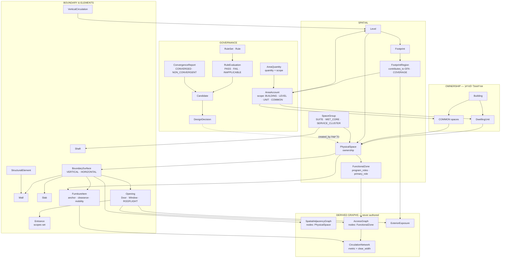

# Domain Model V2.1
## דלתא מלאה מ־24 כשלי הייצוג של E0a

| | |
|---|---|
| **Supersedes** | מודל הדומיין של `SPATIAL_ENGINE_SPEC_V2.md` (חלק י׳) |
| **Input** | `SPATIAL_ENGINE_E0A_STRESS_TEST.md` — 24 כשלי ייצוג |
| **Scope** | מודל דומיין בלבד. **לא** solver · **לא** roadmap · **לא** production code · **לא** E0a נוסף |
| **Not proven** | רב־קומתיות. במכוון — השלב הבא אחרי review |
| **Date** | 2026-09-08 |

---

## 0. עקרון הסיווג — נדרש לפני הדלתא

חמישה מ־24 הכשלים אינם "חסר ישות" אלא **סיווג שגוי**. לכן העיקרון קודם:

| קטגוריה | הפרה משמעה | נאכף | ניתן לייצג הפרה? |
|---|---|---|---|
| **Invariant** | הנתון **לא קוהרנטי** — אי אפשר להסיק ממנו דבר | בבנייה | **לא.** מצב בלתי אפשרי |
| **Rule** | התכנון **לא קביל** | בוולידציה | **כן — חובה.** אחרת אין דיווח הפרות ואין `best infeasible` |
| **Preference** | התכנון **פחות טוב** | בניקוד | כן |

> **המבחן:** אם אני צריך להראות למשתמש "זה חורג מקו הבניין" — אז חריגה מקו בניין **חייבת להיות
> ניתנת לייצוג**, ולכן היא Rule ולא Invariant. V2 ערבב את השניים בשש נקודות.

---

## 1. הדלתא — 24 כשלים, אחד־אחד

לכל כשל: מה V2 לא מסוגל לייצג · השינוי המינימלי · ישויות שנפגעות · breaking · מה עוד זה פותר · סיכון חדש.

---

### FL-A1 · תנועה כאזור מכוון בתוך מרחב פתוח
**Severity:** גבוהה
**V2 לא מסוגל:** ה־"מבואה פנימית" בתוכנית A היא אזור תנועה **מתויג ומכוון** בתוך המרחב הציבורי הפתוח.
V2 מכיר תנועה בתוך מרחב רק כטיפוס **שארית** `CIRCULATION_WITHIN_SPACE` — כלומר כמה שנשאר, לא כמה שתוכנן.
**שינוי מינימלי:** `Δ04` — `CIRCULATION` הופך ל־`program_role` מן המניין ב־`FunctionalZone`. הטיפוס
`CIRCULATION_WITHIN_SPACE` נמחק.
**נפגעים:** `FunctionalZone.program_roles`
**Breaking:** לא — הרחבת enum
**פותר גם:** FL-B7, ותורם ל־FL-C1
**סיכון חדש:** אזור תנועה שאינו מתויג במפורש ייעלם. נדרש כלל שהשארית בתיחום **חייבת** לקבל תפקיד
מפורש — אחרת חוזרים לשארית האילמת.

---

### FL-A2 · צוהר תקרה — אין גבול אופקי
**Severity:** קריטית
**V2 לא מסוגל:** `Opening` יושב על `Wall`, שיושב על `BoundaryEdge`, שהוא קשת ב**מישור** — כלומר גבול
**אנכי בלבד**. צוהר בתקרה חסר בית. תוצאה מעשית: מודל החשיפה פוסל את מבואת החדרים כחסרת אור בעוד
שבפועל היא מוארת מצוין.
**שינוי מינימלי:** `Δ07` — `BoundaryEdge` מוכלל ל־**`BoundarySurface`** עם
`orientation ∈ {VERTICAL, HORIZONTAL}`. אנכי מתממש כ־`Wall`, אופקי כ־`Slab`. `Opening` יושב על
`BoundarySurface` ולא על `Wall`. נוסף `ROOFLIGHT` לנפחים הפתוחים המוכרים.
**נפגעים:** `BoundaryEdge` (שם ומהות) · `Wall` · `Opening` · `ExteriorExposure` · כל גוזר הסמיכות
**Breaking:** **כן** — שינוי שם ומהות של ישות מרכזית
**פותר גם:** נותן בית טבעי ליחסי `ABOVE`/`BELOW` (הגבול האופקי בין קומה N לקומה N+1 **הוא** רשומת
הסמיכות האנכית) → מייתר את ה־enum שV2 הוסיף ל־adjacency בחלק ח׳. הכנה לרב־קומתיות בחינם.
**סיכון חדש:** פיתוי לדחוף את הפותר ל־3D. חובה להצהיר: **החלוקה ב־L2a נפתרת דו־ממדית לכל קומה;
גבולות אופקיים הם נגזרת, לא נעלם בחיפוש.**

---

### FL-A3 · ממ״ד שהוא גם חדר שינה
**Severity:** קריטית
**V2 לא מסוגל:** `FunctionalZone` נושא טיפוס תכניתי **יחיד**. הממ״ד חייב לספק בו־זמנית את חוקי הממ״ד
ואת דרישות חדר השינה (ריהוט, אור), ולהיספר בשטח **פעם אחת**.
**שינוי מינימלי:** `Δ03` — `program_roles: set<ProgramRole>` + `primary_role` יחיד שקובע חשבונאות.
כל החוקים של **כל** התפקידים חלים; השטח נספר לפי `primary_role` בלבד.
**נפגעים:** `FunctionalZone` · `RuleSet` (הרזולוציה לפי תפקיד) · `AreaAccount`
**Breaking:** כן — שדה בודד → קבוצה
**פותר גם:** תוכנית C (חדר שינה ממ״ד), וכל דפוס "חדר עבודה/אורחים"
**סיכון חדש:** צירוף תפקידים סותרים (`BATHROOM` + `BEDROOM`) יעבור ייצוג ויתפוצץ רק בוולידציה.
נדרש `RoleCompatibility` ב־`RuleSet` — **כלל, לא אינווריאנט**, כי צריך לדעת לייצג ולדווח.

---

### FL-A4 · ליבה רטובה של חבר יחיד
**Severity:** בינונית
**V2 לא מסוגל:** `WetCore` דורש ≥2 חברים. חדר הרחצה הצפוני בתוכנית A עומד לבדו ולכן אין לו שיוך
אינסטלציה ואין לו פיר.
**שינוי מינימלי:** `Δ02` — `WetCore` **נמחק כישות** ונבלע ב־**`SpaceGroup`** עם
`kind ∈ {SUITE, WET_CORE, SERVICE_CLUSTER}` ומינימום חבר אחד.
**נפגעים:** `WetCore` (נמחק) · `Shaft` (משויך ל־`SpaceGroup`) · `SpatialAdjacencyGraph` (צרכן)
**Breaking:** כן — מחיקת ישות
**פותר גם:** FL-C2 (סוויטת הורים) באותו שינוי בדיוק
**סיכון חדש:** `SpaceGroup` גנרי מדי עלול להפוך לפח־זבל. מיטיגציה: `kind` הוא enum סגור, וכל ערך
נושא אינווריאנטים משלו.

---

### FL-A5 · ארון בנוי שהוא ההפרדה עצמה
**Severity:** גבוהה
**V2 לא מסוגל:** רצועת ארון בעומק ~60 ס״מ שמפרידה בין שני מרחבים. V2 מכריח בחירה: או `Wall` (ואז
הארון אינו מיוצג) או `BuiltInCabinet` על מחיצה (ואז העומק כפול והשטח שגוי).
**שינוי מינימלי:** `Δ08` + `Δ10` — `BoundarySurface.realization ∈ {Wall, Slab, CabinetBoundary,
Glazing, Open}`. `BuiltInCabinet` **נמחק** ונבלע ב־`FurnitureItem` עם
`mobility=FIXED, may_realize_boundary=true`.
**נפגעים:** `BoundarySurface` · `BuiltInCabinet` (נמחק) · `FurnitureItem` · `AreaAccount`
**Breaking:** כן — מחיקת ישות
**פותר גם:** מפשט את המודל — ישות אחת פחות
**סיכון חדש:** **תלות דו־כיוונית** — ריהוט מממש גבול, וגבול קובע שטח שקובע ריהוט. חייב להיפתר
באותה נקודת שבת של `Δ16` ולא בלולאה נפרדת.

---

### FL-A6 · M1 אחיד פוסל תנועה תקינה
**Severity:** קריטית
**V2 לא מסוגל:** M1 (`opening_ratio`) הוא **אינווריאנט של `PhysicalSpace`**. מבואת החדרים הלא־סדירה
נפסלת ברדיוס של חדר שינה — למרות שהיא תנועה תקינה לחלוטין.
**שינוי מינימלי:** `Δ14` — M1 נשאר **חישוב אוניברסלי** על כל מרחב; **הסף וההחלה עוברים ל־`RuleSet`**
לפי `program_role`. עבור תנועה, המבחן הקובע אינו M1 אלא `clear_width` על קטע הרשת.
**נפגעים:** `PhysicalSpace` (אינווריאנט יורד) · `RuleSet` · `CirculationNetwork`
**Breaking:** לא — הסרת אינווריאנט מרחיבה את מרחב הייצוג
**פותר גם:** FL-C8 (מעטפת מדורגת) — אותו שינוי בדיוק
**סיכון חדש:** בלי סף ברירת מחדל, מרחב פתולוגי יעבור בשקט. נדרש ערך ברירת מחדל ב־`RuleSet` לכל
תפקיד — לא "אין כלל".

---

### FL-A7 · הערות שרטוט לא מוצהרות
**Severity:** נמוכה
**V2 לא מסוגל:** סימוני חתך, חץ ENTER ו־±0.00 אינם ישויות תכנון, אך V2 לא מצהיר עליהן כמחוץ לתחום,
ו־`Datum` מוזכר בגוף אך אינו ישות.
**שינוי מינימלי:** `Δ19` — שכבת מצג מוצהרת **מחוץ לתחום** מודל התכנון. `Level.datum_elevation`
מוגדר כשדה מפורש.
**נפגעים:** `Level`
**Breaking:** לא
**פותר גם:** FL-C7
**סיכון חדש:** אין. מדובר בהצהרת גבול.

---

### FL-A8 · תוכנית בלי מגרש
**Severity:** בינונית
**V2 לא מסוגל:** `Plot.north_azimuth` הוא אינווריאנט, ו־`BuildableRegion` נדרש. תוכנית A אינה מציגה
מגרש כלל — ולכן **לא ניתנת לקידוד**, למרות שהיא תוכנית לגיטימית לחלוטין.
**שינוי מינימלי:** `Δ21` — כל ישות אתר מקבלת מצב `UNKNOWN` **מפורש** (לא היעדר). כלל שתלוי בנתון
חסר מוערך כ־**`INAPPLICABLE`**, לא כ־`FAIL`. נוסף `RuleEvaluation.status ∈ {PASS, FAIL,
INAPPLICABLE, UNKNOWN_INPUT}`.
**נפגעים:** `Plot` · `BuildableRegion` · `RuleSet` · `Violation`
**Breaking:** לא — הרחבה
**פותר גם:** מיישר קו עם משמעת ה־`UNKNOWN != ZERO` שכבר קיימת בקוד הקיים (`RequirementState`)
**סיכון חדש:** `INAPPLICABLE` עלול לשמש כדי להשתיק חוקים. מיטיגציה: חייב לדווח **איזה קלט חסר**.

---

### FL-A9 · סמיכות וגישה אינן אותו גרף
**Severity:** קריטית
**V2 לא מסוגל:** V2 הניח שקשת גישה נשענת על `BoundaryEdge`. מופרך בשני הכיוונים: `BED-1 ↔ BED-2`
חולקים קיר בלי דלת (סמיכות בלי גישה); `KITCHEN ↔ LIVING` נגישים לחלוטין ואין ביניהם גבול כלל
(גישה בלי סמיכות).
**שינוי מינימלי:** `Δ06` — שלושה גרפים **נגזרים** מוצהרים, כל אחד עם מקור וצרכנים:

| גרף | צמתים | קשתות | נגזר מ־ |
|---|---|---|---|
| `SpatialAdjacencyGraph` | `PhysicalSpace` | `BoundarySurface` (+ orientation) | גיאומטריה |
| `AccessGraph` | **`FunctionalZone`** | `OPENING(id)` \| `INTRA_SPACE` | פתחים ∪ שיתוף תיחום |
| `CirculationNetwork` | נקודות גישה וצמתים | קטע מטרי עם `clear_width` | גישה + גיאומטריה + ריהוט |

בחירת `FunctionalZone` כצומת ה־`AccessGraph` היא מה שמאחד את שני המקרים: קשת `INTRA_SPACE` מבטאת
גישה בלי גבול.
**נפגעים:** `AccessGraph` (הצומת משתנה ממרחב לאזור) · `CirculationNetwork` · `BoundarySurface`
**Breaking:** **כן** — שינוי טיפוס הצומת
**פותר גם:** מבסס את `Δ05` (תנועתיות כתכונה) ואת עומק הפרטיות
**סיכון חדש:** שלושה גרפים = שלוש הזדמנויות לחוסר סנכרון. מיטיגציה: **כולם `DERIVED` בלבד, לעולם
לא נכתבים ידנית**, עם פונקציית גזירה אחת לכל אחד וביטול תוקף בכל שינוי גיאומטרי.

---

### FL-B1 · אין `DwellingUnit`
**Severity:** **חוסמת**
**V2 לא מסוגל:** V2 עובר מ־`Level` ישירות ל־`PhysicalSpace`. קומה עם שתי דירות **אינה ניתנת לקידוד
בכלל** — אין גבול יחידה, אין תוכנית ליחידה, אין חשבונאות ליחידה, אין כניסה ליחידה.
**שינוי מינימלי:** `Δ01` — ישות **`DwellingUnit`**. **קריטי: היא אינה יושבת מתחת ל־`Level`.**

```
Level        — חלוקה מרחבית
DwellingUnit — חלוקת בעלות
```

השתיים **אורתוגונליות**. מרחב שייך ל־`Level` אחד (אינווריאנט מרחבי) ול־`DwellingUnit` אחד לכל
היותר (בעלות). דופלקס = יחידה אחת שפורשת שתי קומות — עובד ללא שינוי נוסף.
וילה = בניין עם יחידה **אחת**, לא מקרה מיוחד — אותו מסלול קוד בדיוק.

**האינווריאנט המגדיר של יחידה** הוא גרפי, לא גיאומטרי:
> כל מרחבי היחידה קשירים ב־`AccessGraph` דרך הכניסה שלה, **בלי לעבור במרחב פרטי של יחידה אחרת**.

**נפגעים:** `PhysicalSpace` (שיוך בעלות) · `Entrance` · `AreaAccount` · `AccessGraph` · הצינור כולו
**Breaking:** **כן** — ישות חדשה בשרשרת ההכלה
**פותר גם:** FL-B2 · FL-B3 · FL-B5 · FL-B6 — כולם נגזרות של אותו חסר
**סיכון חדש:** אורתוגונליות `Level`/`DwellingUnit` מקשה על שאילתות ("כל מרחבי היחידה בקומה 2"
דורש חיתוך). זה המחיר הנכון — האלטרנטיבה שוברת דופלקס.

---

### FL-B2 · אין בעלות ואין רכוש משותף
**Severity:** קריטית
**V2 לא מסוגל:** גרעין המדרגות והמבואה המשותפת אינם שייכים לאף יחידה. אין מושג רכוש משותף — הבחנה
מחייבת בישראל.
**שינוי מינימלי:** `Δ11` — `PhysicalSpace.ownership ∈ {PRIVATE(unit_id), COMMON}`.

> **תיקון לדלתא של E0a:** שם הצעתי `{PRIVATE, COMMON, SERVICE}`. זה שגוי — `SERVICE` הוא **תפקוד**
> ולא בעלות. חדר מונים הוא `COMMON` מבחינת בעלות ו־`UTILITY` מבחינת תפקיד. הערבוב היה שלי.

**נפגעים:** `PhysicalSpace` · `AreaAccount` · `DwellingUnit`
**Breaking:** לא — שדה חדש עם ברירת מחדל
**פותר גם:** תנאי מקדים ל־FL-B3
**סיכון חדש:** אין.

---

### FL-B3 · קיר משותף — אין חלוקת שטח בין יחידות
**Severity:** גבוהה
**V2 לא מסוגל:** `AreaAccount` הוא לכל **קומה**. אין איך לחלק שטח קיר משותף בין שתי יחידות.
**שינוי מינימלי:** `Δ11b` + `Δ20` — `AreaAccount.scope ∈ {BUILDING, LEVEL, UNIT, COMMON}`.

> **תיקון שני לדלתא של E0a:** שם כתבתי "חשבון לכל (יחידה × קומה)". זה נשבר על דופלקס — חשבון
> היחידה חייב להיות מעל כל מרחביה, בכל הקומות. לכן **scope enum** ולא מכפלה.

חלוקת קיר משותף היא **כלל** (`WallAreaAllocationRule`). ברירת המחדל מגיעה בחינם מהמודל ההיברידי
של V2 §ז: מכיוון שפותרים ב־**קו מרכז**, החלוקה לקו המרכז היא בדיוק חצי־חצי — התשובה התקנית, ללא
מנגנון נוסף.
**נפגעים:** `AreaAccount` · `Wall` · `RuleSet`
**Breaking:** כן — שינוי מבנה החשבון
**פותר גם:** FL-B8 חלקית (ראה שם)
**סיכון חדש:** ארבעה scopes = ארבע הזדמנויות לספור פעמיים. נדרש אינווריאנט: `Σ UNIT + COMMON = BUILDING`.

---

### FL-B4 · "בדיוק כניסה ראשית אחת" — אינווריאנט שגוי
**Severity:** קריטית
**V2 לא מסוגל:** V2 קובע כאינווריאנט שקיימת `Entrance` אחת מטיפוס `Main`. בתוכנית B יש **שלוש**:
כניסת בניין ושתי כניסות יחידה.
**שינוי מינימלי:** `Δ12` — `Entrance.scopes: set<{SITE_GATE, BUILDING, UNIT}>` — **קבוצה**, כי דלת
הכניסה של וילה היא בו־זמנית כניסת בניין וכניסת יחידה, וזו עובדה ולא כפילות.
האינווריאנט מוחלף בכללים:
- לכל `DwellingUnit` ≥1 כניסה עם `UNIT ∈ scopes` — **Rule**
- לכל בניין ≥1 כניסה עם `BUILDING ∈ scopes` — **Rule**
- "בדיוק כניסה ראשית אחת ליחידה" — **Preference**, לא כלל

**נפגעים:** `Entrance` · `AccessGraph` (שורש) · `DwellingUnit`
**Breaking:** כן — הסרת אינווריאנט + שינוי שדה
**פותר גם:** FL-B5
**סיכון חדש:** אין.

---

### FL-B5 · שורש `AccessGraph` היררכי
**Severity:** גבוהה
**V2 לא מסוגל:** V2 מניח שורש יחיד. המסלול האמיתי: רחוב → כניסת בניין → גרעין משותף → כניסת יחידה
→ פנים היחידה.
**שינוי מינימלי:** נגזר מ־`Δ01` + `Δ12` — ה־`AccessGraph` מושרש ב**קבוצת** הכניסות שב־scope
`SITE_GATE`/`BUILDING`. עומק הפרטיות נמדד **מכניסת היחידה**, לא מכניסת הבניין — אחרת כל דירה בקומה
3 תיראה "פרטית מאוד" בזכות המדרגות.
**נפגעים:** `AccessGraph` · `Entrance` · חישוב `step_depth`
**Breaking:** לא — מוכל ב־`Δ01`/`Δ12`
**פותר גם:** —
**סיכון חדש:** שני מדדי עומק (מהבניין / מהיחידה). חייב להצהיר איזה מהם נכנס לניקוד הפרטיות.

---

### FL-B6 · הצינור מניח תוכנית אחת
**Severity:** גבוהה
**V2 לא מסוגל:** S0–S12 מניח `program` יחיד. בבניין רב־יחידתי יש תוכנית־על ותוכניות ליחידות.
**שינוי מינימלי:** `Δ18` — `BuildingProgram` = אוסף `UnitProgram` + תוכנית משותפת. תקצוב שטח פועל
בשתי סקאלות.
**נפגעים:** מודל התוכנית · `AreaAccount` · `DwellingUnit`
**Breaking:** כן — מבנה הקלט
**פותר גם:** —
**סיכון חדש:** מסבך את הבריף. **מיטיגציה: וילה = `BuildingProgram` עם `UnitProgram` יחיד** — אין
מסלול מיוחד, ולכן המורכבות לא נוגעת במקרה הנפוץ.

---

### FL-B7 · מרחב אחד עם שלושה אזורים ביחידת 34 מ״ר
**Severity:** — (מחזק)
**שינוי מינימלי:** מכוסה ב־`Δ04`
**פותר גם:** —
**סיכון חדש:** אין.

---

### FL-B8 · "34 / 130 מ״ר" — לא ניתן לדעת איזו כמות
**Severity:** קריטית
**V2 לא מסוגל:** התוכנית מדפיסה שטח על עצמה, ואי אפשר לדעת אם זה `NetArea` של היחידה, `GFA` שלה,
או GFA כולל חלק יחסי ברכוש המשותף.
**שינוי מינימלי:** `Δ22` — כל מספר שטח במודל הוא **`AreaQuantity` מטיפוס מפורש**:
`{quantity ∈ {PROGRAM, NET, GFA, PRIMARY, SERVICE}, scope ∈ {BUILDING, LEVEL, UNIT, COMMON, SPACE, ZONE}}`.
מספר שטח בלי שני השדות האלה **אינו ניתן לביטוי**.

> **הבחנה חשובה:** זה **סוגר את פער המודל ולא את השאלה הדומיינית.** אחרי `Δ22` אפשר לייצג כל אחת
> משלוש הפרשנויות באופן חד־משמעי. **איזו מהן הפרקטיקה הישראלית מתכוונת אליה — נשאר פתוח**, וזו
> שאלת מוצר/משפט שהמודל לא אמור להכריע.

**נפגעים:** `AreaAccount` · `ProgramArea` · `FunctionalZone` · `RuleSet` · חוזה ה־API
**Breaking:** **כן — הרחב ביותר.** כל שדה שטח בכל המערכת
**פותר גם:** מבטל את `built_area_m2` הרב־משמעי בשורש (F2 מ־V1)
**סיכון חדש:** מלל. מיטיגציה: ברירת מחדל מוצהרת לכל הקשר, כך שרק חריגה דורשת ציון מפורש.

---

### FL-C1 · אזור מתפקד בתוך חלל תנועה
**Severity:** קריטית
**V2 לא מסוגל:** "פינת עבודה" יושבת בתוך חלל התנועה. V2 מגדיר `CirculationSpace` כ"מרחב שתפקידו
**היחיד** תנועה" — הגדרה שהמציאות מפריכה.
**שינוי מינימלי:** `Δ05` — **`CirculationSpace` נמחקת כישות.** תנועתיות היא **תכונה** של
`FunctionalZone` (תפקיד `CIRCULATION`) ושל `CirculationSegment` — לא סוג של מרחב.
**נפגעים:** `CirculationSpace` (נמחק) · `FunctionalZone` · `CirculationNetwork`
**Breaking:** כן — מחיקת ישות
**פותר גם:** משלים את `Δ04`; יחד הם עושים את היחס דו־כיווני — מרחב פתוח יכול לארח אזור תנועה,
וחלל תנועה יכול לארח אזור מתפקד
**סיכון חדש:** "כמה תנועה יש בתוכנית" הופך לשאילתה על אזורים במקום ספירת חדרים. חייב להיות מדד
מוגדר ולא ספירה נאיבית.

---

### FL-C2 · סוויטת הורים — אין `SpaceGroup`
**Severity:** גבוהה
**V2 לא מסוגל:** חדר + חדר ארונות + מקלחת עם שער גישה אחד. משפיע על עומק פרטיות ועל ביטוי התוכנית
("סוויטה 25 מ״ר").
**שינוי מינימלי:** מכוסה ב־`Δ02` — `SpaceGroup{kind: SUITE}`
**נפגעים:** `SpaceGroup` · `AccessGraph` (שער) · `AreaAccount` (שטח מצטבר)
**Breaking:** כן (מוכל ב־`Δ02`)
**פותר גם:** FL-A4 — **אותו שינוי אחד פותר את שניהם**
**סיכון חדש:** ראה `Δ02`.

---

### FL-C3 · מרפסת שקועה — לא חור ולא שטח
**Severity:** גבוהה
**V2 לא מסוגל:** V2 אומר "חצרות הן חורים ולא שטח". מרפסת שקועה **אינה חור** — היא שקע פתוח מצד
אחד, בתוך קו המעטפת, שאינו נספר ב־GFA.
**שינוי מינימלי:** `Δ13` — `Footprint.gross_outline` + `FootprintRegion[]`, כאשר לכל אזור
`contributes_to: set<{GFA, COVERAGE}>`. חור וש קע מפסיקים להיות מקרים שונים — שניהם אזורים עם
דגלי חשבונאות.
**נפגעים:** `Footprint` · `AreaAccount` · `OutdoorSpace`
**Breaking:** כן — מבנה `Footprint`
**פותר גם:** **מפשט** — מבטל את ההבחנה המלאכותית חור/שקע; חצר, מרפסת שקועה ומרפסת בולטת הן אותו
מנגנון עם דגלים שונים
**סיכון חדש:** הדגלים תלויי־חוק. חייבים להגיע מ־`RuleSet` ולא להיקבע בישות.

---

### FL-C4 · עיגון ומרווח כיווני של ריהוט
**Severity:** גבוהה
**V2 לא מסוגל:** האי במטבח מעוגן ל**כלום** — עומד חופשי אך קבוע. `BuiltInCabinet` ב־V2 "מעוגן
ל־`Wall`". בנוסף, מקרר/תנור/מכונת כביסה דורשים מרווח **בכיוון אחד** ולא מסביב.
**שינוי מינימלי:** `Δ09` — `FurnitureItem` מקבל:
```
anchor      ∈ { WALL(surface_id, offset) | FLOOR(point, rotation) | CEILING(surface_id) | NONE }
clearance   : [ ClearanceZone{ side ∈ {FRONT, BACK, LEFT, RIGHT, ALL}, depth_m } ]
mobility    ∈ { FIXED, LOOSE }
may_realize_boundary : bool
```
**נפגעים:** `FurnitureItem` · `BuiltInCabinet` (נמחק) · `BoundarySurface` · `CirculationNetwork`
(רק `FIXED` משתתף ב־`clear_width`)
**Breaking:** כן — מחיקת ישות + שינוי סכמה
**פותר גם:** FL-A5 · FL-C5
**סיכון חדש:** מרווח כיווני דורש כיוון (rotation) לכל פריט, גם כשהוא לא רלוונטי. נדרש ערך ברירת
מחדל שלא מכריח מידע שאין.

---

### FL-C5 · סט ריהוט נדרש חייב להגיע מ־`RuleSet`
**Severity:** בינונית
**V2 לא מסוגל:** חדר ארונות דורש סט ריהוט שונה מהותית מכל חדר אחר. V2 לא אומר מאיפה הסט מגיע.
**שינוי מינימלי:** מכוסה ב־`Δ09` — `RuleSet.required_furniture(program_role)`
**נפגעים:** `RuleSet` · `FurnitureItem` · M2/M3
**Breaking:** לא
**פותר גם:** —
**סיכון חדש:** אין.

---

### FL-C7 · שכבת מצג לא מוצהרת
**Severity:** נמוכה
**שינוי מינימלי:** מכוסה ב־`Δ19`
**סיכון חדש:** אין.

---

### FL-C8 · מעטפת מדורגת מול M1 אחיד
**Severity:** גבוהה
**שינוי מינימלי:** מכוסה ב־`Δ14` — **אותו שינוי בדיוק כמו FL-A6**
**סיכון חדש:** ראה `Δ14`.

---

### כשל־על · לולאת קיר↔מידה אינה מתכנסת בסבב אחד
**Severity:** גבוהה (עלה מ־E0a §4.5, לא ממוספר כ־FL)
**V2 לא מסוגל:** V2 קובע "סבב תיקון אחד". שרשרת התלות אינה נעצרת: עובי → שטח נטו → ירידה מתחת
למינימום → הקצאה מחדש → מידות שכנים → אולי טיפוס קיר אחר → עובי.
**שינוי מינימלי:** `Δ16` — נקודת שבת חסומה + ישות `ConvergenceReport`:
```
ConvergenceReport {
  iterations, max_delta_area_m2,
  status ∈ { CONVERGED, NON_CONVERGENT, ABORTED_BUDGET },
  oscillating_entities : [ref]        # חובה — אחרת אי אפשר לאבחן
}
```
`NON_CONVERGENT` הוא **מצב ניתן לייצוג** (מועמד תקין כאובייקט) אך **לא ניתן לקבלה** — הולך
ל־`best infeasible` עם הפרה מסוג ייעודי. עקבי לחלוטין עם עקרון הסיווג בחלק 0.
**נפגעים:** `Candidate` · `Wall` · `AreaAccount` · `FurnitureItem` (דרך `may_realize_boundary`)
**Breaking:** לא — הרחבה
**פותר גם:** נותן בית גם לתלות הדו־כיוונית של `Δ08`/`Δ10`
**סיכון חדש:** **`NON_CONVERGENT` עלול לשמש כפתח מילוט** — "לא התכנס" במקום לתקן מודל שגוי.
מיטיגציה: `oscillating_entities` הוא **שדה חובה**, כדי שאי־התכנסות תהיה תמיד ניתנת לאבחון ולא
סטטוס אילם.

---

## 2. סיכום השינויים

| Δ | שינוי | סוג | Breaking | כשלים שנפתרים |
|---|---|---|---|---|
| **Δ01** | `DwellingUnit` — אורתוגונלי ל־`Level` | ישות חדשה | כן | B1, B2, B3, B5, B6 |
| **Δ02** | `SpaceGroup{SUITE, WET_CORE, SERVICE_CLUSTER}`; `WetCore` נמחק | מיזוג | כן | A4, C2 |
| **Δ03** | `program_roles: set` + `primary_role` | סמנטיקה | כן | A3 |
| **Δ04** | `CIRCULATION` כתפקיד מן המניין | סמנטיקה | לא | A1, B7 |
| **Δ05** | `CirculationSpace` נמחק | מחיקה | כן | C1 |
| **Δ06** | שלושה גרפים; צומת `AccessGraph` = `FunctionalZone` | סמנטיקה | כן | A9 |
| **Δ07** | `BoundaryEdge` → **`BoundarySurface`** + `Slab` + `ROOFLIGHT` | הכללה | כן | A2 |
| **Δ08** | `BoundarySurface.realization` | סמנטיקה | כן | A5 |
| **Δ09** | `FurnitureItem`: anchor · מרווח כיווני · mobility | סכמה | כן | C4, C5, A5 |
| **Δ10** | `BuiltInCabinet` נמחק → `FurnitureItem` | מחיקה | כן | A5 |
| **Δ11** | `ownership ∈ {PRIVATE, COMMON}` | שדה | לא | B2 |
| **Δ11b** | `AreaAccount.scope` enum | סמנטיקה | כן | B3 |
| **Δ12** | `Entrance.scopes: set` | סמנטיקה | כן | B4, B5 |
| **Δ13** | `Footprint.gross_outline` + `FootprintRegion` | סמנטיקה | כן | C3 |
| **Δ14** | M1: חישוב אוניברסלי, סף ב־`RuleSet` | סיווג מחדש | לא | A6, C8 |
| **Δ16** | נקודת שבת חסומה + `ConvergenceReport` | ישות חדשה | לא | כשל־העל |
| **Δ18** | `BuildingProgram` = אוסף `UnitProgram` | מבנה | כן | B6 |
| **Δ19** | שכבת מצג מחוץ לתחום; `datum_elevation` | הצהרה | לא | A7, C7 |
| **Δ20** | `WallAreaAllocationRule` | כלל | לא | B3 |
| **Δ21** | `UNKNOWN` מפורש + `RuleEvaluation.status` | הרחבה | לא | A8 |
| **Δ22** | `AreaQuantity{quantity, scope}` | סמנטיקה | **כן — הרחב** | B8 |

**מאזן ישויות:** +6 (`DwellingUnit`, `SpaceGroup`, `Slab`, `ConvergenceReport`, `FootprintRegion`,
`RuleEvaluation`) · −4 (`CirculationSpace`, `WetCore`, `BuiltInCabinet`, `BoundaryEdge` מוכלל) ·
**נטו +2**. הדלתא אינה צמיחה טהורה — ארבע ישויות נמחקות.

> **על פער המספור:** אין `Δ15` ואין `Δ17`. שתי ההצעות המקבילות ב־E0a (`D15` הפרדת אינווריאנט מחוק,
> `D17` מינימום חבר אחד ב־`WetCore`) לא נמחקו אלא **נבלעו**: `D15` הפך לעקרון המארגן של המסמך
> (חלק 0 + חלק 3) ולכן אינו שינוי נקודתי, ו־`D17` נבלע ב־`Δ02`. המספור נשמר מיושר ל־E0a בכוונה
> כדי שההשוואה בין המסמכים תהיה ישירה.

---

## 3. סיווג מחדש — Invariant / Rule / Preference

| כלל | V2 | **V2.1** | נימוק |
|---|---|---|---|
| `opening_ratio ≥ סף` (M1) | Invariant | **Rule** | תלוי תפקיד — A6, C8 |
| "בדיוק כניסה ראשית אחת" | Invariant | **Rule** (ליחידה) + **Preference** (אחת בלבד) | B4 |
| `WetCore` ≥ 2 חברים | Invariant | **Preference** | A4 |
| `Footprint ⊆ BuildableRegion` | Invariant | **Rule** | חייבים לייצג חריגה כדי לדווח |
| `north_azimuth` מוגדר | Invariant | **Rule מותנה** → אחרת `INAPPLICABLE` | A8 |
| תאימות תפקידים באזור | — | **Rule** (חדש) | A3 |
| התכנסות לולאת הקיר | — | **Rule** (חדש) | כשל־העל |
| אזורים מרצפים את התיחום | Invariant | **Invariant** | הגדרתי |
| אין `Opening` בגבול פנימי בין אזורים | Invariant | **Invariant** | הגדרתי |
| מרחב שייך לקומה אחת | Invariant | **Invariant** | הגדרתי |
| מרחב שייך ליחידה אחת לכל היותר | — | **Invariant** (חדש) | הגדרתי |
| מרחבים אינם חופפים | Invariant | **Invariant** | הגדרתי |
| `Σ UNIT + COMMON = BUILDING` | — | **Invariant** (חדש) | Δ11b |
| יישור אנכי של פיר/גרעין | Invariant | **Invariant** | פיזי |

---

## 4. Domain Model V2.1 — הישויות הסופיות

### אתר
`Plot` · `StreetEdge` · `BuildableRegion` · `BuildableExclusion` · `VehicleAccess` ·
`PedestrianApproach` · `OutdoorSpace`
> כולן תומכות ב־`UNKNOWN` מפורש (`Δ21`).

### מבנה ובעלות
`Level` (מרחבית) · **`DwellingUnit`** (בעלות — אורתוגונלית) · `Footprint` + **`FootprintRegion`** ·
`PhysicalSpace` (+`ownership`) · `FunctionalZone` (+`program_roles`) · **`SpaceGroup`** ·
**`BoundarySurface`** (+`orientation`, `realization`) · `Wall` · **`Slab`** · `Opening` ·
`Entrance` (+`scopes`) · `Shaft` · `StructuralElement` · `FurnitureItem` · `VerticalCirculation`

### מופשטות ונגזרות
`SpatialAdjacencyGraph` · `AccessGraph` · `CirculationNetwork` · `ExteriorExposure` ·
`AreaAccount` (+`scope`) · **`AreaQuantity`**

### ממשל
`RuleSet` · `Rule` · `RuleEvaluation` · `Violation` · `DesignDecision` · `Candidate` ·
**`ConvergenceReport`**

### נמחקו
~~`CirculationSpace`~~ → תכונה · ~~`WetCore`~~ → `SpaceGroup{WET_CORE}` ·
~~`BuiltInCabinet`~~ → `FurnitureItem{FIXED}` · ~~`BoundaryEdge`~~ → `BoundarySurface{VERTICAL}`

---

## 5. תרשים קשרים V2.1



**שלוש קריאות מהתרשים:**

1. **בעלות ומרחב אורתוגונליים.** `DwellingUnit` ו־`Level` שניהם מצביעים על `PhysicalSpace` ואינם
   מצביעים זה על זה. זה מה שמאפשר דופלקס.
2. **`BoundarySurface` הוא הצומת היחיד** שממנו יוצאים `Wall`, `Slab`, `Opening` ו־`Furn` — ומשם
   נגזרת הסמיכות. זה מה שנתן לצוהר התקרה בית.
3. **שלושת הגרפים הם עלים נגזרים** — שום חץ לא נכנס אליהם מהממשל, ואף אחד לא נכתב ידנית.

---

## 6. סיכונים חדשים — מרוכז

| סיכון | מקור | מיטיגציה |
|---|---|---|
| `NON_CONVERGENT` כפתח מילוט | Δ16 | `oscillating_entities` שדה **חובה** |
| שלושה גרפים לא מסונכרנים | Δ06 | כולם `DERIVED` בלבד; ביטול תוקף בכל שינוי גיאומטרי |
| ספירה כפולה בין scopes | Δ11b | אינווריאנט `Σ UNIT + COMMON = BUILDING` |
| `INAPPLICABLE` משתיק חוקים | Δ21 | חובה לדווח **איזה קלט חסר** |
| תלות דו־כיוונית ריהוט↔גבול | Δ08/Δ10 | נפתרת בתוך נקודת השבת של Δ16, לא בלולאה נפרדת |
| `SpaceGroup` כפח־זבל | Δ02 | `kind` enum סגור; אינווריאנטים לכל ערך |
| שני מדדי עומק פרטיות | Δ12 | להצהיר שהניקוד משתמש בעומק **מכניסת היחידה** |
| מלל ב־`AreaQuantity` | Δ22 | ברירת מחדל להקשר; רק חריגה מצוינת |
| אזור תנועה אילם | Δ04 | כלל: שארית בתיחום **חייבת** תפקיד מפורש |
| תפקידים סותרים באזור | Δ03 | `RoleCompatibility` ב־`RuleSet` |
| פיתוי ל־3D בפותר | Δ07 | הצהרה: L2a נפתר **דו־ממדית לכל קומה**; גבול אופקי נגזר |

---

## 7. מה V2.1 לא מוכיח

**רב־קומתיות לא נבדקה.** `Δ01` (אורתוגונליות `Level`/`DwellingUnit`) ו־`Δ07` (גבול אופקי) נועדו
לתמוך בה, ושתיהן **נגזרות משיקול ולא מראיה** — שלוש התוכניות ב־E0a הן מפלס אחד.

זה במכוון השלב הבא אחרי review, ולא נכלל כאן.

**גם לא נבדק:** `DesignDecision` (אין החלטות בפירוק ידני) · התכנסות בפועל של `Δ16` · כל רובד מטרי.
