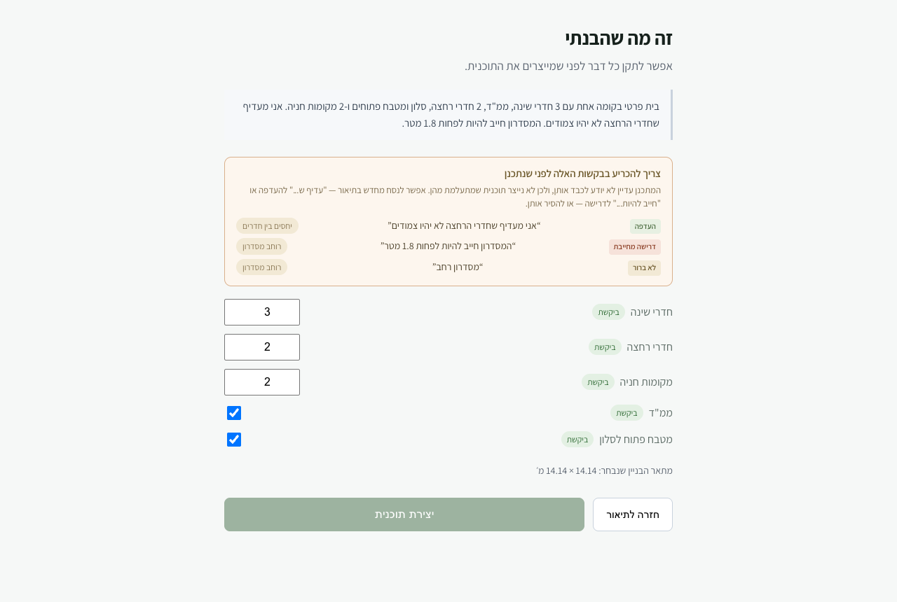

# UNSUPPORTED_REQUEST_CLASSIFICATION_REPORT

```
STATUS = DONE
TESTS  = 690 backend (was 688, +6 net), 64 frontend (was 62, +4 net), tsc clean
SCOPE  = parser / review / capability-check semantics only
         no new architectural capability: the corridor is still 1.4 m and adjacency is still
         decided internally
```

Disclosure alone was not enough. **The wording decides what may happen next**, and the same
underlying request now leads to three different outcomes.

<p align="center">
  
</p>

---

## The three severities

| Severity | Example | What happens |
|---|---|---|
| `preference` | "אני מעדיף מסדרון רחב" | **Plan is produced.** The request is quoted on the review screen and again as a warning on the plan itself: `לא נכלל בתכנון: "…"` |
| `hard_requirement` | "המסדרון חייב להיות לפחות 1.8 מטר" | **Refused** — `UNSUPPORTED_HARD_REQUIREMENT`. Planning around it would overrule a point the person made binding. |
| `ambiguous` | "מסדרון רחב" | **Refused** — `CLARIFICATION_REQUIRED`. Which of the two it is, is the person's call, not ours. |

`severity` is a reading of the **text**, never of how important the request sounds. Both examples
above ask for the same thing; only one of them can be set aside without agreement.

---

## What changed

**Parser** — `RequestSeverity` enum on `UnsupportedRequest`. The prompt lists the cues explicitly:
חייב / חובה / נדרש / אסור / לפחות / לא פחות מ / מינימום and a bare numeric bound read as
`hard_requirement`; עדיף / רצוי / אשמח / כדאי / אם אפשר read as `preference`; a bare noun phrase or a
plain statement with no modality reads as `ambiguous`. The prompt says in as many words: *when in
doubt choose ambiguous, do not guess a severity to be helpful.*

**Fail closed.** The field defaults to `AMBIGUOUS`, both on the model and in storage. An
unclassified request stops generation and asks, rather than being quietly demoted to "just a
preference" and planned around. Pinned by `test_an_unclassified_request_fails_closed`.

**Capability check** — two new codes in `app/demo/scope.py`, checked before any planning runs. Hard
requirements are reported **before** ambiguous ones: a definite blocker is more useful to hear about
than an unclear one. The message names the quoted request and offers the way forward — rephrase as a
preference, remove it, or wait for support — and never claims the house cannot be built.

**Plan warnings** — `app/demo/service.py` now passes only `severity == "preference"` through to the
plan. Nothing else can reach a plan, because the gate refuses first.

**Review screen** — each request carries a badge (העדפה / דרישה מחייבת / לא ברור). When anything is
not a preference the panel changes voice: the heading becomes *"צריך להכריע בבקשות האלה לפני
שנתכנן"*, and **the generate button is disabled** with a title explaining why. Telling the person
before they press beats letting them press and read a refusal. "חזרה לתיאור" stays enabled — with
the form-preservation fix from earlier, editing the brief is a real way out.

---

## Tests

Six new backend tests, all through the real routes:

| Test | Case |
|---|---|
| `test_a_preference_we_cannot_honour_warns_but_still_plans` | "אני מעדיף מסדרון רחב" → 200, valid plan, request in `warnings`, and no passing statement claims it was honoured |
| `test_a_hard_requirement_we_cannot_honour_stops_generation` | "המסדרון חייב להיות לפחות 1.8 מטר" → 422 `UNSUPPORTED_HARD_REQUIREMENT`, quoted, offers a way forward |
| `test_wording_that_settles_neither_asks_before_planning` | "מסדרון רחב" → 422 `CLARIFICATION_REQUIRED` |
| `test_mixed_severities_are_judged_by_the_most_binding_one` | all four at once → the hard requirement is the blocker and is the one named; the preference is not |
| `test_an_unclassified_request_fails_closed` | no severity given → treated as ambiguous, refused |
| `test_a_brief_with_nothing_extra_reports_nothing` | a clean brief produces no noise |

Four frontend tests cover the badges, the blocking heading, the disabled generate button with the
escape route still open, and a preference-only brief that still generates.

Two earlier tests were rewritten rather than kept: they asserted that unsupported requests never
block generation, which is exactly the behaviour this task replaces.

---

## Still not implemented, by instruction

The corridor is still **1.4 m** (front-band parti) / capped at **2.4 m** (column partis), and
bathroom adjacency is still decided internally by `_allocations` and `_rows_of`. Nothing here plans
anything new — it only makes the system honest about which requests it is setting aside and which
ones it refuses to set aside on its own.

The two capability steps remain ready when you want them: corridor width as a real parameter (the
smaller of the two — one number plus removing those two constants), and adjacency/separation
constraints in the concept generator.

Stopping for review.
