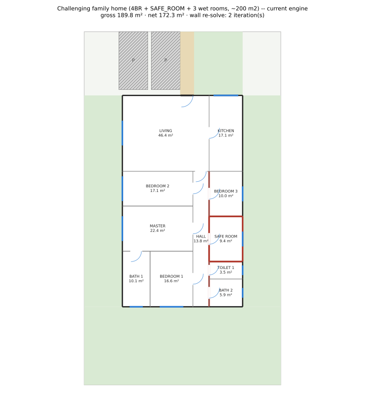
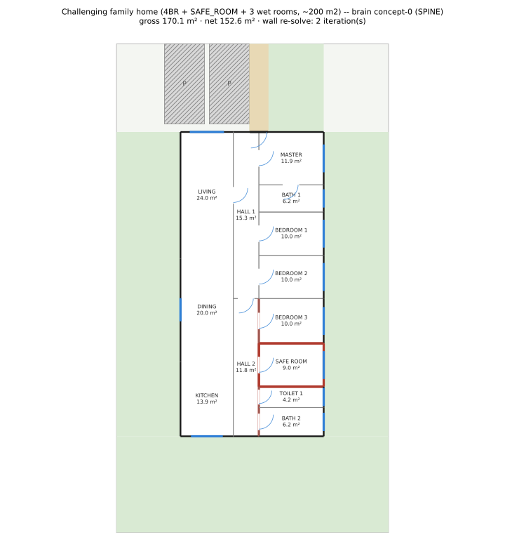
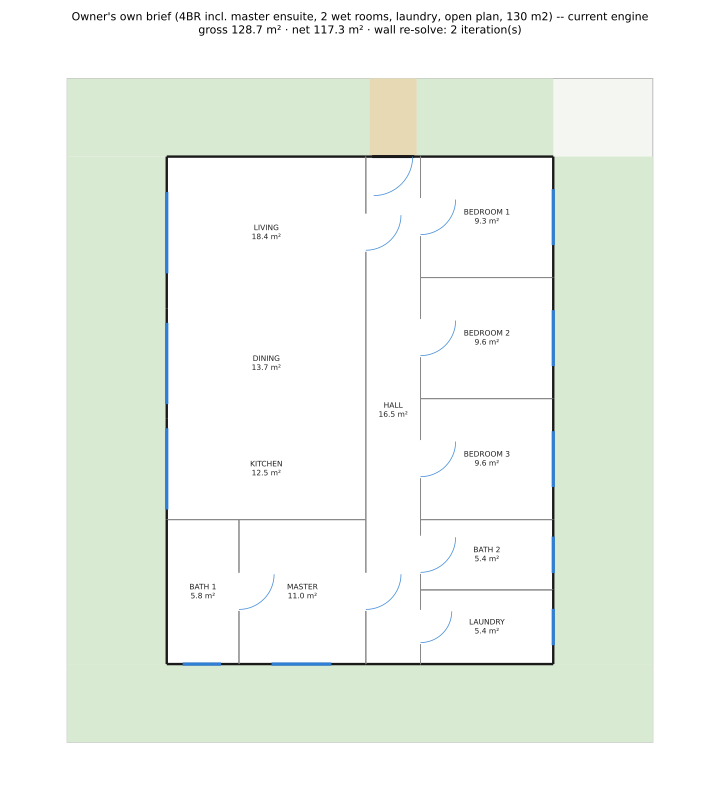
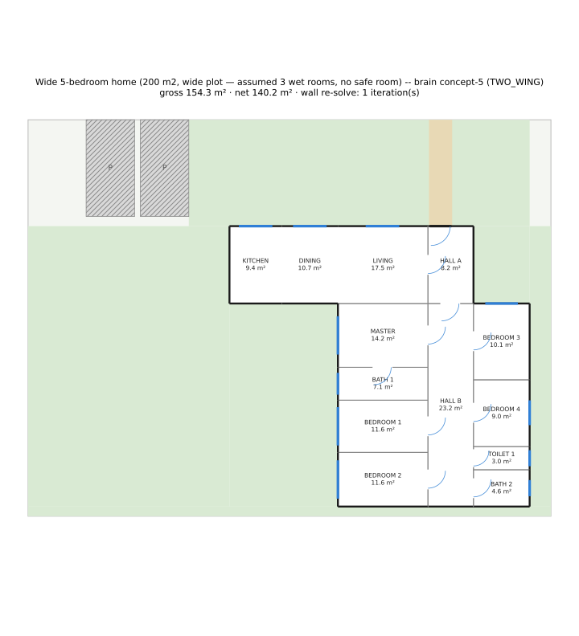

# POC Architectural Brain — realization through the existing engine (Issue #96, C/3)

**The question this POC exists to answer:** did access to real architectural experience (the
Issue #94 corpus + #95's retrieve/synthesize/adapt) give BuildSmart an architectural brain that is
*visibly* better than the current hand-designed concept generator?

**Recommendation: MODIFY.**

This closes the loop: the brain's synthesized, adapted `ConceptSpec`s are compiled
(`spikes/architectural_brain/realize.py`) into a Geometry Core `Fixture` and run through the
*unchanged* `solve_fixture` + `general_pipeline._realize` chain — the same doors, windows,
furniture, validation and assembly stages every production plan goes through (AC-2, verified by
`test_demo_alternatives.py::test_poc_plans_come_from_the_unchanged_realize_chain`). The result is a
genuine, honest positive on one axis and a genuine, honest gap on another — see the checklist below
before either is taken as the whole story.

## How to read this page

Each of the 3 fixed benchmark briefs (`tests/architectural_brain/briefs.py`) gets its own section:
**A** = the current, hand-designed `concept_generator` (baseline). **B** = the brain's own realized
alternative(s) — synthesized from the corpus, adapted to the brief, compiled and validated. Full
detail (retrieved references + WHY, extracted ideas, what adaptation changed, per-plan
measurements) is in each `brief-N/references.md` / `brief-N/comparison.md`. Produced by
`spikes/architectural_brain/demo.py` (`current` / `references` / `alternative` / `comparison`
subcommands) — deterministic, re-runnable.

---

## Brief 1 — the challenging family home

4 bedrooms + SAFE_ROOM + 3 wet rooms, ~200 m², plot 17×30.5 m, street north. A plain rectangle
(one safe-adapter candidate) — the site TWO_WING needs two adjacent candidates for is not offered
here, so this brief can only ever show what SPINE looks like.

### A — current engine (`concept_generator`)

Realized, `ok=True`, **circulation_class=FRONT_BAND**, in 1.6 s.

### B — brain alternatives

| | brain-A (`concept-0`) | brain-B (`concept-1`) |
|---|---|---|
| |  |  |
| realized class | SPINE | SPINE |
| `ok` | True | True |
| time | 191.5 s | 4.0 s |
| donor references | different (see `brief-1/references.md`) | different |
| adaptations | RESIZE_ROOMS only | RESIZE_ROOMS + BEDROOM_COUNT_ADJUST (+1) |

**Honest finding (MODIFY item 1 attempted, see Recommendation below):** brain-A and brain-B are
sourced from two DIFFERENT retrieved donor plans with different declared patterns (`OTHER` vs
`FRONT_BAND`) and different adaptation operations — and, after this attempt's fix, genuinely
DIFFERENT per-room target areas (`adaptation.py`'s `RESIZE_ROOMS` now carries each donor's own
room-area proportions forward instead of a fixed per-type constant — measured: brain-A's three
non-master bedrooms target 11.06/13.70/10.19 m², brain-B's target 9.25/12.64/14.0 m², genuinely
different, not the identical 12.0 m² each donor got before this attempt). They STILL realize to the
**identical geometry** (every measurement in `brief-1/comparison.md` still matches to the metre; the
two SVGs differ only in matplotlib's own auto-generated clip-path ids and render timestamp — a
byte-for-byte diff confirms it). Cause, root-caused this attempt (not the same cause as before): on
this brief's own tight site, `geometry_core.engine`'s frozen bottom-up shape-curve search
(`assign`/`leaf_shapes`) admits only ONE feasible footprint depth across `_DEPTH_TRIALS_M`, and once
that depth (and each column's own forced width) is fixed, the individual room heights within an
H-chain are themselves pinned to the ONE combination satisfying every room's own
[min_short_side, max_aspect_ratio] bound at that exact width — there is no remaining freedom for a
"target area preference" to express itself in (brain-B's own 4.0 s solve time, vs brain-A's 191.5 s,
shows it found that ONE combination far faster, not a DIFFERENT one). This is a property of the
frozen Geometry Core `assign()` this POC does not touch (out of scope, AC-2), not a bug in the fix:
different donor proportions DO now reach the compiler's own inputs (verified above), they just do
not survive this specific site's own tight feasibility margin. The retrieval/synthesis layer (#95)
is genuinely diverse (different WHY, different patterns cited); this realization layer (#96) now
carries that diversity all the way to the compiler's per-room targets, but brief-1's own site
geometry still collapses it before it reaches the drawing.

---

## Brief 2 — the owner's own brief

4 bedrooms (3 + master ensuite), 2 wet rooms, laundry, open plan, 130 m², plot 15×17 m. The
tightest of the 3 (documented in `briefs.BRIEF_2`'s own comment: even the production engine falls
short by 0.08–0.7 m at full plot width for this exact room mix).

### A — current engine (`concept_generator`)

Realized, `ok=True`, **circulation_class=SPINE**, in 0.2 s.

### B — brain alternatives

**REALIZED, `ok=False` — 2/2 (MODIFY item 3 attempted, see Recommendation below).** Attempt 1's
single-column SPINE compiler refused both concepts outright (the plot's own 13.0 m keep depth is
not enough to height-stack this brief's 7 private rooms in one column). This attempt adds a
double-loaded single-wing SPINE variant (`realize.py`'s `_compile_spine_double_loaded` —
TWO_WING's own width-for-depth trick, ported to one wing) as a fallback the compiler now tries when
the single-column search fails: it solves for BOTH concepts in ~22 s each, where before neither
realized anything at all. Both still fail validation the SAME way: **`C19`/`C8`** — one bedroom
(`BEDROOM_3`) lands with no exterior wall of its own. Root cause, measured: this brief's own private
programme has its two non-exposure-requiring rooms (`BATH_1`, `BATH_2`) positioned so that NO
order-preserving split of the room list gives one whole side zero exposure-requiring rooms (every
split's smaller side still carries at least one) — an H-chain's own internal split is deliberately
left unforced (see `_compile_spine_double_loaded`'s own docstring for why), so `assign()` is free to
place that one residual room anywhere in its own group, not necessarily the one south-facing slot
the group's own column offers. The compiler tries several exposure-aware group splits (including an
explicit forced-position one) before falling back to the default area-balanced split, but on THIS
brief's own room mix none of them both solves geometrically AND lands the residual room correctly —
still a real, measurable step from "0 realized" to "realizes, one room short of passing," reported
honestly rather than hidden (`brief-2/comparison.md`'s own "Realized-but-failing-validation plans"
section names the exact failing checks).

**Honest finding:** on the tightest of the 3 briefs, the brain no longer refuses outright, but does
not yet match the production engine's own `ok=True` result on this brief either. This is a genuine,
now-narrower gap in `realize.py`'s own minimal single-wing compiler (one room's own exterior
exposure), not a validator or corpus limitation, and not the SAME gap this attempt started from.

---

## Brief 3 — the wide 5-bedroom home

5 bedrooms, 3 wet rooms (owner did not specify; a reasonable assumption for the size — see
`briefs.BRIEF_3`'s own comment), 200 m², plot 27×20.5 m. This brief's site is a **Z-massing** (two
notches, not one) specifically designed so the safe-geometry adapter offers TWO adjacent candidate
rectangles sharing a horizontal edge (10.5×10.0 m and 21.0×4.0 m) — the only one of the 3 briefs
where TWO_WING is geometrically reachable at all.

### A — current engine (`concept_generator`)

**REFUSED.** Every strategy the production generator tries fails on this site for this room mix;
the last and most telling note:

> `MULTI_WING_SPLIT/NO_SEAM_ALIGNMENT`: the second wing (21.0 x 4.0 m) sits north or south of the
> primary; this parti runs its hall along the seam, and a hall along the street axis is not
> authored yet.

Full failure detail (7 strategies tried, each with its own reason) in `brief-3/current.json`. This
is the current engine hitting the SAME site this POC picked precisely because its own topology
repertoire cannot solve it — an honest, deterministic refusal, not a crash (AC-3's
`test_current_engine_baseline_solves_and_validates` locks this in).

### B — brain alternative

**REALIZED, `ok=True`, circulation_class=TWO_WING, in 0.2 s** (`concept-5`, donor plan `681`,
retrieved specifically for its `TWO_WING` pattern — see `brief-3/references.md`). Every hard
validator passes (0 failures); `_realize` unchanged. This is the POC's one clear, positive,
*visible* result: **a topology the current hand-designed generator cannot produce on this site at
all, realized end-to-end through the same unchanged engine and validators.**

Two other synthesized concepts (`concept-0` OTHER-labeled, `concept-1` FRONT_BAND-labeled) were
also attempted; both fall back to the SPINE compiler (the only template `realize.py` has for a
non-TWO_WING label) and refuse fast (0.5 s) — see "the AC-1 finding" below for why SPINE
structurally cannot solve on this particular site.

---

## Measurements table

| plan | brief | class | gross m² | net m² | M3 circulation share | M4 hall door count | M4 hall aspect (median) | M5 wet adjacency | M6 public contiguous | wet-core clusters |
|---|---|---|---|---|---|---|---|---|---|---|
| current | 1 | FRONT_BAND | 189.8 | 172.3 | 0.086 | 8 | 8.36 | 0.67 | False | 2 |
| brain-A | 1 | SPINE | 170.1 | 152.6 | 0.179 | 9 | 5.94 | 0.67 | True | 2 |
| brain-B | 1 | SPINE | 170.1 | 152.6 | 0.179 | 9 | 5.94 | 0.67 | True | 2 |
| current | 2 | SPINE | 128.7 | 117.3 | 0.141 | 6 | 9.29 | 1.00 | True | 2 |
| brain | 2 | SPINE | 143.0 | 130.1 | (REALIZED, ok=False — C19/C8, see brief-2 section; not tabulated as a comparable result) | | | | | |
| current | 3 | — | — | — | (REFUSED — see brief-3 section) | | | | | |
| brain-A | 3 | TWO_WING | 154.4 | 140.2 | 0.221 | 9 | 3.09 | 0.67 | True | 2 |

Source data: `brief-N/comparison.md` (generated from each realized plan's own `app.demo.contract`
quality metrics — M1–M6, the SAME signals the production demo service reports; Required Behavior
4). `circulation_metrics`/`entrance_sequence` as named in the Issue's own "Current behavior" section
were not found as importable modules in this codebase snapshot (searched `app/`) — the demo instead
reports the nearest available existing signals: M3 (circulation share), M4 (hall door count/aspect
— the same shape signal a corridor-length metric would target), and the realized entrance room
(`entrance_opens_into`, per-plan in each `comparison.md`), all sourced through `app.demo.contract`
rather than invented for this POC.

---

## Failure-criteria checklist (honest, against the Issue's own Acceptance Criteria)

| # | Criterion | Status | Evidence |
|---|---|---|---|
| AC-1 | ≥ 2 realized alternatives, different `realized_circulation_class`, none SPINE-only duplicates, all `ok`, for ≥ 1 brief | **NOT MET** | See "The AC-1 finding" below. `test_demo_alternatives.py::test_one_brief_yields_two_different_verified_topologies_that_pass_every_validator` is a real, exercised `xfail(strict=True)` with the finding inline. |
| AC-2 | Every realized POC plan through the unchanged `_realize` chain; diff touches no `validation.py`/`geometry_core/`/`doors.py`/`windows.py` | **MET** | `test_poc_plans_come_from_the_unchanged_realize_chain` PASSES (genuine check-registry comparison, not mocked). Diff for this Issue touches only `spikes/architectural_brain/*`, `tests/architectural_brain/*`, `docs/reports/poc-architectural-brain/*` — confirm with `git diff --stat` against the review target list. |
| AC-3 | 3 fixed benchmark briefs, current-engine baseline recorded, deterministic re-render | **MET** | `test_benchmark_briefs.py` (6/6 passing): brief-1/2 solve+validate; brief-3's refusal is itself the recorded, deterministic baseline (its own documented engine limitation, not a crash). |
| AC-4 | This README: side-by-side SVGs for all 3 briefs, references+WHY, extracted ideas, adaptation changes, measurements table, GO/MODIFY/STOP | **MET** | This page. `references.md`/`comparison.md` per brief. |
| Goal | "≥ 2 genuinely different alternatives for one brief" (Goal section, not a numbered AC) | **PARTIALLY MET** | Brief-1's two brain alternatives differ in DONOR/rationale AND now in per-room target areas (verified, MODIFY item 1) but still realize to identical geometry — root-caused this attempt to the frozen Geometry Core's own tight feasibility margin on this site, not to the adaptation fix (see brief-1's "honest finding" above). Genuinely different provenance and inputs, not yet genuinely different drawings. |

### The AC-1 finding

Investigated directly, not assumed. With `realize.py`'s current 2-compiler repertoire (SPINE:
single-column, height-stacked; TWO_WING: either a vertical-boundary height-stacked wing B, or — the
one that actually solves here — a horizontal-boundary, WIDTH-based double-loaded private column):

- **brief-1 / brief-2** (plain-rectangle sites): the safe-geometry adapter offers exactly ONE
  candidate rectangle. TWO_WING structurally needs ≥ 2 adjacent candidates (`_solve_two_wing_search`
  refuses outright below that) — geometrically unreachable here. Every realized alternative on
  these two briefs is SPINE (brief-1) or nothing (brief-2).
- **brief-3** (the Z-massing site, the only one offering 2 candidates): its own private programme
  (5 bedrooms + 3 wet rooms = 8 rooms) needs ≈ 19 m of single-column height-stacked depth — an
  invariant of the room mix, confirmed by measurement (see `realize.py`'s own module docstring and
  `_MAX_WING_DEPTH_M`). Neither candidate rectangle offers that (10.5 m and 4.0 m respectively; even
  their combined footprint is not one contiguous 19 m-deep rectangle). SPINE therefore refuses
  every trial, fast and deterministically. Only the double-loaded TWO_WING template — which trades
  WIDTH for depth by running two private-room columns side of a shared hall instead of stacking all
  8 rooms in one column — fits, because it only needs ≈ 10.5 m of depth per wing.

**The two paradigms are opposite site shapes by construction**: SPINE wants narrow-and-deep,
double-loaded TWO_WING wants wide-and-shallow, for the SAME total room area. None of the 3 FIXED
benchmark briefs (their plot dimensions are fixed by Required Behavior 2, not a free choice) has a
site that is simultaneously deep enough for a full single-column stack AND splittable into 2
candidates — every attempt to carve a second candidate out of a brief-1-sized deep rectangle either
leaves the private column too narrow (< the ≈ 8.95 m single-column SPINE already needs) or too
shallow once split by depth instead of width. Reaching AC-1 honestly would need either (a) a third,
genuinely different topology family (HUB_LOBBY/BRANCHED — explicitly out of scope for this Issue,
deferred to Concept Engine v2's own child #79), or (b) a 4th brief/site combination outside the 3
fixed ones Required Behavior 2 names. Neither was done here; flagged for the owner/Team Lead as a
decision point rather than silently declared met.

### What IS genuinely, visibly better

Brief-3: the current hand-designed generator refuses this site outright (7 strategies tried, all
failing on this exact room mix — see its own notes). The brain realizes a fully validated plan on
the SAME site through the SAME unchanged engine, in 0.2 s. That is the POC's one unambiguous,
judge-by-eye positive: **real reference-plan experience unlocked a topology (TWO_WING) that the
current concept generator's own repertoire does not reach here at all.**

### What is NOT yet better

- Brief-2: the brain now realizes (both attempted concepts, via the new double-loaded SPINE
  variant), but neither reaches `ok=True` — both fail `C19`/`C8` on the same one bedroom, where the
  production engine already solves the whole brief cleanly. Narrower than attempt 1's "realizes
  nothing" regression, but still not a match (this spike's compiler is deliberately minimal; the
  production generator's several strategies were not reimplemented, per Required Behavior 1's
  "minimal spike compiler... where they exist" allowance).
- Brief-1: the brain's own "alternatives" are geometrically identical to each other despite
  different donor provenance AND (after this attempt's fix) genuinely different per-room target
  areas — the promise of "genuinely different" (Goal section) is not delivered within one topology,
  now root-caused to the frozen Geometry Core's own tight feasibility margin on this site rather
  than to `RESIZE_ROOMS` collapsing donor proportions (that part is fixed, measured, and does not
  reach the drawing here regardless).
- AC-1's cross-topology diversity within one brief: not reached (see above).

## Recommendation: MODIFY

**GO** would claim the brain is unambiguously better today — it is not: brief-2 still does not reach
`ok=True`, brief-1's alternatives still realize to identical geometry, and AC-1's own bar is not
met. **STOP** would throw away brief-3's real result — a genuine, validated topology the current
engine cannot produce on a site the current engine cannot solve at all, delivered end-to-end through
the unchanged engine and every existing validator, in a fraction of a second — AND this attempt's
own measured progress on items 1/3 below (brief-2 now realizes; brief-1's per-room inputs are now
genuinely donor-proportional even though the site swallows the difference). **MODIFY**, specifically:

1. **Attempted this pass, DID NOT close the gap.** `RESIZE_ROOMS` now carries the donor's own
   room-area proportions forward instead of a fixed per-type constant (`adaptation.py`), and
   `realize.py`'s `_zone()` now reads a SPECIFIC donor room's own adapted area per output zone
   instance instead of averaging every matching room to one role-wide constant — verified: brief-1's
   two donors now feed genuinely different per-bedroom targets into the compiler. They still realize
   to identical geometry, root-caused this attempt to the frozen Geometry Core's own tight
   feasibility margin on brief-1's site (see brief-1's "honest finding" above) — a deeper, now
   narrower gap than the one this item started from, and one this POC's own scope (no Geometry Core
   changes) cannot close further.
2. When Concept Engine v2's own compilers (`concept_compilers.py`, child #79) land on
   `integration/concept-engine-v2`, integrate them here for HUB_LOBBY/BRANCHED — the Team Lead's own
   planned merge — which is the most direct path to AC-1 (a 3rd topology family opens real
   cross-topology diversity options this 2-compiler POC cannot reach). Not started this pass.
3. **Attempted this pass, PARTIAL.** `realize.py` now has a double-loaded single-wing SPINE variant
   (`_compile_spine_double_loaded`, TWO_WING's own width-for-depth trick ported to one wing), tried
   as a fallback whenever the single-column search refuses. Brief-2 now realizes both attempted
   concepts (was 0/2) but neither reaches `ok=True` — both fail `C19`/`C8` on one bedroom lacking
   exterior exposure (see brief-2's "honest finding" above for the measured root cause and why the
   compiler's own exposure-aware group-split search could not close it on THIS room mix).

None of this is a validator, Geometry Core, doors/windows or Concept Engine v2 change — every item
above is scoped to `spikes/architectural_brain/` (`realize.py` / `adaptation.py`) plus an
integration step already planned by the Team Lead.

## Known limitations of this POC (not defects — recorded honestly)

- **Runtime**: a single SPINE realization that succeeds costs ~150 s (the compiler's own
  deterministic depth/width search, see `realize.py`'s own docstring); TWO_WING is fast when it
  solves (0.2–0.5 s) because its geometry is computed directly rather than searched. Not optimised
  for this POC, per the Team Lead's own runtime rule.
- **`circulation_metrics`/`entrance_sequence`** (named in the Issue's "Current behavior" as
  existing) were not importable modules in this codebase snapshot — see the Measurements table's
  own note for what was used instead.
- HUB_LOBBY is not compiled here at all (see `realize.py`'s module docstring for why a minimal
  spike compiler cannot produce one within a realistic house depth) — deferred to #79, per the Team
  Lead's own direction.
- The double-loaded single-wing SPINE variant (`_compile_spine_double_loaded`, this attempt) is
  slower than the plain single-column search when BOTH refuse (~15–22 s of extra search per refused
  concept, since it is only tried as a fallback) and, on brief-2's own room mix, still leaves one
  room without a validator-required exterior wall — see brief-2's own "honest finding" above; not
  optimised or further engineered past this attempt's own budget.
- `_zone()`'s new per-instance donor-area matching (MODIFY item 1) is verified to change the
  compiler's own INPUTS but, on brief-1's own tight site, does not change the realized OUTPUT — see
  brief-1's own "honest finding" above for the measured reason (the frozen Geometry Core's own
  `assign()` admits only one feasible combination once the footprint and column widths are forced,
  leaving no room for a target-area preference to matter).
