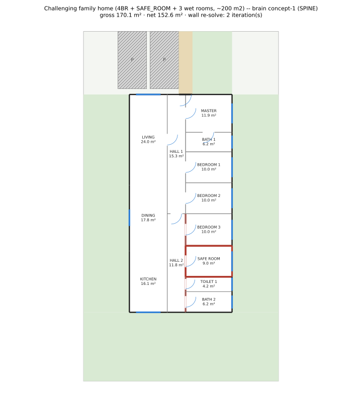
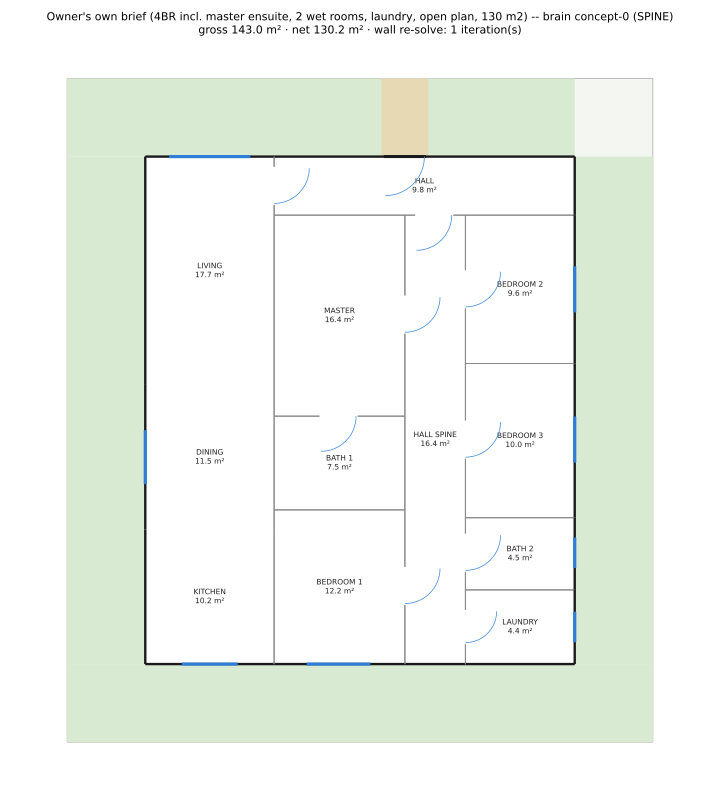
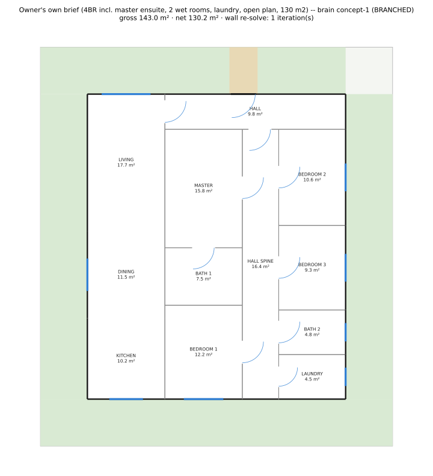

# POC Architectural Brain — PHASE 2 evaluation and decision gate (Issue #111)

**This is the owner's decision-gate document (2026-09-23 rules).** It puts three columns side by
side, on the SAME three fixed benchmark briefs (`backend/tests/architectural_brain/briefs.py`),
for every one of the POC's tracks so far:

- **CURRENT ENGINE** — the hand-designed `concept_generator` (production baseline, untouched).
- **BRAIN PHASE 1** — Issue #96's committed realization (SPINE/TWO_WING compilers only), kept
  exactly as it shipped, **as the baseline** — see `phase1-*.svg`/`phase1-*.json` per brief below,
  extracted verbatim from commit `166630c` before Track 1 overwrote the live files in place.
- **BRAIN PHASE 2** — Track 1 (#110, `HUB_LOBBY`/`BRANCHED` compilers, Issue #79's own generator-
  level pattern compilers, imported unchanged) + Track 3 (#109, `RealizationIntent`/
  `PreservationReport`) applied on top of the same retrieval/synthesis/adaptation layer.

Full narrative and the honest MODIFY verdict for Phase 1 alone is unchanged and lives in
`README.md` (do not re-read it as current — its own SVG links now resolve to the Phase 2 files
since Track 1 overwrote them in place; this page is the one place all three states are visible
together). Per-brief structured detail: `brief-N/comparison.md` (Phase 2, live), `brief-N/
references.md` (retrieval), `preservation.md` (Track 3's fact taxonomy).

---

## Brief 1 — the challenging family home

4 bedrooms + SAFE_ROOM + 3 wet rooms, ~200 m², plot 17×30.5 m, street north. Plain rectangle site
(one safe-adapter candidate) — `TWO_WING`/`HUB_LOBBY`/`BRANCHED` all need preconditions this site
or this room count does not offer (see below).

| | CURRENT ENGINE | BRAIN PHASE 1 | BRAIN PHASE 2 |
|---|---|---|---|
| |  |  /  |  /  |
| outcome | REALIZED, `ok=True` | REALIZED, `ok=True` (both donors) | REALIZED, `ok=True` (both donors) |
| realized class | FRONT_BAND | SPINE (concept-0), SPINE (concept-1) | BRANCHED (concept-0), BRANCHED (concept-1) — see "the collapse" below |
| donor(s) | — | 13630 (concept-0), 1996 (concept-1) | same two donors, same layer |

**Retrieved references and WHY (concept-0, donor 13630, score 0.724):** strongest factors were
`room_count_types` (brief needs 4 bedroom/3 wet/1 safe-room vs donor's 4 bedroom/4 wet/0 safe-room),
`built_area` (200.0 m² brief vs 199.2 m² donor) and `footprint_aspect_shape` (site aspect 1.91 vs
donor 1.83); donor's own `circulation_class=OTHER`, `zoning=CENTRAL_PUBLIC`,
`wet_core_strategy=DISPERSED`. **concept-1 (donor 1996, score 0.716)**: `room_count_types` (donor
has only 3 bedrooms, `BEDROOM_COUNT_ADJUST` added a 4th), `built_area` (200.0 vs 226.6 m²),
`footprint_aspect_shape` (1.91 vs 2.05); donor's own `circulation_class=FRONT_BAND`,
`zoning=PUBLIC_FRONT_PRIVATE_REAR`. Full ranked top-15 (both scored within 0.02 of each other,
architecturally similar for this brief) in `brief-1/references.md`.

**Compiler probes (Track 1, retrieval-independent — the SAME two calls run for every brief):**
`BRANCHED` REFUSED ("supports exactly 3 bedrooms with a safe room, not 4"); `HUB_LOBBY` REFUSED
("supports exactly 2 bedrooms, not 4"). Both were tried directly against this brief's own
programme (`realize_compiled_topology`, Track 1's own retrieval-independent probe) and both refuse
immediately on the bedroom-count precondition, before any geometry is compiled.

**PRESERVED / LOST (Track 3, `RealizationIntent` → realized geometry), concept-0 (donor 13630):**

| fact class | adjacency preservation | access | exposure | placement | clusters | wet_core_groups | entrance_relationship | room_proportions | footprint_relationships |
|---|---|---|---|---|---|---|---|---|---|
| concept-0 | 14% (2/14) | 50% (4/8) | 100% (3/3) | 0% (0/10) | 50% (1/2) | 50% (2/4) | 0% (0/1) | 86% (6/7) | 0% (0/2) |
| concept-1 | 17% (2/12) | 75% (3/4) | n/a (0/0) | 0% (0/8) | 50% (1/2) | 0% (0/2) | 0% (0/1) | 86% (6/7) | 50% (1/2) |

Every LOST `adjacency`/`placement`/`clusters`/`entrance_relationship` fact for a realized room pair
is reason `GUILLOTINE_IMPOSSIBLE` (`brief-1/comparison.md`'s own LOST list) — the compiled tree's
fixed SPINE topology simply does not place those donor room pairs the way the donor had them,
because `realize.py` never searches the intent graph for a tree that would (§ "what realize.py
actually attempts", `preservation.md`).

---

## Brief 2 — the owner's own brief (tightest site)

4 bedrooms (3 + master ensuite), 2 wet rooms, laundry, open plan, 130 m², plot 15×17 m.

| | CURRENT ENGINE | BRAIN PHASE 1 | BRAIN PHASE 2 |
|---|---|---|---|
| |  |  /  |  /  |
| outcome | REALIZED, `ok=True` | REALIZED, `ok=False` (both) | REALIZED, `ok=False` (both) |
| realized class | SPINE | SPINE (both) | BRANCHED (both) — see "the collapse" below |
| failing checks | — | C19, C8 | C19, C8 |
| donor(s) | — | 9302 (concept-0), 518 (concept-1) | same |

Phase 1's own SPINE compiler was single-column only and refused this brief outright (0/2). Track 1
adds nothing new here beyond re-labelling — the improvement from "refuses" to "realizes but fails
validation" is Issue #109's own `_compile_spine_double_loaded` fallback (already Phase-1-adjacent
work, landed in the same squashed commit as Track 3), not a Track 1 topology-compiler result.

**Retrieved references and WHY (concept-0, donor 9302, score 0.751):** `room_count_types` (brief 4
bedroom/2 wet vs donor's 3 bedroom/2 wet — `BEDROOM_COUNT_ADJUST` +1), `built_area` (130.0 vs
129.6 m²), `footprint_aspect_shape` (site 1.20 vs donor 1.25); donor's own
`circulation_class=FRONT_BAND`, `zoning=CENTRAL_PUBLIC`. **concept-1 (donor 518, score 0.751,
tied)**: same room-count gap, `built_area` 130.0 vs 126.6 m², aspect 1.20 vs 1.19; donor's own
`circulation_class=OTHER`, `zoning=PUBLIC_PRIVATE_WINGS`. Full top-15 in `brief-2/references.md`.

**Compiler probes (Track 1):** `BRANCHED` REFUSED ("witness sizing search found no fit for this
programme within `ROOM_TEMPLATES`' own bounds, or the resulting footprint exceeds this site's own
safe candidate rectangle"); `HUB_LOBBY` REFUSED ("supports exactly 2 bedrooms, not 4"). This is the
one brief where `BRANCHED`'s own bedroom-count precondition (4, no safe room) DOES match the
programme, yet it still refuses — on this brief the blocker is genuinely the site (this site's own
tight 15×17 m plot), not just precondition narrowness.

**PRESERVED / LOST:**

| fact class | adjacency preservation | access | exposure | placement | clusters | wet_core_groups | entrance_relationship | room_proportions | footprint_relationships |
|---|---|---|---|---|---|---|---|---|---|
| concept-0 (9302) | 17% (2/12) | 80% (4/5) | 67% (4/6) | 0% (0/8) | 0% (0/2) | 50% (1/2) | 0% (0/1) | 100% (6/6) | 100% (2/2) |
| concept-1 (518) | 22% (2/9) | 100% (5/5) | 75% (3/4) | 0% (0/7) | 0% (0/2) | 100% (2/2) | 0% (0/1) | 71% (5/7) | 50% (1/2) |

Both donors' realized C19/C8 failure is the SAME room (one bedroom with no exterior wall) —
`README.md`'s own root cause: on this brief's room mix, no order-preserving split of the private
room list leaves one whole side with zero exposure-requiring rooms, and `assign()` is free to place
the residual room anywhere in its own group.

---

## Brief 3 — the wide 5-bedroom home (Z-massing site)

5 bedrooms, 3 wet rooms (assumed), 200 m², plot 27×20.5 m — the only one of the 3 briefs whose site
offers 2 adjacent candidate rectangles, so `TWO_WING` is geometrically reachable at all.

| | CURRENT ENGINE | BRAIN PHASE 1 | BRAIN PHASE 2 |
|---|---|---|---|
| | REFUSED (no image) |  |  |
| outcome | REFUSED (`INSUFFICIENT_RECTANGULAR_CAPACITY`, 7 strategies tried) | REALIZED, `ok=True` | REALIZED, `ok=True` |
| realized class | — | TWO_WING | TWO_WING (unchanged — see "the collapse" below) |
| donor | — | 681 | 681 |

**Retrieved references and WHY (concept-5, donor 681, score 0.698):** `room_count_types` (brief 5
bedroom/3 wet/0 safe vs donor's 3 bedroom/3 wet — `BEDROOM_COUNT_ADJUST` +2), `built_area` (200.0
vs 149.9 m²), `footprint_aspect_shape` (site 1.91 vs donor 1.82); donor's own
`circulation_class=TWO_WING` (the deciding factor — this is the only donor among the top-15 whose
OWN declared class is `TWO_WING`), `zoning=PUBLIC_PRIVATE_WINGS`. Two other synthesized concepts
(concept-0/concept-1, donors 13630/1996 — coincidentally the SAME two donors used for brief-1's own
alternatives, since both briefs' room-count/area profile ranks them similarly in this 199-plan
corpus) were also attempted; both REFUSE (`"no footprint size solved for the SPINE template"`) — a
different donor, same site-driven SPINE refusal brief-1 does not hit (brief-1's site allows SPINE;
brief-3's does not). Full top-15 in `brief-3/references.md`.

**Compiler probes (Track 1):** `BRANCHED` REFUSED ("supports exactly 4 bedrooms without a safe
room, not 5"); `HUB_LOBBY` REFUSED ("supports exactly 2 bedrooms, not 5"). Same precondition-
narrowness story as brief-1.

**PRESERVED / LOST, concept-5 (donor 681):**

| fact class | adjacency preservation | access | exposure | placement | clusters | wet_core_groups | entrance_relationship | room_proportions | footprint_relationships |
|---|---|---|---|---|---|---|---|---|---|
| concept-5 | 8% (1/13) | 83% (5/6) | n/a (0/0) | 0% (0/8) | 0% (0/2) | 50% (1/2) | 0% (0/1) | 29% (2/7) | 50% (1/2) |

**This is the POC's one clear, genuinely-different, visible result across BOTH phases**: the current
hand-designed generator refuses this exact site/programme outright (7 strategies, all failing); the
brain realizes a fully validated `TWO_WING` plan through the SAME unchanged Geometry Core and
validators, in Phase 1 and unchanged in Phase 2.

---

## Full measurement table

Every metric the owner listed, per realized-and-comparable plan (`UNKNOWN` where a metric genuinely
does not apply or is not an importable signal in this codebase — see the note below the table).

| plan | brief | realized class | gross m² | net m² | adjacency preservation | access preservation | zoning preservation (clusters) | wet-core preservation | circulation ratio (M3) | dead space | exterior exposure preservation | hard validator failures | room-area compliance (room_proportions) |
|---|---|---|---|---|---|---|---|---|---|---|---|---|---|
| current | 1 | FRONT_BAND | 189.8 | 172.3 | N/A (no donor) | N/A | N/A | N/A | 0.086 | UNKNOWN | N/A | 0 | N/A |
| brain-P1/P2 concept-0 | 1 | SPINE→BRANCHED | 170.1 | 152.6 | 14% (2/14) | 50% (4/8) | 50% (1/2) | 50% (2/4) | 0.179 | UNKNOWN | 100% (3/3) | 0 | 86% (6/7) |
| brain-P1/P2 concept-1 | 1 | SPINE→BRANCHED | 170.1 | 152.6 | 17% (2/12) | 75% (3/4) | 50% (1/2) | 0% (0/2) | 0.179 | UNKNOWN | n/a | 0 | 86% (6/7) |
| current | 2 | SPINE | 128.7 | 117.3 | N/A | N/A | N/A | N/A | 0.141 | UNKNOWN | N/A | 0 | N/A |
| brain-P1/P2 concept-0 | 2 | SPINE→BRANCHED | 143.0 | 130.2 | 17% (2/12) | 80% (4/5) | 0% (0/2) | 50% (1/2) | 0.205 | UNKNOWN | 67% (4/6) | 2 (C19, C8) | 100% (6/6) |
| brain-P1/P2 concept-1 | 2 | SPINE→BRANCHED | 143.0 | 130.2 | 22% (2/9) | 100% (5/5) | 0% (0/2) | 100% (2/2) | 0.205 | UNKNOWN | 75% (3/4) | 2 (C19, C8) | 71% (5/7) |
| current | 3 | REFUSED | — | — | N/A | N/A | N/A | N/A | — | UNKNOWN | N/A | — (never realized) | N/A |
| brain-P1/P2 concept-5 | 3 | TWO_WING | 154.4 | 140.2 | 8% (1/13) | 83% (5/6) | 0% (0/2) | 50% (1/2) | 0.221 | UNKNOWN | n/a | 0 | 29% (2/7) |

**Notes**: "brain-P1/P2" rows are numerically IDENTICAL between Phase 1 and Phase 2 for every metric
except the realized-class label (see "the collapse" below) — one row serves both phases. **Dead
space**: no importable dead-space metric exists in this codebase snapshot (`circulation_metrics`/
`entrance_sequence`, named in Issue #96's own "Current behavior" section, were not found as
importable `app/` modules either at Phase 1 or Phase 2 — README.md's own Measurements-table note).
Reported `UNKNOWN` rather than invented. **Zoning preservation** is read from the `clusters` fact
class (`public_private_clusters`: do the donor-mapped PUBLIC rooms form one connected component,
and likewise PRIVATE — the operational definition of "zoning" the donor's own
`zoning=CENTRAL_PUBLIC`/etc. label describes); the donor's own zoning LABEL is copied onto the
synthesized `ConceptSpec` by construction (`preservation.md`: "the circulation label/zoning/wet-core
pattern already survive today") so is not independently re-measured as a fact — `clusters` is the
one geometry-derived proxy for it that Track 3 actually measures against the realized plan.

---

## Where architectural information disappears — the collapse cases

Every pair of plans in this evaluation that realized to the same (or near-identical) geometry,
with the exact causing constraint:

1. **Brief 1: concept-0 vs concept-1 (two different donors, 13630 vs 1996) — BYTE-IDENTICAL
   realized geometry**, in both Phase 1 and Phase 2 (confirmed against `alt-0.json`/`alt-1.json`
   layout coordinates and `README.md`'s own note: "every measurement in `brief-1/comparison.md`
   still matches to the metre"). **Cause**: `geometry_core.engine.assign()` (the frozen, out-of-
   scope Geometry Core) admits only ONE feasible footprint depth for this brief's own tight site
   across `_DEPTH_TRIALS_M`; once that depth and each column's forced width are fixed, every room's
   own `[min_short_side, max_aspect_ratio]` bound pins the SAME height combination regardless of
   which donor's `room_proportions` target fed the compiler — Track 3's own intent-driven sizing
   genuinely reaches the compiler (verified: the two donors' distinct `area_share_of_type` values do
   reach `_zone`/`_intent_target_area_m2`) but never reaches the OUTPUT on this site. This is a
   Geometry Core search-space limit, not a compiler-calibration gap — no amount of Track 1/Track 3
   work over the existing `assign()` can close it.
2. **Brief 1 and brief 3: BRAIN PHASE 1 vs BRAIN PHASE 2, same donor — geometry unchanged, LABEL
   changed (SPINE → BRANCHED for brief 1/2's concepts; TWO_WING unchanged for brief 3).** Confirmed
   directly: `git diff 166630c d285358 -- brief-1/alt-0.json` shows only `elapsed_s` (timing noise)
   and `realized_circulation_class` differ — every room coordinate, area and validator result is
   identical. **Cause**: Issue #79's own classifier extension (`concept_spec.
   realized_circulation_class`, merged into this POC's dependency chain by Track 1) now labels ANY
   two directly-connected HALL/CIRCULATION zones `BRANCHED` — `realize.py`'s own SPINE compiler
   always splits its hall into two such segments, so its output is re-labelled `BRANCHED` post hoc.
   **This is a taxonomy artifact, not new compiled geometry** — Track 1's real new machinery
   (`concept_compilers.compile_hub_lobby`/`compile_branched`) never actually fires on any of the 3
   fixed briefs (every compiler probe REFUSES — see each brief's own section above); the only
   "different label" this evaluation observes anywhere is this reclassification.
3. **Brief 2: concept-0 (donor 9302) vs concept-1 (donor 518) — NEAR-identical, not byte-identical.**
   Room dimensions differ by 0.05–0.5 m per room (e.g. `BATH_1` 3.35×2.40 vs 3.30×2.45) and one
   metric differs (`m1_habitable_aspect_median` 1.357 vs 1.263), but `gross_area_m2`/`net_area_m2`,
   circulation class, and both failing checks (C19, C8) are identical. **Cause**: the same
   mechanism as #1 above, one level looser — `ROOM_TEMPLATES`' own `[min, max]` area bound (never
   the donor) still sets each private column's width, so the donor-specific target only gets to
   choose WITHIN a narrow band the shared width leaves, rather than being fully swamped as on
   brief-1's tighter site.

**What is NOT a collapse**: brief-3's `TWO_WING` result is a genuinely different circulation class
from both `current` (REFUSED) and from brief-1/2's `SPINE`/`BRANCHED` results — it is the one case
in this evaluation where the realized architecture is visibly, structurally different, not merely
relabeled.

---

## Decision gate

### ROOT #105's spikes (Track 2, sibling branch `integration/non-rectangular-geometry`, not yet
merged into this POC branch — read directly via `git show` against `origin/agent/106…`/`107…`/
`108…` since no branch currently carries both this ROOT's work and this POC's; see the Reproducing
section for how):

- **#106 (full 199-plan corpus re-measurement)**: 0.0% of real reference plans are
  guillotine-separable under the standard test (0/199 with the artefact filter disabled — the same
  0% as the original 19-plan sample, now on 10× the sample); 95.5% of real building ENVELOPES are
  irregular polygons, not rectangles or simple L-shapes (9/199, 4.5%, are near-rectangular/simple-L).
  **This is a structural ceiling, not a calibration gap**: no amount of compiler-precondition
  widening inside the current guillotine `assign()` can ever reach the topology diversity real
  reference plans actually have, because the solver's own output space (a guillotine slicing tree)
  cannot represent 99.5–100% of real room layouts or 95.5% of real building envelopes, independent
  of which template/compiler picks the tree.
- **#107 (Architecture A — LIVING+KITCHEN room merge spike, PROVEN)**: on the full 432-context
  regression corpus, flag ON: 168/404 planned contexts (42%) get a validated merged L/flush room,
  LOST=0, crashes=0; kitchen/dining aspect improves from median 2.12 to 1.18 (-44%) across the
  applied subset; C9 furniture-envelope feasibility holds across a representative footprint sweep.
  Neither of the investigation's own kill criteria fired. This is real, low-risk, low-cost headroom
  still available WITHOUT a new Geometry Core — but it only reaches interior room-pair shape, not
  building-envelope topology (see #106 above).
- **#108 (Architecture B — non-guillotine rectangular reuse spike, substantially confirmed)**: a
  hand-encoded, genuinely non-guillotine 9-room pinwheel-plus-wing fixture passes 24/25 non-C26
  `validate()` checks, all 6 M1-M6 quality metrics, the demo contract, both renderers and the
  frontend payload contract with **zero `app/` code changes**. The one near-miss (C22, wing seams)
  needs a solver OUTPUT field (`seam_leaf_sides`), not a validator rewrite. Effort revised down from
  ~8-14 to ~6-10 engineer-weeks — the reduction applies to the now-measured-near-zero downstream
  integration cost; the dominant, still-unresolved cost driver is the SOLVER ITSELF (a genuinely
  harder, NP-hard-in-general dissection algorithm, unbuilt) and the corpus-rebaselining blast radius
  a real solver's varied outputs would cause across hundreds of contexts' primary selections —
  neither measured by this one-fixture spike.
- **Beyond #105, for context (a separate, later, still-in-progress Issue, #117, on the same sibling
  branch — not part of ROOT #105's own scope, included here because it directly bears on GO-B)**:
  a first real non-guillotine rectilinear realizer core (pinwheel + notch-carve construction) run
  against 10 real solved contexts from the frozen 432-context corpus reaches 9/10 REALIZED (1
  refused on a measured `SHORT_SIDE_INFEASIBLE`), every check on every realized layout passing
  through the UNCHANGED validator chain, across PINWHEEL/L/U/TWO_WING families. Wet rooms and
  SAFE_ROOM are excluded from this stage (a disclosed simplification — placement, not the
  realizer, is this stage's own gap). Early, not corpus-scale, but a real positive signal that GO-B
  is buildable, not just reusable downstream.

### Fixed-benchmark evidence (this Issue, Phase 2)

Across the 3 fixed briefs, EVERY observed "different result" in Phase 2 versus Phase 1 is one of:
(a) the SPINE→BRANCHED relabelling artifact (collapse case 2 above — no new geometry), or (b) the
already-Phase-1-adjacent double-loaded SPINE fallback on brief-2 (refuses→realizes-but-fails, not a
Track 1 result). Track 1's actual new machinery (`compile_hub_lobby`/`compile_branched`) never
fires on any of the 3 fixed briefs — every one of the 3 briefs' room counts (4+safe-room, 4, 5)
falls outside both compilers' own narrow preconditions (`HUB_LOBBY`: exactly 2 bedrooms; `BRANCHED`:
exactly 3 bedrooms+safe-room OR exactly 4 bedrooms without one). Brief-3 remains this POC's one
unambiguous positive across both phases: a genuinely different, validated `TWO_WING` topology the
current engine cannot reach on this site at all, produced through the SAME unchanged guillotine
Geometry Core.

### Recommendation: **GO-B**

A non-guillotine rectangular realizer is needed as the next Geometry Core.

**Why not GO-A** ("existing slicing solver + selective merged rooms is expressive enough"): #106's
0%/95.5% full-corpus numbers are a structural ceiling on the CURRENT guillotine `assign()`, not a
compiler-repertoire gap — widening `HUB_LOBBY`/`BRANCHED`'s bedroom-count preconditions (a real,
cheap fix this Issue's own findings motivate) would let Track 1's compilers fire on more briefs, but
could never, by construction, reach the ~99.5-100% of real room layouts and 95.5% of real building
envelopes a guillotine tree cannot represent. #107's room-merge win is real and worth shipping
regardless of this decision, but it only ever touches interior room-pair shape, never
building-envelope topology.

**Why not STOP** ("real-plan retrieval is not materially influencing realized architecture"):
empirically false on two independent counts. #107 shows retrieval-informed extension DOES change
432/432 corpus outcomes measurably (168/404, 42%, LOST=0) when the compiler's own scope matches the
extension's target. Brief-3, on the fixed benchmark itself, shows the SAME true across both phases:
a genuinely different, validated topology the current engine cannot reach at all. The 3 fixed
briefs' own lack of NEW diversity in Phase 2 specifically is explained by compiler-precondition
narrowness (a measured, named, fixable gap) and the Geometry Core's own search-space ceiling (#106),
not by retrieval failing to matter.

**Why GO-B over GO-C-LATER**: GO-C's own justification (95.5% of real envelopes are genuinely
irregular polygons, per #106 — beyond what even a non-guillotine RECTANGULAR-wing layout, B's own
scope, can represent) is real, but has no spike, no cost measurement and no corpus-scale estimate
refresh beyond the original investigation-level number — pursuing it now would be a decision made on
speculation, which the owner's own rule (2026-09-23) forbids. GO-B is the smallest next step that
measurably narrows the #106-identified gap (non-guillotine INTERIOR partition topology, which #108
shows the downstream pipeline already accepts at near-zero integration cost, and #117 shows an early
solver core can already reach 9/10 real layouts), without foreclosing C later.

### What would change this answer

- If GO-B's own eventual corpus-rebaselining sweep (not yet run against a real solver's varied
  output, only against #108's one hand-fixed fixture and #117's 10-context Stage-1 gate) shows
  broad `LOST > 0` or wide primary-signature churn across the 432-context corpus, the answer moves
  toward GO-A-with-merges-only (ship #107, do not pursue the solver).
- If widening `HUB_LOBBY`/`BRANCHED`'s bedroom-count preconditions (a cheap, Track-1-scoped fix)
  and re-running these same 3 fixed briefs STILL produces no genuinely different geometry, that
  would strengthen GO-B further (proving the Geometry Core itself, not just compiler narrowness, is
  the ceiling — which #106's numbers already predict, but this Issue's own 3 briefs did not
  independently confirm since neither compiler's precondition was ever met here).
- If #117's Stage-1 gate's excluded scope (wet rooms, SAFE_ROOM placement) turns out to need
  Geometry Core changes rather than realizer-side work once attempted, GO-B's effort estimate would
  need to rise back toward the original ~8-14 week range.
- If a future spike measures GO-C's own cost/risk directly (the one thing this decision explicitly
  lacks today), and finds it materially cheaper than expected, GO-C-LATER could become GO-C now.

---

## Reproducing this evaluation

```
cd backend
uv run pytest -q tests/architectural_brain/test_preservation.py tests/architectural_brain/test_realization_intent.py
uv run python -m spikes.architectural_brain.demo comparison --brief brief-1   # regenerates brief-N/comparison.md
```

ROOT #105's own reports (`#106`/`#107`/`#108`) live on `origin/integration/non-rectangular-geometry`
and its child branches, not on this POC branch — read them with `git show <ref>:<path>` (no merge/
checkout available in this sandboxed session); paths: `docs/reports/non-rectangular-geometry-full-
corpus-remeasurement.md`, `docs/reports/non-rectangular-geometry-architecture-a-spike.md`,
`docs/reports/non-rectangular-geometry-architecture-b-spike.md`. #117's Stage 1 gate:
`docs/reports/rectilinear-realizer/stage1-gate.md` on `origin/agent/117-stage-1-2-2-the-gate-a-non-
guillotine-re`.

Phase-1 baseline files (`phase1-*.svg`) were extracted with `git show 166630c:docs/reports/poc-
architectural-brain/brief-N/<name>.svg` — commit `166630c` is the last commit before Track 1
(`d285358`) overwrote the live `brain-*.svg`/`alt-*.svg` files in place.
