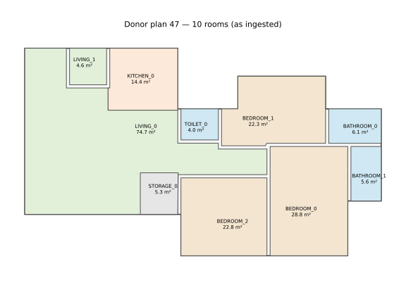
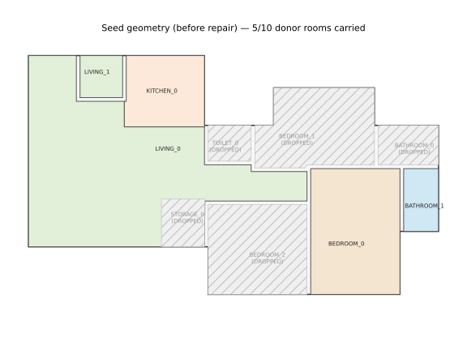
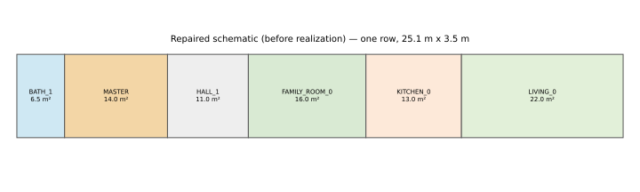
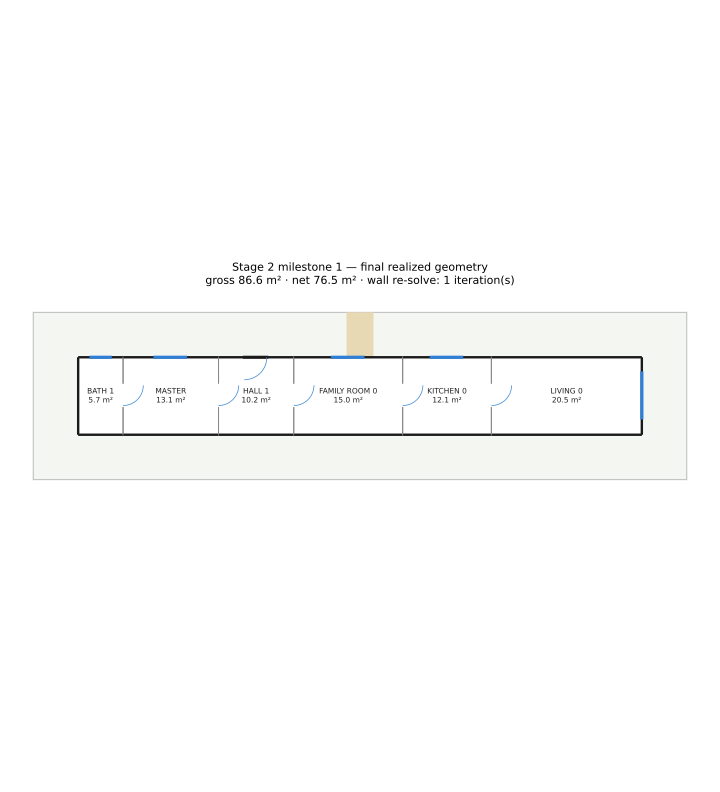

# Stage 2 — Milestone 1: one complete house, end to end

Issue #134 (Stage 2, B/2). One donor plan (a real ResPlan fixture, CC BY 4.0), one brief, carried donor -> `RealizationIntent` -> seed -> repair -> non-guillotine geometry -> validators -> preservation report. Reproduce with:

```
cd backend && uv run python -m app.vertical_slice.stage2.report
```

## Donor

- plan id: `47` (`tests/spikes/fixtures/geometry_shapes/plans/47.json`)
- rooms: 10 — BATHROOM_0, BATHROOM_1, BEDROOM_0, BEDROOM_1, BEDROOM_2, KITCHEN_0, LIVING_0, LIVING_1, STORAGE_0, TOILET_0
- footprint aspect ratio ≈ 1.72, fill ratio ≈ 0.76
- entrance: `LIVING_0`, side `W`



## The brief

- bedrooms: 1, safe_room: False, wet_rooms: 1

## Seed (before repair)



## Repair log — every repair, with its reason

| step | reason | before | after |
|---|---|---|---|
| RESOLVE_WET_ROOMS | the brief's authoritative wet-room programme (program.wet_rooms=1, ENSUITE) is the SAME resolver (`wet_rooms.resolve_wet_rooms`) the production pipeline uses — never a Stage-2-only wet-room shape. | donor carries 3 wet rooms (TOILET_0, BATHROOM_0, BATHROOM_1) | programme requires 1: BATH_1 (ENSUITE, host MASTER) |
| BEDROOM_COUNT_ADJUST | brief requires program.bedrooms=1; donor carries 3 (BEDROOM_0/1/2). BEDROOM_0 is kept (renamed MASTER) — the donor's own largest bedroom and the one with a real donor ensuite access edge (BATHROOM_1). BEDROOM_1 and BEDROOM_2 are dropped: the row realizer's own one-arm topology limit (module docstring) means a SECOND gated bedroom has no arm left to occupy. | 3 bedrooms (BEDROOM_0, BEDROOM_1, BEDROOM_2) | 1 bedroom kept: BEDROOM_0 (renamed MASTER, hosts BATH_1) |
| ROLE_RELABEL | the brief's ensuite is host=ENSUITE_HOST_MASTER, which names a zone literally "MASTER" (`wet_rooms.resolve_wet_rooms`); BEDROOM_0 is promoted to ProgramRole.MASTER_BEDROOM / zone id "MASTER". | BEDROOM_0 (role BEDROOM) | MASTER (role MASTER_BEDROOM) |
| ROLE_RELABEL | the donor's second LIVING-type room (LIVING_1, 4.6 m2, adjacent to KITCHEN_0) reads as a secondary sitting room, not a second primary living room — ProgramRole has one LIVING slot, so it is carried as ProgramRole.FAMILY_ROOM instead of dropped. | LIVING_1 (type LIVING, 4.59 m2) | FAMILY_ROOM_0 (role FAMILY_ROOM) |
| DROP_UNFIT_FOR_ROW_TOPOLOGY | the non-guillotine realizer's RowWing places every top-level zone at the SAME shared depth (Required Behaviour 3's own realizer, `stage2.realizer._build_row_wing`); a depth that clears MASTER/LIVING's own 3.0 m minimum short side leaves STORAGE_0's ~3 m2 target too narrow to clear ITS OWN minimum short side at that same depth (no single row depth satisfies both — the two pull in opposite directions as area shrinks). STORAGE has no ProgramSpec field of its own (not part of the brief's authoritative programme), so it is dropped rather than forced. | STORAGE_0 (5.31 m2, donor) | dropped — no realized counterpart |
| DROP_SUPERSEDED_WET_ROOM | BATHROOM_0 and TOILET_0 are the donor's other two wet rooms; the brief's programme (program.wet_rooms=1, mapped from BATHROOM_1 above) covers the requirement in full, and BATHROOM_0's own donor host (BEDROOM_1) is itself dropped above, so neither has a role left to carry into. | BATHROOM_0 (6.14 m2), TOILET_0 (3.95 m2) | dropped — no realized counterpart |
| ADD_CIRCULATION | the donor carries no CIRCULATION/HALL room at all (`donor.rooms` has none), but C24 requires MASTER be entered ONLY from circulation — one HALL zone is added in front of it, and (the row realizer's ONE gated-arm limit — see module docstring) becomes the resolved entrance itself. | no circulation room in the donor | HALL_1 added (role HALL, MASTER's arm, the entrance) |
| SAFE_ROOM_NOT_INCLUDED | brief.program.safe_room=False in THIS milestone brief — not because the brief has no SAFE_ROOM requirement to honour, but because the row realizer's own one-arm limit (module docstring) makes SAFE_ROOM and MASTER mutually exclusive in a single connected row: both are PRIVATE-role and each needs its own dedicated circulation arm, and a second arm always trips C25 (`entrance_sequence._stray_pockets`) or C20/C24 (a notch-carved SAFE_ROOM's own regulated area/aspect vs. the row's shared depth) — measured empirically while building this repair, not merely reasoned. SAFE_ROOM's own C4/RC_SAFE_ROOM wiring is proven separately, on a smaller scenario with no competing bedroom (`test_stage2_wet_rooms_and_safe_room.py`). See the milestone report's own decision section. | brief could have asked for a SAFE_ROOM | not asked for in this milestone's own brief |
| RETARGET_AREAS | every zone's area target/min/max/min-short-side/max-aspect comes from `concept_generator.ROOM_TEMPLATES[role]` — the SAME per-role targets the production planner sizes to, not a donor-proportion-scaled figure (a known simplification: the donor's own room-size spread, e.g. BEDROOM_0 at 28.8 m2, is NOT carried into the repaired areas — see the report's `room_proportions` preservation result). | donor areas (e.g. LIVING_0 74.7 m2, BEDROOM_0 28.8 m2, BATHROOM_1 5.6 m2) | template targets (LIVING 22.0 m2, MASTER_BEDROOM 14.0 m2, BATHROOM 6.5 m2, HALL 11.0 m2, ...) |
| ROW_ORDER_FROM_DONOR_PLACEMENT | BATH_1 is pinned to a row end (its own required host, MASTER, is its only row neighbour there — C17's 'entered only from the host' rule); MASTER/HALL_1 sit between BATH_1 and the public block, ordered by the donor's own room centroid x (FAMILY_ROOM_0 at x=3.5, KITCHEN_0 at x=6.8, LIVING_0 at x=7.1 — the donor's own left-to-right reading). This is the step that collapses the donor's real 2D adjacency graph into the realizer's own 1D row — see the report's own decision section for what this costs `adjacency`/`placement` preservation. | donor: a 2D adjacency graph (17 adjacency edges) | repaired: one row, left to right: BATH_1, MASTER, HALL_1, FAMILY_ROOM_0, KITCHEN_0, LIVING_0 |
| ENVELOPE_FIT_AND_GRID_SNAP | a RowWing shares ONE depth across every zone (Required Behaviour 3's own realizer); the depth is the largest per-role minimum short side across the roster (MASTER_BEDROOM/LIVING, 3.00 m) plus the realizer's own inset-margin pre-check (0.3 m) and a rounding safety margin (0.15 m); the row's own width is the summed area targets over that depth, with a small overall margin (1.05x) protecting the tightest zone from the last slot's own rounding drift. The realizer itself snaps every dimension to its own 0.05 m grid unit (`realizer.UNIT_M`) when it solves each slot's rectangle. | donor footprint 20.77 m x 12.11 m (aspect ~1.72, fill ratio ~0.76 — see the intent report) | repaired envelope 25.11 m x 3.45 m (one row, aspect 7.3:1) |


## Room lineage — CARRIED / DROPPED / ADDED

| kind | donor room(s) | result(s) | stage | reason |
|---|---|---|---|---|
| CARRIED | LIVING_0 | LIVING_0 | adaptation | carried unchanged (role LIVING) |
| CARRIED | LIVING_1 | LIVING_1 | adaptation | carried, role relabelled to FAMILY_ROOM (see ROLE_RELABEL above) |
| CARRIED | KITCHEN_0 | KITCHEN_0 | adaptation | carried unchanged (role KITCHEN) |
| CARRIED | BEDROOM_0 | BEDROOM_0 | adaptation | carried, role relabelled to MASTER_BEDROOM (see ROLE_RELABEL above) |
| CARRIED | BATHROOM_1 | BATHROOM_1 | adaptation | carried into BATH_1 (ENSUITE, host MASTER) — the donor's own BATHROOM_1-BEDROOM_0 access edge, preserved as the ensuite host relationship |
| DROPPED | BEDROOM_1 | — | adaptation | bedroom count 3 -> 1; row-topology one-arm limit; see BEDROOM_COUNT_ADJUST above |
| DROPPED | BEDROOM_2 | — | adaptation | bedroom count 3 -> 1; row-topology one-arm limit; see BEDROOM_COUNT_ADJUST above |
| DROPPED | BATHROOM_0 | — | adaptation | superseded by the brief's 1-ensuite wet-room programme; its own donor host (BEDROOM_1) is also dropped; see DROP_SUPERSEDED_WET_ROOM above |
| DROPPED | TOILET_0 | — | adaptation | superseded by the brief's 1-ensuite wet-room programme; see DROP_SUPERSEDED_WET_ROOM above |
| DROPPED | STORAGE_0 | — | repair | row-topology minimum-short-side conflict; see DROP_UNFIT_FOR_ROW_TOPOLOGY above |
| ADDED | — | HALL_1 | repair | C24 requires MASTER entered only from circulation; see ADD_CIRCULATION above |


## Geometry after repair (schematic, before realization)



## Realization

No refusal — the layout realized on the first attempt.




### Validators — the checks that ran

| check | passed | detail |
|---|---|---|
| C1 | PASS | none |
| C2 | PASS | footprint fully consumed by rooms |
| C3 | PASS | all zones within spec |
| C20 | PASS | no room is a strip |
| C21 | PASS | no room above its hard maximum |
| C4 | PASS | safe room compliant |
| C5 | PASS | all 6 zones reachable over 5 realized connections |
| C24 | PASS | every enclosed room has a proper door from an allowed role, no private-to-private chain |
| C6 | PASS | open-plan clean |
| C7 | PASS | 6 doors placeable |
| C28 | PASS | 6 doors usable |
| C19 | PASS | all 4 exterior-required zones touch the envelope |
| C8 | PASS | all 4 daylight-requiring zones windowed |
| C9 | PASS | all furnished zones fit |
| C26 | PASS | circulation ratio 13%, longest segment 3.25 m, 0 dead end(s) — within the calibrated limits |
| C10 | PASS | 0 bays front the street |
| C18 | PASS | 0 bays outside the footprint |
| C11 | PASS | entrance walk clear, street to door |
| C12 | PASS | 0 garden region(s) explicitly classified |
| C16 | PASS | entrance at x=9.90 m on the street wall; HALL_1 spans 8.25-11.60 m |
| C23 | PASS | HALL_1 role(s) HALL |
| C25 | PASS | arrival zone HALL_1 opens onward with no unserved pocket |
| C13 | PASS | all 5 declared edges have a physical connection |
| C17 | PASS | all 1 wet rooms entered as required |
| C29 | PASS | all 1 wet rooms clear of a direct public-zone sight line |
| C33 | PASS | 19 walls; every placeable door/window hosted, every safe-room wall protected |


C17 (bathroom access): **PASS**. C29 (wet-room privacy): **PASS**.

## PRESERVED / LOST

### PRESERVED / LOST — stage2-milestone-1:47 (donor 47)

| fact class | preserved | total | ratio |
|---|---|---|---|
| adjacency | 3 | 17 | 18% |
| access | 3 | 7 | 43% |
| exposure | 2 | 3 | 67% |
| placement | 0 | 10 | 0% |
| clusters | 2 | 2 | 100% |
| wet_core_groups | 0 | 2 | 0% |
| entrance_relationship | 0 | 1 | 0% |
| room_proportions | 3 | 5 | 60% |
| footprint_relationships | 0 | 2 | 0% |

LOST facts:

- **adjacency** BATHROOM_0-BATHROOM_1 — DONOR_ROOM_NOT_REALIZED
- **adjacency** BATHROOM_0-BEDROOM_0 — DONOR_ROOM_NOT_REALIZED
- **adjacency** BATHROOM_0-BEDROOM_1 — DONOR_ROOM_NOT_REALIZED
- **adjacency** BEDROOM_0-BEDROOM_1 — DONOR_ROOM_NOT_REALIZED
- **adjacency** BEDROOM_0-BEDROOM_2 — DONOR_ROOM_NOT_REALIZED
- **adjacency** BEDROOM_0-LIVING_0 (realized MASTER/LIVING_0 do not touch) — NOT_HONOURED
- **adjacency** BEDROOM_1-LIVING_0 — DONOR_ROOM_NOT_REALIZED
- **adjacency** BEDROOM_1-TOILET_0 — DONOR_ROOM_NOT_REALIZED
- **adjacency** BEDROOM_2-LIVING_0 — DONOR_ROOM_NOT_REALIZED
- **adjacency** BEDROOM_2-STORAGE_0 — DONOR_ROOM_NOT_REALIZED
- **adjacency** KITCHEN_0-TOILET_0 — DONOR_ROOM_NOT_REALIZED
- **adjacency** LIVING_0-LIVING_1 (realized LIVING_0/FAMILY_ROOM_0 do not touch) — NOT_HONOURED
- **adjacency** LIVING_0-STORAGE_0 — DONOR_ROOM_NOT_REALIZED
- **adjacency** LIVING_0-TOILET_0 — DONOR_ROOM_NOT_REALIZED
- **access** BATHROOM_0-BEDROOM_1 (DOOR) — DONOR_ROOM_NOT_REALIZED
- **access** BEDROOM_1-LIVING_0 (DOOR) — DONOR_ROOM_NOT_REALIZED
- **access** BEDROOM_2-LIVING_0 (DOOR) — DONOR_ROOM_NOT_REALIZED
- **access** LIVING_0-TOILET_0 (DOOR) — DONOR_ROOM_NOT_REALIZED
- **exposure** BATHROOM_0 (donor sides=['E']) — DONOR_ROOM_NOT_REALIZED
- **placement** LIVING_0 (donor FRONT/ABOVE): realized LIVING_0 is UNKNOWN/RIGHT — NOT_HONOURED
- **placement** LIVING_1 (donor FRONT/ABOVE): realized FAMILY_ROOM_0 is UNKNOWN/LEFT — NOT_HONOURED
- **placement** KITCHEN_0 (donor FRONT/ABOVE): realized KITCHEN_0 is UNKNOWN/RIGHT — NOT_HONOURED
- **placement** BEDROOM_0 (donor REAR/BELOW): realized MASTER is UNKNOWN/LEFT — NOT_HONOURED
- **placement** BEDROOM_1 (donor REAR/ABOVE) — DONOR_ROOM_NOT_REALIZED
- **placement** BEDROOM_2 (donor REAR/BELOW) — DONOR_ROOM_NOT_REALIZED
- **placement** TOILET_0 (donor FRONT/ABOVE) — DONOR_ROOM_NOT_REALIZED
- **placement** BATHROOM_0 (donor REAR/ABOVE) — DONOR_ROOM_NOT_REALIZED
- **placement** BATHROOM_1 (donor REAR/BELOW): realized BATH_1 is UNKNOWN/LEFT — NOT_HONOURED
- **placement** STORAGE_0 (donor FRONT/BELOW) — DONOR_ROOM_NOT_REALIZED
- **clusters** private: BEDROOM_1 — DONOR_ROOM_NOT_REALIZED
- **clusters** private: BEDROOM_2 — DONOR_ROOM_NOT_REALIZED
- **wet_core_groups** group ['BATHROOM_0', 'BATHROOM_1']: ['BATHROOM_0'] not realized — DONOR_ROOM_NOT_REALIZED
- **wet_core_groups** group ['TOILET_0']: ['TOILET_0'] not realized — DONOR_ROOM_NOT_REALIZED
- **entrance_relationship** donor entrance -> TO_LIVING, realized entrance -> TO_HALL — NOT_HONOURED
- **room_proportions** LIVING_1/FAMILY_ROOM_0: donor share=0.116, realized share=1.000 — BUDGET
- **room_proportions** LIVING_0/LIVING_0: donor share=1.884, realized share=1.000 — BUDGET
- **footprint_relationships** aspect_ratio: donor=1.715, realized=7.275 — NOT_HONOURED
- **footprint_relationships** fill_ratio: donor=0.760, realized=1.000 — NOT_HONOURED


## The decision

**Is the donor's structure still clearly recognisable after repair, with the validators passing?** The validators pass (every C1-C29 check that ran, passed, including C17/C29). The donor's structure is only PARTIALLY recognisable: `adjacency` and `placement` are mostly lost (a 2D donor adjacency graph collapsed into the realizer's own 1D row — see the `ROW_ORDER_FROM_DONOR_PLACEMENT` repair step), and `footprint_relationships` is lost outright (the donor's own compact ~1.7:1 footprint becomes a >7:1 strip — an inherent consequence of the single-row realizer, not a repair bug). What DID survive: the donor's own real ensuite access edge (BATHROOM_1-BEDROOM_0, preserved as MASTER's own BATH_1 host relationship), the donor's own public/private cluster split, and 60% of `room_proportions`.

**Which step destroyed the most structure?** `ROW_ORDER_FROM_DONOR_PLACEMENT` (collapsing 2D adjacency into a 1D row) and `ENVELOPE_FIT_AND_GRID_SNAP` (the row's own shared depth, forced by the realizer's topology) together account for essentially all of the `adjacency`/`placement`/`footprint_relationships` loss. `RETARGET_AREAS` (donor areas -> fixed per-role templates, ignoring the donor's own proportions) accounts for the `room_proportions` loss.

**A genuine, load-bearing finding from building this repair**: the row realizer supports at most ONE gated-PRIVATE-room arm per connected row (see `repair.py`'s own module docstring) — a SAFE_ROOM could not be added to this brief alongside its one bedroom without tripping C25 (`entrance_sequence._stray_pockets`) or C20/C24, regardless of which corner/family of notch-carve was tried. This is a real capability limit of the Stage 1 realizer (#117), not a Stage 2 defect, and it should be read before scheduling any breadth work that assumes multiple private rooms plus a SAFE_ROOM in one realized plan.

**Recommendation**: this is an honest, partially-preserved first result, matching what Required Behaviour 6 calls the expected outcome of a first end-to-end run. Breadth work should wait for the owner to read this case, and any future child should budget for EITHER a richer realizer topology (branching, not a single row) OR a donor-proportion-aware area retarget before adjacency/placement/footprint preservation can be expected to improve materially.
